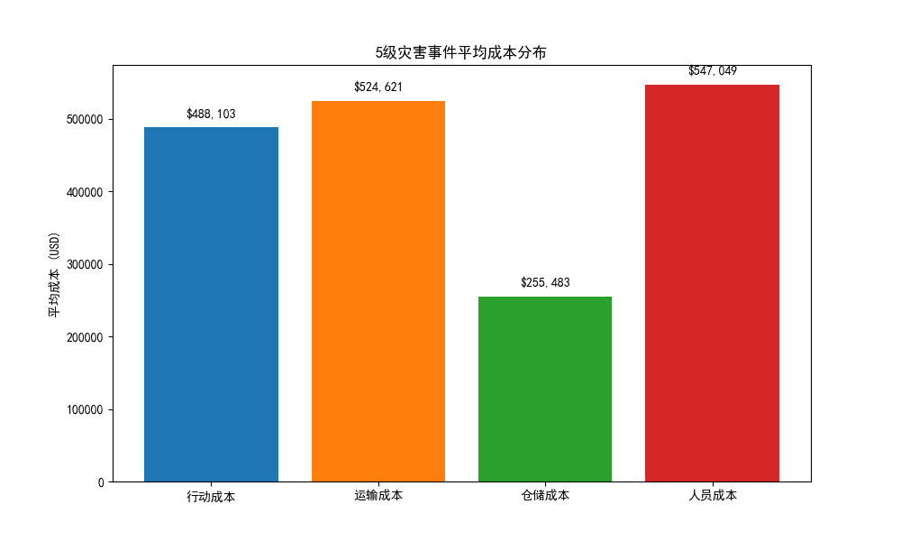
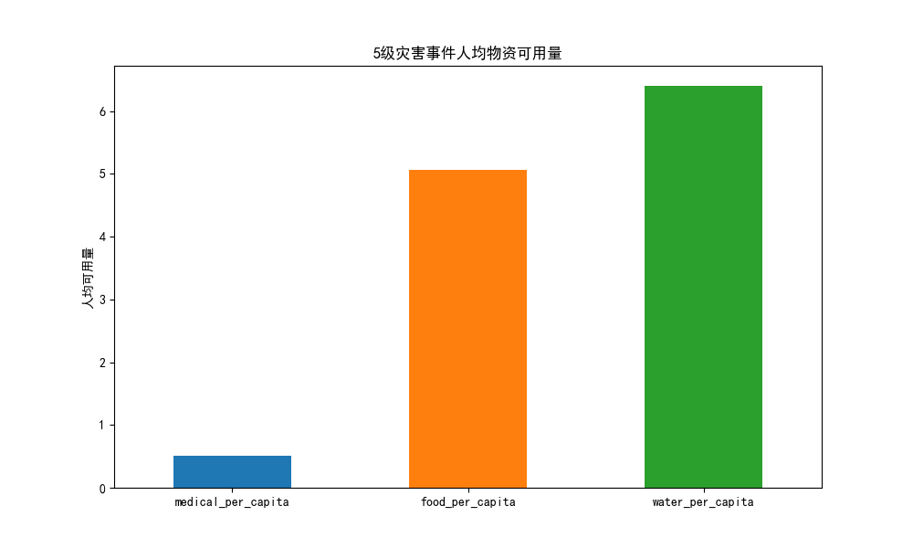

# 全球5级灾害事件应急响应资源配置效能评估报告

## 1. 执行摘要

本报告旨在系统性评估全球灾害等级为5的重大灾害事件中，应急响应的资源配置效能。通过对**人力、财力、物力、运输**四个核心维度的数据进行深入分析，我们发现尽管投入了大量资源，但在资源配置的及时性、充足性和利用效率方面仍存在显著的改进空间。

**核心发现:**
- **人力资源**：严重依赖志愿者，但专业人员在个人防护装备、通讯设备和专业培训方面存在明显短板。
- **财力资源**：预算资金利用率仅为50.25%，存在大量资金未能有效转化为救援能力的现象。成本结构显示运输和人员成本占比较高。
- **物力资源**：人均基础物资（特别是医疗用品）配给量可能不足以应对长期需求，存在短缺风险。
- **运输资源**：末端配送环节问题突出，交付延迟和中断情况普遍，交付成功率有待提高。

**关键建议:**
我们建议采取以下措施以优化资源配置：
1.  **强化专业团队建设**，减少对志愿者的过度依赖，并加强人员培训与装备配置。
2.  **优化预算审批与执行流程**，提高资金使用效率，确保资金能迅速响应一线需求。
3.  **建立动态的物资需求预测模型**，实现更精准的物资储备与调配。
4.  **投资于智慧物流技术**，优化运输路线，加强对末端配送的管理与监控。

---

## 2. 详细分析

### 2.1 人力资源：依赖与准备不足并存

在5级灾害事件中，平均每起事件投入258名专业人员和541名志愿者。志愿者人数是专业人员的两倍多，凸显了应急响应对社会力量的极大依赖。

然而，人员的“战备状态”堪忧：
- **个人防护装备 (PPE)**：`“危急”`和`“有限”`状态的报告最为频繁，表明一线人员的安全保障不足。
- **通讯设备**：`“有限”`和`“不足”`是主要状态，这会严重阻碍现场的协调与指挥效率。
- **培训水平**：多数人员的培训状态为`“需要培训”`或`“进行中”`，这意味着大量人员可能未完全掌握应急技能。
- **人员可用率**：平均85.1%的可用率意味着有近15%的人员在需要时无法到位。

**结论**：人力资源配置在数量上依赖志愿者，但在质量和准备度上存在严重短板，这可能导致响应行动的专业性和效率大打折扣。

### 2.2 财力资源：资金利用率低下，成本结构待优化

平均每起5级灾害事件的预算约为520万美元，但**平均资金利用率仅为50.25%**。这表明有近一半的预算资金未能在应急响应中被有效使用，可能原因包括复杂的审批流程、预算与实际需求脱节或采购效率低下。

从平均成本分布来看：

运输成本和人员成本是主要支出项。结合运输环节的低效表现，高昂的运输成本可能并未带来相应的高效率。资金的大量沉淀和不合理的成本结构，削弱了财力资源对救援行动的支撑作用。

**结论**：财力资源配置的核心问题在于“钱没花在刀刃上”，资金使用效率低下是制约应急响应效能的关键瓶颈。

### 2.3 物力资源：人均配给量紧张

为更准确地评估物资充足性，我们计算了人均关键物资的可获得量。

- **人均医疗用品**：仅为0.5单位/人。
- **人均食品**：约为5.06公斤/人。
- **人均饮用水**：约为6.4升/人。

**结论**：考虑到5级灾害的严重性和持续时间，目前的人均物资水平，特别是医疗用品，可能难以满足所有受灾人员的基本需求，存在较大的人道主义风险。物资储备量需要基于更精确的需求评估进行调整。

### 2.4 运输资源：“最后一公里”挑战严峻

运输是将资源转化为有效救援的关键环节，但数据显示其效率不尽人意。
- **交付效率**：平均交付成功率仅为**85.78%**，意味着每7次运输中就有1次失败。平均交付时间长达**35.6小时**，对于急需的物资而言过长。
- **末端配送状态**：`“延迟”`和`“中断”`的次数远超`“正常”`，表明物资配送的“最后一公里”问题非常突出。
- **路线优化**：多数运输线路的优化状态为`“需要优化”`，显示当前的物流规划能力不足。

**结论**：运输网络，特别是末端配送环节，是整个应急响应链条中的明显短板。低效的运输不仅延误了救援时机，也推高了整体的运营成本。

---

## 3. 结论与系统性建议

综合以上分析，全球5级灾害事件的应急响应资源配置在人力、财力、物力和运输四个方面均表现出显著的效能短板。资源并未得到最优配置，效率和效果均有巨大的提升空间。

为构建更具韧性和效率的应急响应体系，我们提出以下四点系统性建议：

1.  **优化人力资源管理**：
    *   **加强专业力量**：增加核心专业人员（医疗、工程、后勤）的储备和投入，降低对非专业志愿者的过度依赖。
    *   **提升战备水平**：为所有一线人员，包括志愿者，提供标准化的PPE和可靠的通讯设备。建立常态化的培训和演练机制，确保人员随时可用。

2.  **革新财务管理机制**：
    *   **简化资金流程**：设立应急响应快速拨款通道，减少不必要的行政审批，确保资金能迅速直达一线。
    *   **实施绩效预算**：将预算分配与预期成果挂钩，对成本效益进行持续追踪，特别是高昂的运输成本，确保每一分钱都用出最大效益。

3.  **实施精准物资调配**：
    *   **动态需求预测**：利用大数据和AI技术，根据灾害类型、受灾人口密度等因素，建立更精准的物资需求预测模型。
    *   **提升人均标准**：重新评估并适当提高关键物资（尤其是医疗用品和清洁饮用水）的人均储备和分发标准。

4.  **构建智慧高效物流**：
    *   **投资物流科技**：引入无人机勘察、GIS路线规划、实时在途追踪等技术，对运输路线进行动态优化。
    *   **聚焦末端配送**：建立社区/临时安置点内的物资分发网络和责任人制度，打通“最后一公里”，确保物资能快速、准确地送达每个受灾者手中。
