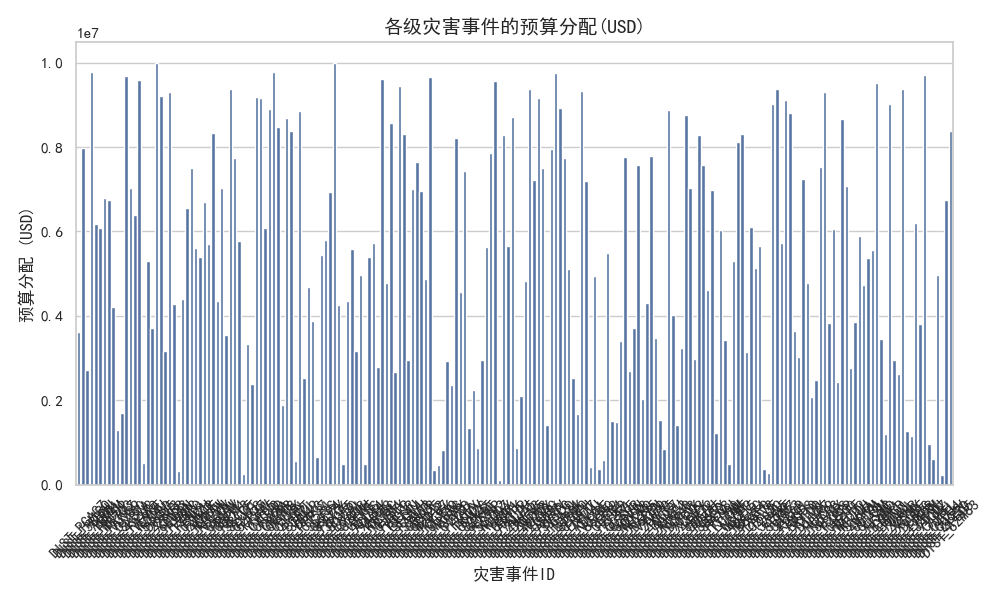
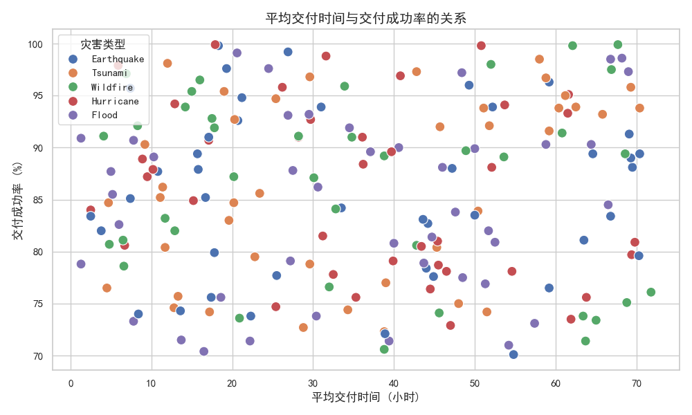
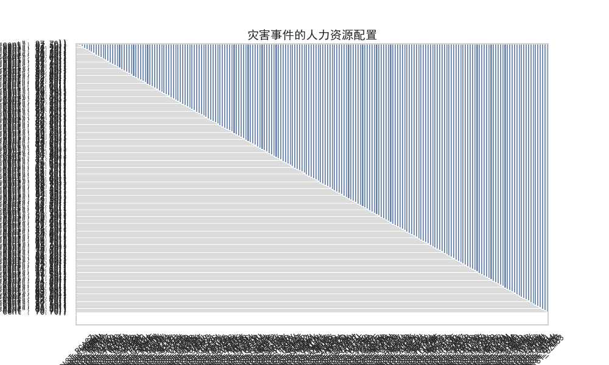

# 全球五级灾害应急响应资源配置效能评估报告

## 介绍

本报告分析了全球五级灾害事件中的资源配置效能，重点关注人力资源、财政资金、物资供应和运输效率。我们利用数据库中的灾情事件数据，并结合SQL查询和Python数据分析工具，评估了资源分配的效率。

## 关键分析

### 1. 预算分配（USD）

上图呈现了各五级灾害事件的预算分配情况。我们可以看到，不同灾害事件间的预算分配存在显著差异。最高预算分配约为998万美元，最低则为11.9万美元。这种差异可能反映了灾害影响范围、基础设施需求和区域经济状况的不同。

### 2. 运输绩效：平均交付时间与交付成功率

上图展示了平均交付时间与交付成功率之间的关系。总体而言，地震灾害的交付速度较快，成功率较高。相比之下，海啸事件的平均交付时间更长，且成功率达到较高水平，表明运输系统在紧急情况下仍能保持较高的效率。

### 3. 人力资源配置

该图显示了五级灾害事件的人力资源配置情况。尽管所有事件都获得了一定程度的人力支持，但人员配置总量在不同灾害之间存在波动。这表明可能存在资源分配不均的问题，某些灾害事件可能未获得足够的人员支持。

## 结论与建议

### 结论：
- **预算分配差异显著**：五级灾害事件之间的预算差异较大，可能受灾害类型、受灾区域和基础设施需求影响。
- **运输绩效总体良好**：尽管交付时间存在波动，但交付成功率普遍较高，表明运输系统在灾难响应中较为有效。
- **人力资源配置不均衡**：不同灾害事件获得的人力资源支持存在较大差异，可能导致部分事件响应效率较低。

### 建议：
1. **优化预算分配机制**：引入基于灾害影响范围和基础设施需求的动态预算分配模型，确保资源能够更公平、高效地分配。
2. **提升运输调度效率**：加强运输路线优化，确保在灾害响应期间能够实现更快的物资交付。
3. **均衡人力资源配置**：根据灾害严重程度和受影响人口数量，制定更具针对性的人力资源分配策略，避免资源浪费或不足。
