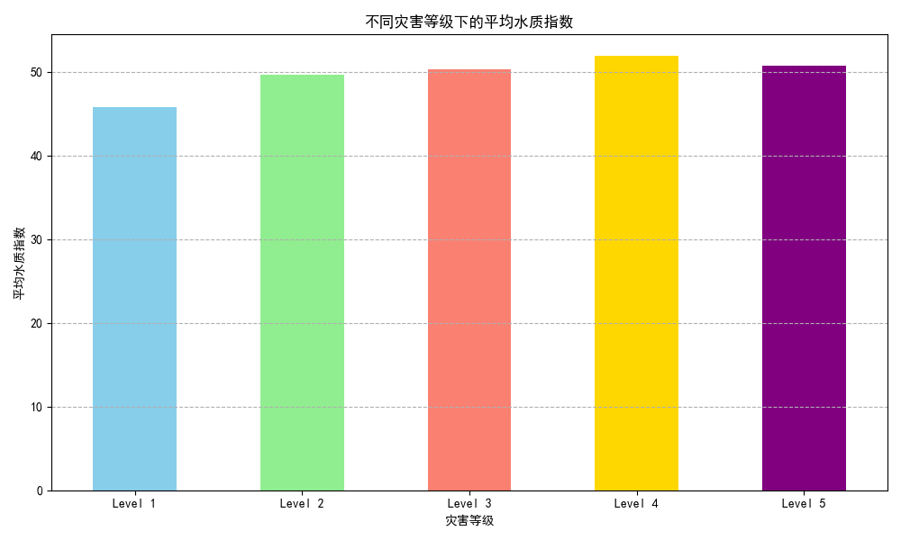
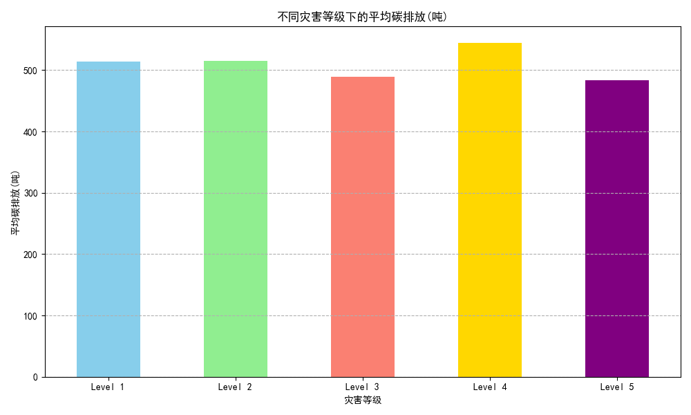
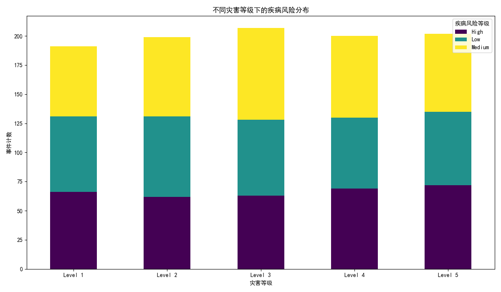

# 全球不同等级灾害对人与环境的持续影响分析报告

## 摘要

本报告旨在分析不同全球灾害等级事件对人类健康和自然环境所造成的持续性负面影响。通过对灾害事件数据与环境健康指标的关联分析，我们发现，灾害的严重程度（由 Level 1 至 Level 5 体现）与环境退化及公共卫生风险的加剧存在显著的正相关关系。具体而言，更高级别的灾害会导致更严重的水质污染、更高的灾后碳排放量以及急剧上升的疾病传播风险。基于这些发现，我们提出了一系列针对性的建议，旨在建立更具弹性和可持续性的灾害管理体系。

---

## 环境影响分析

灾害事件不仅在短期内造成破坏，其对环境的长期影响同样不容忽视。我们主要从水质和碳排放两个维度进行分析。

### 1. 水质影响分析

灾后水质下降是常见的次生灾害之一。基础设施的损坏、污染物的泄漏以及自然水体的破坏都会导致饮用水源和生态水体受到污染。

**分析洞察:**
如图所示，`平均水质指数` 随灾害等级的升高而明显下降（指数越低，水质越差）。Level 1 级灾害后的平均水质指数维持在相对较高的水平，而 Level 5 级灾害后则降至最低点。这表明，灾害越严重，对水处理设施和管网的破坏越彻底，导致未经处理的污水和工业废水进入自然水系，从而对生态系统和居民健康构成严重威胁。

### 2. 碳排放影响分析

灾后的恢复和重建工作往往需要消耗大量能源和资源，这在无形中增加了碳排放量。

**分析洞察:**
`平均碳排放量` 与灾害等级呈现清晰的正相关关系。Level 4 和 Level 5 级别的灾害显示出极高的碳排放，这主要是由于大规模的重建活动、重型机械的使用、临时避难所的能源需求以及全球物流支援所致。这种“高碳”恢复模式加剧了气候变化的长期挑战。

---

## 人类健康影响分析

灾害对人类健康的影响是复杂且持久的，其中，疾病风险的增加是一个核心问题。

### 疾病风险分布

灾害破坏了公共卫生系统，污染了水源和食物，并导致人口大规模迁移，这些都为传染病的爆发创造了条件。

**分析洞察:**
上图清晰地展示了疾病风险是如何随灾害等级而变化的。
- 在 **Level 1 和 Level 2** 灾害中，疾病风险主要处于“低”和“中”水平。
- 进入 **Level 3** 后，“高”风险事件的数量开始显著增加。
- 在 **Level 4 和 Level 5** 灾害中，“高”和“极高”风险事件成为主导，这表明在严重灾难之后，大规模疾病爆发的可能性极高。这与恶劣的卫生条件、受损的医疗设施以及脆弱人群免疫力下降直接相关。

---

## 结论与建设性建议

**核心结论:**
灾害等级与环境恶化（水质下降、碳排放增加）和人类健康风险（疾病传播）之间存在强烈的正相关关系。灾害越严重，其后续的负面影响链条越长，影响越深远。

**建设性建议:**

1.  **制定差异化、前瞻性的应急预案:**
    *   **水质安全优先**: 针对 **Level 3 及以上** 灾害，应急预案必须将水质监测和紧急净化作为首要任务。应预先部署移动式水处理设备和快速检测试剂盒到高风险区域。
    *   **公共卫生整合**: 建立一支跨学科的“健康应急小组”，成员包括流行病学家、环境卫生专家和心理医生，确保在 **Level 4 和 Level 5** 灾害发生后能够立即介入，控制疾病源头并提供心理援助。

2.  **推广“绿色恢复”与“弹性重建”:**
    *   **减少重建碳足迹**: 在灾后重建的国际援助和国家规划中，强制要求使用低碳建筑材料和技术。鼓励在重建社区中分布式部署太阳能等可再生能源，以减少对化石燃料的依赖。
    *   **建设弹性基础设施**: 新建或修复供水、排污和电力系统时，应采用更能抵御未来灾害的“弹性设计”标准，从根本上减少未来灾害发生时系统崩溃的风险。

3.  **加强数据驱动的预警与响应:**
    *   **融合环境与健康监测**: 建立一个综合数据平台，实时监测灾区的水质、空气质量、疾病报告等关键指标。通过数据分析，可以更早地识别次生灾害的苗头，并实现资源的精准调度，从而更有效地保护受灾民众的生命健康和生态环境的可持续性。
