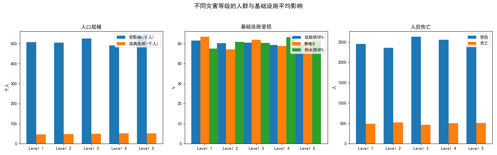
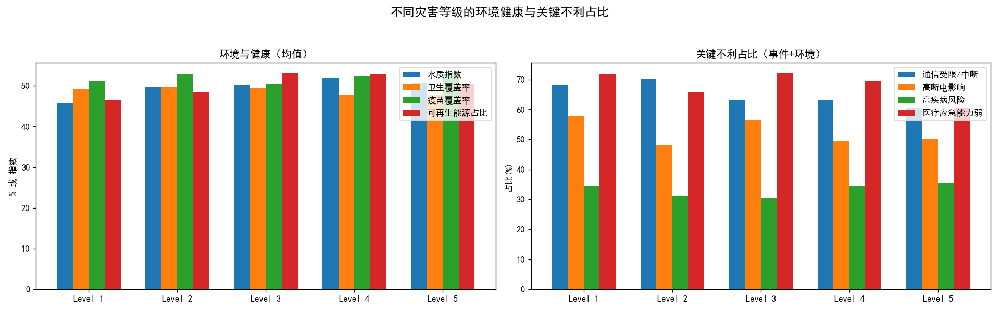

# 全球灾害等级下，后续灾害对人和环境的持续负面影响分析与建议

## 摘要
基于数据库中“灾害事件”“环境与健康”等表的分级聚合分析，我们发现：
- 人群层面：灾害等级越高，受影响人口与流离失所人口总体上升（Level 5相对Level 1分别+5.49%、+12.12%）；死亡人数小幅上升（+4.41%）。
- 基础设施层面：高等级灾害下供水系统受损占比与平均损坏程度上升（高供水损坏率从47.12%升至54.95%；均值提升至51.69%），但电力中断严重占比略降（>=50%断电的事件占比从57.59%降至50%），通信受限占比也下降（从68.06%降至60.40%）。
- 环境与健康层面：高等级灾害往往伴随部分改善（碳排放减少、可再生能源占比与水质指数提升、医疗应急能力弱的占比显著下降），但卫生覆盖率下降，疾病风险与心理健康援助不足有上行压力。

这表明：后续灾害在高等级情境下仍会对“人群（尤其是流离失所）”与“水务与公共卫生系统”形成更持久的负面影响，而“电力与通信”在应急资源优先投入下恢复相对较快。建议针对性加固与优先投入WASH（水与卫生）能力、长期安置与心理健康支持，以及以分布式清洁能源与冗余通信体系作为韧性底座。

## 数据与方法
- 数据源：SQLite数据库 dacomp-027.sqlite
- 关键表与字段：
  - 灾害事件：含“灾害等级(‘Level 1’~‘Level 5’)”与“影响指标”(JSON，含population与infrastructure子项等)。
  - 环境与健康：含水质指数、卫生覆盖率、疫苗覆盖率、碳排放、可再生能源占比、废物管理状态、疾病风险、心理健康援助等；通过灾害ID与灾害事件表关联获取灾害等级。
- 方法步骤：
  - 使用SQL的json_extract对“影响指标”进行解析，按灾害等级进行均值与不利占比聚合。
  - 对环境与健康表与灾害事件表做连接，按灾害等级聚合数值与不利类别占比。
  - 计算Level 5相对Level 1的百分比变化作为衡量高等级灾害的持续影响趋势。

## 关键可视化
- 不同灾害等级的人群与基础设施平均影响


- 不同灾害等级的环境健康与关键不利占比


## 主要发现（以分级统计与变化幅度为依据）
1) 人群负面影响的持续性
- 受影响人口：Level 1≈507,454人 → Level 5≈535,295人（+5.49%）。
- 流离失所人口：Level 1≈46,526人 → Level 5≈52,163人（+12.12%），升幅居各项之首，体现高等级灾害的长期安置挑战。
- 死亡人数：Level 1≈491 → Level 5≈513（+4.41%），整体略增。

2) 基础设施与系统性风险
- 供水系统：平均损坏程度由47.48%升至51.69%，且“高供水损坏率(>=50%)”占比从47.12%升至54.95%——说明供水网络在高强度灾害中更易受持续破坏与修复缓慢，可能成为后续灾害的放大器。
- 电力系统：平均断电比例由53.48%降至50.46%，且“高断电占比(>=50%)”从57.59%降至50%——应急电力恢复相对更快（可能因资源优先与备用电源介入）。
- 通信系统：通信受限/中断占比从68.06%降至60.40%——表明应急通信与冗余链路在高等级灾后被优先投入与快速修复。
- 交通系统：交通受限占比在高等级下仍偏高（Level 5≈70.79%），妨碍物资与人员流动，影响恢复效率。

3) 环境与健康的延续性影响与结构性差异
- 环境与能源：可再生能源占比与水质指数在高等级下提升（可再生能源占比+8.14%，水质指数+10.91%），碳排放下降（-6.04%），显示重建阶段可能更倾向清洁能源与水质治理；同时回收率总体有所提升（47.67%→50.43%）。
- 公共卫生：卫生覆盖率下降（-2.75%），与供水受损叠加，形成对后续疾病风险的压力；疾病高风险占比略升（+3.15%），需警惕。
- 医疗应急能力：弱能力占比显著降低（-15.80%），反映高等级灾害引发更大规模医疗应急资源投入与能力提升。
- 心理健康援助：受限占比小幅上升（约+4.9%），表明心理健康支持仍是薄弱环节，可能在中长期持续影响人群功能恢复与社会稳定。

## 诊断性分析（为什么会这样）
- 资源优先次序效应：高等级灾害激发更大规模与更快的电力与通信应急投入，导致相关不利占比下降；但水务与卫生系统（管网、处理设施）修复复杂、周期长，且受地形与污染影响，故在高等级下呈现更持久的不利。
- 人群迁移路径依赖：大规模基础设施受损与供水、卫生能力下降会延长人口流离失所时间，导致高等级灾害下流离失所人口持续高企。
- 重建结构性机会：高等级灾后重建往往引入更多可再生能源与水质治理资金与项目，推动碳排与水质改善；但心理健康服务与社区层面支持网络的建设相对滞后。
- 传染病风险耦合：卫生覆盖率下降 + 供水受损 + 高密度避难处所叠加，提升疾病风险，解释高等级情境下疾病高风险占比微升。

## 预测性判断（将会发生什么）
- 在未来更高强度或更频繁的灾害情境下：
  - 流离失所人口与受影响人口可能继续攀升，人口安置与社会服务压力增大。
  - 供水与卫生系统的不利将更加凸显，疾病风险偏高的事件比重上升，心理健康问题累积。
  - 电力与通信不利占比或继续缓慢下降（若维持现有优先投入与冗余策略），但交通限制仍将成为物资与医疗到达的瓶颈。

## 规范性建议（我们应该做什么）
1) WASH与供水管网韧性优先
- 预置移动水处理设备与管网旁路修复包；在Level 4–5情境下，当“高供水损坏率”>55%时，立即启动WASH增援机制。
- 建立模块化卫生设施与应急污水处理单元，压制卫生覆盖率的下行。
- 设计韧性供水：分区隔离阀、关键节点冗余泵站、地表水/地下水双源切换方案。

2) 长期安置与心理健康支持体系
- 流离失所人口持续高企需“以居住为先”的安置策略：过渡性住房+现金援助+就业衔接，减少长期依赖。
- 扩展心理健康与精神社会支持（MHPSS）：社区志愿者培训、远程心理咨询、学校与社区中心开设心理辅导点，形成多层级支持网络。

3) 分布式清洁能源与冗余通信
- 推进微电网、太阳能+储能等分布式电力，锁定关键设施（医院、水厂、避难所）以保障“高断电事件”中的关键负载。
- 建立冗余通信链路：卫星通信、便携式中继、网状网络，确保在通信受限事件中维持协调能力。

4) 交通与供应链保障
- 对交通受限概率高的区域预置桥梁快速修复组件、便携路面加固设备，设置应急物流枢纽与无人机配送作为补充手段。
- 物资调度算法侧重“多节点-分布式储备”，减少单点失效对响应的影响。

5) 医疗与公共卫生增援
- 在疾病高风险事件（>34%）中，优先投放疫苗、清洁用水与卫生包，部署移动诊所；将MHPSS纳入医疗包的标准配置。
- 维持医疗应急能力的高水平，形成“常态化演练+战备库存+跨区域互援”机制，延续高等级灾后能力提升的正向趋势。

## 监测与触发阈值（KPI）
- 高供水损坏率(>=50%)：作为WASH增援触发指标，目标在灾后7日内将该占比降低≥10个百分点。
- 通信受限占比：目标在灾后72小时内降至≤60%，保持冗余链路生效。
- 卫生覆盖率与疾病高风险占比：设定灾后14日目标，卫生覆盖率恢复到≥49%，疾病高风险占比≤32%。
- 心理健康援助受限占比：灾后30日内降至≤32%，并保持下降趋势。

## 方法可复用性与代码片段
以下为本次分析中用于绘图的Python代码片段（完整脚本已在当前目录运行生成图片），特别包含中文字体与负号设置行：
```python
import matplotlib.pyplot as plt

# 中文与负号设置
plt.rcParams['font.sans-serif'] = ['SimHei']
plt.rcParams['axes.unicode_minus'] = False

# 示例：按灾害等级绘制受影响人口与流离失所人口的对比柱状图
levels = ['Level 1','Level 2','Level 3','Level 4','Level 5']
affected = [507454, 505208, 526294, 491188, 535295]
displaced = [46526, 48681, 48867, 52132, 52163]

import numpy as np
x = np.arange(len(levels))
w = 0.35
plt.figure(figsize=(8,4))
plt.bar(x - w/2, np.array(affected)/1000, width=w, label='受影响(千人)')
plt.bar(x + w/2, np.array(displaced)/1000, width=w, label='流离失所(千人)')
plt.xticks(x, levels)
plt.ylabel('千人')
plt.title('不同灾害等级的人口影响对比')
plt.legend()
plt.tight_layout()
plt.savefig('示例_人口影响对比.png')
```
说明：本报告中使用的两张图“灾害等级_人群与基础设施均值.png”“灾害等级_环境健康与不利占比.png”已在当前目录生成。

## 局限性与注意事项
- 数据为已工程化的统计快照，未进行数据清洗；结论基于分级均值与占比，未深入到事件时序与因果识别。
- 环境健康指标的改善（如水质指数）可能受项目投入与抽样范围影响；需结合地区差异与项目投入强度做更细分评估。

## 结论
高等级灾害在后续阶段对“人口流离失所与供水/卫生系统”形成更持久的负面影响，叠加心理健康支持不足与疾病风险，构成中长期挑战。与此同时，电力与通信在优先投入下恢复较快，重建阶段出现清洁能源占比提升与碳排下降。建议将韧性底座（分布式清洁能源与冗余通信）与WASH能力建设置于高等级灾害响应与重建的核心，并同步强化长期安置与心理健康服务，以降低持续负面影响并提升整体恢复质量。
