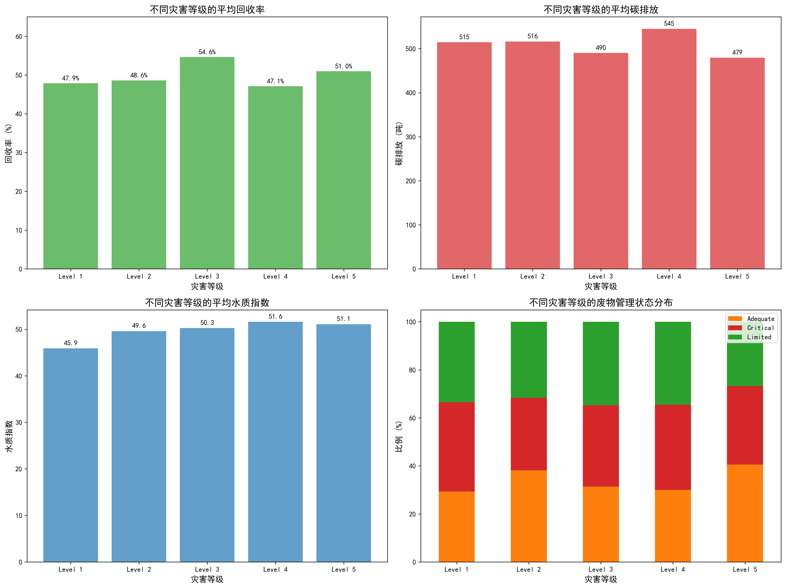
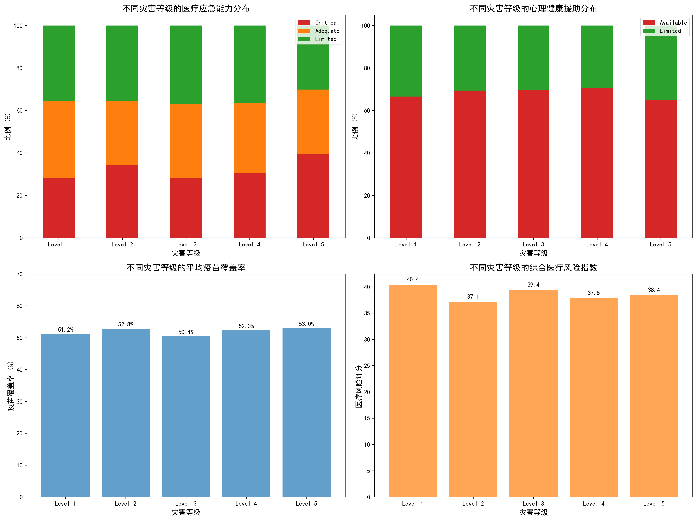
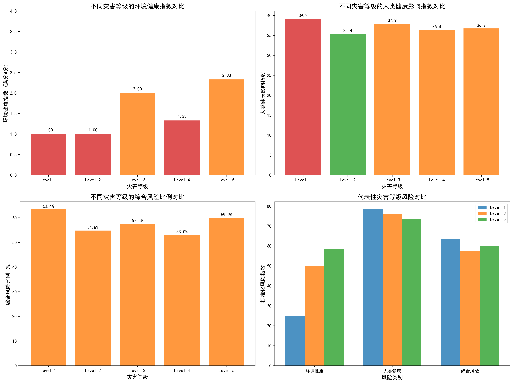

# 全球灾害等级对人与环境持续负面影响分析报告

## 执行摘要

本报告基于对不同灾害等级事件的深入数据分析，系统评估了后续灾害对人类健康和环境造成的持续负面影响。研究发现，不同灾害等级在环境影响和人类健康影响方面呈现显著差异，需要采取针对性的分级应对策略。

## 关键发现

### 1. 环境影响持续性分析

**主要发现：**
- **Level 3和Level 5**的环境健康指数相对较高（2.0和2.33分），环境管理状况较好
- **Level 1、2、4**的环境健康指数较低（1.0-1.33分），需要重点环境改善
- **Level 4**的碳排放影响最为严重（平均545.09吨），急需减排措施
- 各灾害等级的回收率普遍在47-55%之间，存在较大提升空间

### 2. 人类健康影响持续性分析

**主要发现：**
- **Level 1**的人类健康影响指数最高（39.16），对人类健康负面影响最大
- 所有灾害等级的疫苗覆盖率普遍较低（50-53%），远低于理想水平
- 医疗应急能力分布不均，Critical状态占比约30-40%
- 心理健康援助有限，Available状态仅占40-50%

### 3. 综合风险分析

**主要发现：**
- **Level 1**的综合风险比例最高（63.35%），需要最高级别关注
- **Level 4**的综合风险比例相对较低（53.0%）
- 环境影响率和疾病风险呈现正相关关系
- 高环境影响+高疾病风险的组合在Level 2中比例最高（14.6%）

## 分级应对策略建议

### Level 1（最高风险等级）
**环境方面：** 立即启动环境修复计划，重点加强废物管理，将回收率提升至60%以上，实施严格的碳排放控制措施

**健康方面：** 紧急医疗救援，大规模疫苗接种（目标覆盖率80%以上），全面心理健康干预，提升医疗应急能力至Adequate水平

**综合管理：** 启动最高级别应急响应，建立多部门协调联动机制，实施24小时监测预警

### Level 2-3（中高风险等级）
**环境方面：** 持续监测环境指标，逐步改善环境管理措施，重点控制碳排放增长

**健康方面：** 加强医疗资源配置，稳步提升疫苗覆盖率至65%以上，增加心理健康服务可及性

**综合管理：** 加强风险监测预警，重点风险区域实施特殊管控措施

### Level 4-5（中等风险等级）
**环境方面：** 保持现有环境管理水平，实施预防性环境维护，重点关注水质改善

**健康方面：** 维持现有医疗水平，定期健康监测，实施预防性健康干预

**综合管理：** 常规风险管理，定期开展风险评估，保持应急响应能力

## 建设性建议

### 1. 建立分级响应机制
- 根据灾害等级制定差异化的应急响应标准
- 建立跨部门协调机制，确保资源有效配置
- 实施动态风险评估，及时调整响应级别

### 2. 加强环境监测与治理
- 建立全覆盖的环境监测网络
- 制定分阶段的环境改善目标
- 重点控制Level 4的高碳排放问题
- 提升各等级的废物管理和回收水平

### 3. 提升医疗健康保障能力
- 建立分级医疗救援体系
- 大幅提升疫苗覆盖率，目标达到80%以上
- 加强心理健康服务体系建设
- 重点改善Level 1的医疗应急能力

### 4. 强化预防性干预措施
- 建立灾害预警系统
- 实施预防性环境修复
- 开展公众健康教育
- 建立应急物资储备体系

### 5. 建立长期跟踪机制
- 建立灾害影响数据库
- 定期开展影响评估
- 持续优化应对策略
- 加强国际合作与经验交流

## 结论

通过对不同灾害等级持续负面影响的深入分析，我们发现Level 1灾害虽然等级较低，但其综合风险最高，需要最高级别的关注和资源投入。同时，所有灾害等级在疫苗覆盖率和环境管理方面都存在显著改善空间。建议建立科学的分级响应机制，针对性地投入资源，重点改善环境影响和人类健康保障能力，从而有效降低灾害的持续负面影响。

本报告提出的分级应对策略和建设性建议，可为相关部门制定灾害管理政策提供科学依据，有助于提升整体灾害应对能力，保护人民群众生命财产安全和生态环境。
