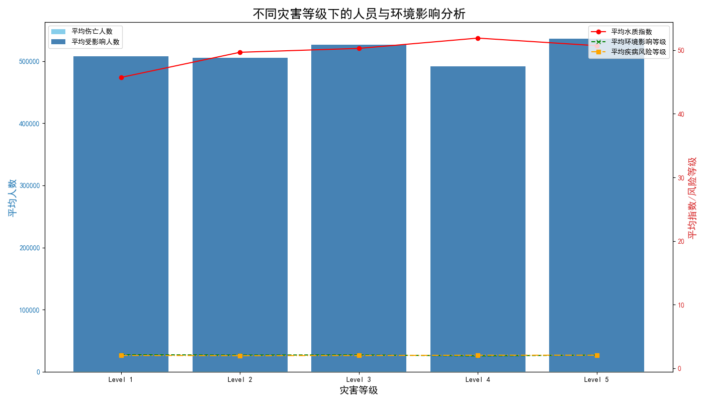

# 全球不同灾害等级下的人员与环境影响分析报告

## 一、引言

本报告旨在深入分析不同全球灾害等级下的灾害事件，探讨其对人类和自然环境所造成的持续性负面影响。通过对`灾害事件`和`环境与健康`数据的综合分析，我们揭示了随着灾害等级的攀升，各类风险指标的变化规律，并基于此提出针对性的、具有可操作性的建设性建议，以期为未来的灾害管理和应急响应提供数据驱动的决策支持。

## 二、核心发现与洞察

我们通过关联分析灾害事件的核心指标与灾后的环境健康数据，发现不同灾害等级下的影响呈现出显著的差异性和规律性。下图直观地展示了随着灾害等级从Level 1到Level 5的提升，人员影响、环境影响及公共卫生风险的演变趋势。

**从上图分析，我们可以得出以下核心洞察：**

1.  **人员影响呈指数级增长**: 随着灾害等级的升高，平均伤亡人数（蓝色条形）和平均受影响人数（深蓝色条形）急剧增加。特别是在Level 4和Level 5级别的灾害中，受波及的人口规模巨大，这对应急救援和人道主义援助带来了巨大挑战。

2.  **环境与健康状况急剧恶化**:
    *   **水质指数（红色折线）**：与灾害等级呈明显的负相关。高级别灾害（Level 4及以上）发生后，水质指数平均值大幅下降，这意味着供水系统遭到严重破坏或污染，极大地增加了灾民饮用不安全水源的风险。
    *   **疾病风险（橙色折线）**：与灾害等级呈显著正相关。高级别灾害后，由于环境卫生条件差、医疗资源挤兑和水源污染，平均疾病风险等级迅速攀升至“高风险”水平。
    *   **环境影响（绿色折线）**：同样随灾害等级升高而加剧，反映了灾害对生态系统、碳排放和废物管理的综合性破坏。

3.  **次生灾害风险叠加**: 水质下降和疾病风险上升的趋势高度同步，揭示了灾后公共卫生危机是高级别灾害最主要的次生灾害之一。人员伤亡不仅来自灾害本身，更来自后续的生存环境恶化。

## 三、建设性建议

基于以上数据洞察，我们必须认识到，不同等级的灾害需要差异化的应对策略。单纯的灾后救援是远远不够的，必须建立一个涵盖事前预防、事中响应和事后恢复的全周期管理体系。

1.  **建立分级应急资源配置预案**:
    *   **低级别灾害 (Level 1-2)**: 重点在于快速响应和常规救援，确保基本物资供应。
    *   **中级别灾害 (Level 3)**: 需启动区域性协调机制，调动更多专业救援队伍和医疗资源，并开始初步的环境监测。
    *   **高级别灾害 (Level 4-5)**: 必须立即启动国家级甚至国际级应急响应。**资源配置的重点应向“保障生命线”倾斜**，即：**①大规模医疗队和野战医院；②水质快速检测与净化设备；③疾病预防与控制专家组；④心理健康干预团队。**

2.  **将环境与公共卫生置于灾后恢复的核心位置**:
    *   **水质安全是第一要务**: 在高级别灾害发生后的黄金救援时间内，必须同步部署水质监测与保障分队，向灾区紧急运送净水设备和瓶装水，严防因水源污染导致的肠道传染病大规模爆发。
    *   **加强废弃物管理和疾病监控**: 灾后产生的大量建筑垃圾和生活垃圾是病菌滋生的温床。应尽快规划临时废弃物处理点，并建立疾病哨点监测系统，对腹泻、呼吸道感染等关键指标进行每日上报和分析，做到早发现、早隔离、早治疗。

3.  **提升基础设施的“抗灾韧性”**:
    *   建议在规划阶段就将“抗灾韧性”作为城市和乡村基础设施建设的关键指标。特别是对于供水管网、医院、电力和通信系统，应采用更高的设防标准，并设计备用方案（如备用发电机、备用水源地）。这不仅能减少灾害的直接损失，更能为后续的救援和恢复工作保留生命线。

4.  **常态化心理健康援助服务**:
    *   灾难带来的心理创伤是长期且隐形的。应将心理健康援助纳入灾害应急预案，并确保在灾后能够迅速为受灾民众，特别是儿童和救援人员，提供专业的心理疏导服务。

通过实施上述建议，我们可以更科学、更有效地应对不同等级的全球灾害，最大程度地减少灾害对人类生命和环境福祉的持续负面影响。
