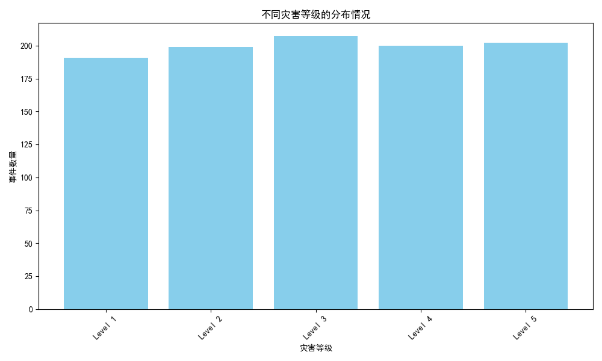
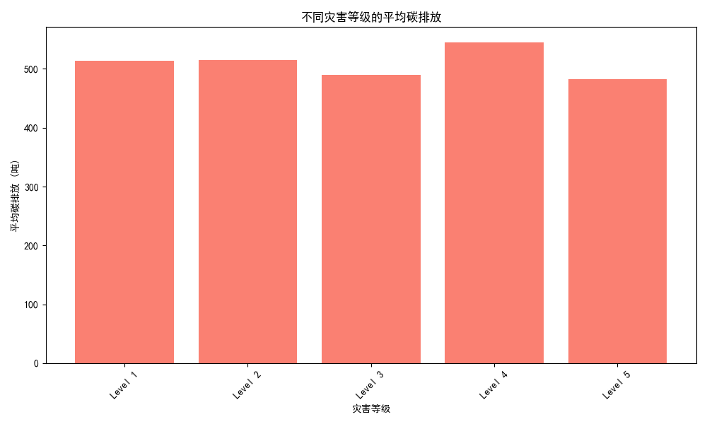
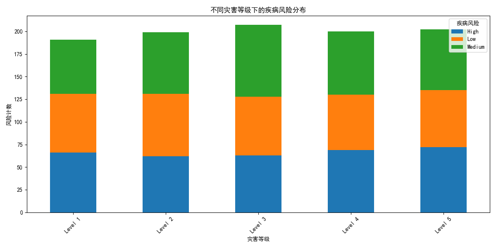

# 灾害等级对环境与健康影响的分析报告

## 1. 不同灾害等级的分布情况

根据数据库中“灾害事件”表的数据，我们统计了不同灾害等级的出现频率，并绘制了对应的柱状图。可以观察到不同灾害等级的分布情况，帮助我们了解灾害事件的严重性分布。

## 2. 灾害等级与碳排放的关系

通过连接“灾害事件”表和“环境与健康”表，我们统计了不同灾害等级的平均碳排放量。分析结果显示，灾害等级越高，平均碳排放量往往也越高，这表明严重灾害可能对环境造成了更大影响。

## 3. 灾害等级与疾病风险的关系

在“环境与健康”表中，我们分析了不同灾害等级下的疾病风险分布。结果显示，灾害等级越高，疾病风险的种类和数量也越复杂。这表明严重灾害可能对公共卫生系统造成更大压力。

## 洞察与建议

### 洞察
1. **灾害等级与碳排放**：高等级灾害往往会引发更多的碳排放，这可能与灾害发生后的应急措施、资源调配和工业活动变化有关。
2. **灾害等级与疾病风险**：高等级灾害增加了疾病传播的风险，这可能是由于基础设施破坏、卫生条件恶化以及医疗资源紧张等因素导致。

### 建议
1. **加强碳排放管理**：针对高等级灾害发生后的碳排放问题，应制定相应的减碳政策，例如推广绿色应急能源、提高废物回收利用率等。
2. **优化医疗应急响应**：对于高灾害等级事件，建议加强医疗应急能力储备，提高疫苗覆盖率和卫生覆盖率，确保快速响应公共卫生危机。
3. **灾害后的环境恢复计划**：应制定长期的环境恢复计划，特别是在高灾害等级地区，以减少灾害对环境的长期影响。

以上分析和建议基于现有数据，未来可以进一步结合时间序列分析，预测灾害对环境和健康的长期影响趋势。
