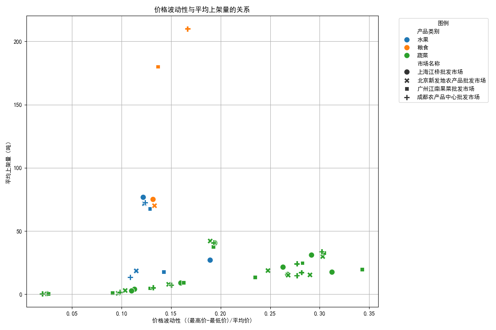

# 农产品市场分析报告：价格趋势与供应关系洞察

## 摘要

本报告旨在深入分析农产品市场的动态，具体包括两个核心方面：一是**各产品类别在主要市场的平均价格环比增长趋势**，二是**价格波动性对市场供应量（上架量）的影响**。通过对蔬菜、水果、粮食三大类别在四大批发市场（北京、上海、广州、成都）的数据进行分析，我们旨在揭示不同品类的市场特性，并为市场管理者、政策制定者及供应商提供数据驱动的策略建议。

**核心洞察:**
1.  **价格增长趋势呈现市场与品类差异**：各产品类别在不同市场的价格环比增长率表现出不同的波动模式，这反映了区域性供需关系、物流效率和季节性因素的综合影响。
2.  **价格波动性对供应量的影响机制因品类而异**：
    *   对于**粮食和蔬菜**，价格波动性与供应量呈现显著的**正相关**关系。这表明，价格的大幅波动（通常伴随着价格上涨的预期）是激励供应商增加市场投放量的重要驱动力。
    *   对于**水果**，二者关系呈**弱负相关**。这暗示水果的供应更多地受到其自身的生产周期、季节性和储存条件的刚性约束，短期价格波动对供应决策的影响较小，甚至可能因为市场不确定性而导致供应略有收缩。

---

## 一、各产品类别平均价格环比增长趋势分析

为了解价格的动态变化，我们计算了各产品类别（蔬菜、水果、粮食）在四大主要批发市场每月平均价格的环比增长率。如下图所示，价格趋势表现出复杂性和多样性。

**图表解读与分析：**
*   **波动性显著**：从图中密集的折线波动可以看出，所有市场的各类产品价格都经历了频繁的环比正负增长交替，表明农产品价格具有天然的短期不稳定性。
*   **市场间差异**：不同市场的价格波动节奏不尽相同。例如，某些月份，北京市场的某种蔬菜价格可能在上涨，而广州市场则可能在下跌，这反映了不同地区供需状况的差异。
*   **品类间差异**：粮食作物的价格增长率波动幅度相对蔬果可能较小（具体需看图中数值），这通常与其较长的储存周期和国家宏观调控有关。蔬菜和水果作为鲜活农产品，其价格对短期气候、物流和消费变化更为敏感。

这一分析表明，任何单一的价格调控政策都难以适应所有市场和品类。市场参与者需要根据特定市场的具体情况，制定灵活的定价和采购策略。

---

## 二、价格波动性对供应量的影响分析

价格不仅是交易的结果，更是引导生产和供应的关键信号。我们通过分析“价格波动性”（以`(最高价-最低价)/平均价`作为衡量指标）与“平均上架量”之间的关系，来探究价格信号如何影响供应商的行为。

上图的散点图直观地展示了价格波动性与平均上架量之间的关系，并通过计算相关系数，我们得到了更精确的量化结论：

*   **粮食 (相关系数: 0.78)**：存在强正相关。
*   **蔬菜 (相关系数: 0.67)**：存在中等强度的正相关。
*   **水果 (相关系数: -0.20)**：存在弱负相关。

**分析与洞察：**
1.  **粮食与蔬菜（正相关）：“价格越高，卖得越多”**
    对于粮食和蔬菜，价格波动越大，市场供应量也越大。这完全符合经典的经济学供需理论：当价格出现剧烈波动，特别是价格走高时，生产者和经销商有强烈的动机将库存或新采收的作物投入市场，以抓住高价机会实现利润最大化。价格的不确定性本身就是一种“风险与机遇并存”的信号，驱动着供应量的增加。

2.  **水果（弱负相关）：“价格波动大，供应反趋谨慎”**
    与粮食和蔬菜不同，水果的供应对价格波动的反应呈现微弱的负相关。这揭示了水果作为一种特殊商品的属性。其供应量主要受限于以下刚性因素：
    *   **生产周期长**：果树的生长和结果需要较长周期，无法像部分蔬菜一样快速响应市场价格变化。
    *   **季节性强与保鲜期短**：大多数水果有固定的成熟季节，且易腐烂，这决定了其供应的刚性。
    *   **风险规避**：剧烈的价格波动可能意味着市场信息混乱或存在极端天气等风险。在这种不确定的环境下，果农或供应商可能会选择更稳妥的策略，如延迟采收（如果可能）、转向更稳定的合同订单或直销渠道，而非将易腐坏的产品投入一个价格不稳定的批发市场，从而导致上架量略有下降。

---

## 三、策略建议

基于以上分析，我们为不同市场参与方提出以下切实可行的建议：

#### **1. 对市场管理者与政策制定者：**
*   **实施品类差异化管理**：
    *   **稳定粮蔬供应**：对于粮食和蔬菜，核心在于**稳定价格预期**。通过发布准确及时的市场供需信息、建立价格平抑基金、优化全国物流网络以降低运输成本，可以有效平抑价格过度波动，从而保障供应的稳定性。
    *   **增强水果供应链韧性**：对于水果，政策重点应从单纯的价格干预转向**增强供应链的抗风险能力**。鼓励和支持冷链物流、推广先进的保鲜和仓储技术、扶持产地预处理中心建设，能有效延长水果的销售窗口期，降低损耗，从而平滑供应。

*   **鼓励长期合作**：推动批发市场、大型商超与水果产地建立长期供销合作关系或订单农业，这能让果农获得稳定的销售渠道和价格预期，降低其对短期市场波动的过度反应。

#### **2. 对供应商（农民、合作社、经销商）：**
*   **粮食与蔬菜供应商**：
    *   应密切关注市场价格动态，利用价格预测工具，灵活制定销售计划，在价格高位时适当增加出货量以提升利润。
    *   同时，可以通过农业期货、期权等金融衍生品工具，对冲价格下跌的风险，实现稳健经营。

*   **水果供应商**：
    *   **多样化销售渠道**：减少对单一批发市场的依赖，积极开拓电商、社区团购、采摘园等直销渠道，建立自己的品牌，掌握定价主动权。
    *   **提升产品附加值**：通过分级、包装和深加工，延长产业链，创造更多价值，抵御鲜果价格波动的风险。

## 结论

农产品市场的价格与供应关系并非一成不变，而是根据产品自身的生物学特性、储存能力和市场结构呈现出显著差异。**价格机制在调控粮食和蔬菜等相对标准化的产品供应方面发挥着核心作用，而对于水果这类季节性强、易腐坏的非标品，供应链的稳定性和韧性则更为关键。** 理解并应用这些差异化的洞察，是提升我国农产品市场效率、保障供应稳定和促进农民增收的核心所在。
