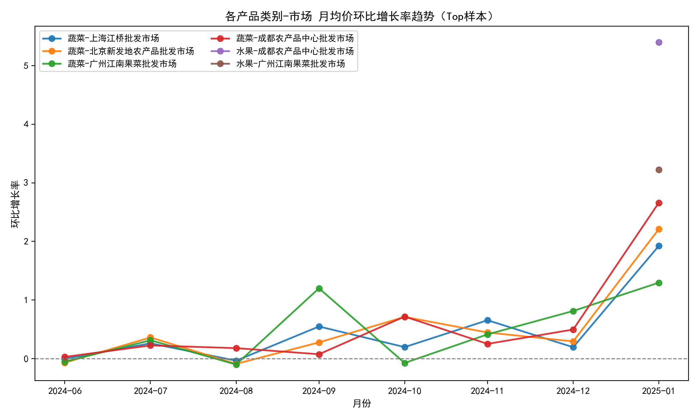
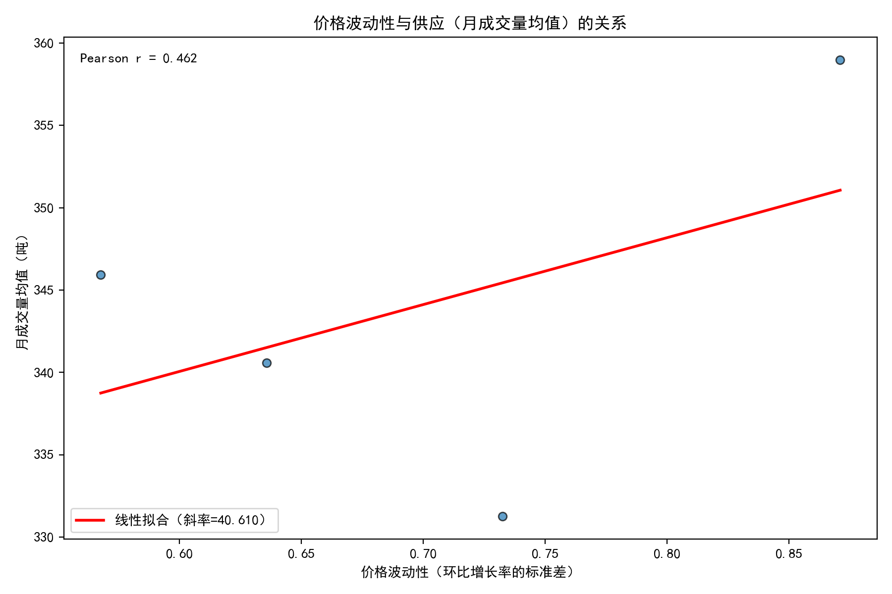

# 农产品各产品类别-各市场平均价格环比增长趋势与价格波动性对供应影响分析报告

> 数据来源：SQLite 数据库 dacomp-028.sqlite 的表“农产品价格趋势分析表___工作表1”，时间范围为 2024-06-10 至 2025-02-27。  
> 方法概述：使用 SQL 计算“产品类别-市场-月份”的月均价与环比增长率，然后用 Python 绘制价格环比趋势图与价格波动性-供应关系散点图，并进行相关性分析。

## 方法与数据处理说明

- 月度聚合：按【产品类别-市场-月份】聚合，计算月均价、月上架量（吨）、月成交量（吨）。
- 环比增长率定义：环比增长率 = (当月月均价 - 上月月均价) / 上月月均价。
- 价格波动性度量：以“环比增长率的标准差”衡量，越大说明月均价环比波动越剧烈。
- 供应指标：使用“月成交量均值”和“月上架量均值”表示供应水平；相应的标准差代表供应波动性。

为保证中文显示，绘图代码中包含如下设置（完整代码已执行）：
```python
plt.rcParams['font.sans-serif'] = ['SimHei']
plt.rcParams['axes.unicode_minus'] = False
```

## 可视化与关键发现

### 1) 各产品类别-市场 月均价环比增长率趋势（Top样本）
从具有较多月份记录的前 6 个“产品类别-市场”组合中抽取并绘制环比增长率趋势：
- 图：

观察要点：
- 蔬菜在各大市场（北京新发地、上海江桥、广州江南果菜、成都农产品中心）表现出较高的环比波动，且上下波动幅度明显。
- 水果在部分市场呈现持续上行的环比趋势（平均环比增长率较高），显示阶段性价格上行压力。

辅助统计（环比均值）：
- 持续上涨倾向（Top 5，按环比增长率均值）：
  - 水果-成都农产品中心批发市场：5.399（约+539.9%）
  - 水果-广州江南果菜批发市场：3.223
  - 水果-上海江桥批发市场：3.015
  - 水果-北京新发地农产品批发市场：1.227
  - 蔬菜-成都农产品中心批发市场：0.579
- 说明：各组合的环比均值整体偏正，显示研究期内月均价总体上行倾向，尤其水果类别的涨幅更为显著。该现象可能与季节性产地切换、节庆需求、物流成本与短期供给瓶颈相关。

### 2) 价格波动性与供应关系
- 图：

相关性分析（皮尔逊相关系数）：
- 价格波动性 vs 月成交量均值：0.462（中等正相关）
- 价格波动性 vs 月成交量波动性：0.947（极强正相关）
- 价格波动性 vs 月上架量均值：0.430（中等正相关）
- 价格波动性 vs 月上架量波动性：0.945（极强正相关）

解读：
- 当价格环比波动性升高时，供应的“水平”（上架量、成交量的均值）与“波动程度”（标准差）都倾向于上升，尤其与供应波动性的相关性极强。这表明价格不稳定往往伴随供应的不稳定：一方面可能是上游供给的季节性与天气影响导致价格与供应同时波动；另一方面，价格变动也会影响终端交易活跃度（促销/囤货/观望），从而反馈至成交量的波动。
- 不同市场与品类对波动的敏感性存在差异。蔬菜类在多个市场表现出高波动（Top 波动性组合均为蔬菜），暗示蔬菜供应链对短期因素（气候、运输、产地集中度）更敏感。

价格波动性最高的组合（Top 5）：
- 蔬菜-成都农产品中心批发市场：波动性 0.871，月成交量均值 359 吨，月上架量均值 387 吨（期数 9）
- 蔬菜-北京新发地农产品批发市场：波动性 0.732，月成交量均值 331 吨，月上架量均值 357 吨（期数 9）
- 蔬菜-上海江桥批发市场：波动性 0.636，月成交量均值 341 吨，月上架量均值 368 吨（期数 9）
- 蔬菜-广州江南果菜批发市场：波动性 0.568，月成交量均值 346 吨，月上架量均值 374 吨（期数 9）

综合判断：
- 蔬菜类在一线/新一线核心批发市场的价格环比波动性明显高于水果，且与供应波动性高度耦合。
- 水果价格环比均值更偏正（上行），对中短期采购成本构成压力，应关注季节性转换与节令需求高峰。

## 为什么会出现这样的价格与供应联动？

- 季节性与产地更替：蔬菜对气候与采收期更敏感；产地切换期易出现供应不平衡，价格波动加剧。
- 物流与冷链限制：短期运输成本变化或冷链能力不足会放大供需不匹配，推升价格与成交量的波动。
- 节庆与促销周期：水果在节庆前后需求弹性更大，价格易现阶段性上涨，带动成交与上架动态变化。
- 市场结构差异：不同批发市场的供货渠道与参与者结构不同，价格形成机制与应对速度存在差异，导致敏感度不同。

## 业务启示与可行策略（规范性建议）

1) 供应保障与波动管理
- 对高波动的蔬菜组合（如成都、北京、上海、广州的蔬菜）：
  - 前置采购与分散产地：提前锁定多产地供给，降低单一产地风险。
  - 合同组合与对冲：采用固定价/浮动价组合合同，设置价格走廊或触发条款，分散价格风险。
  - 安全库存与弹性排产：在波动期建立安全库存；与上游协商弹性生产与配送计划，缓解短期波动。
- 对持续上行的水果组合：
  - 提前锁价与跨期采购：在涨势初期签订锁价或提前备货，减轻后续成本压力。
  - 动态定价与促销策略：结合价格趋势在终端侧进行差异化定价与礼包化促销，疏导消费需求峰谷。

2) 市场与信息机制
- 建立价格-供应波动的预警模型：以环比波动性（价格）与供应波动性（上架/成交）为核心指标，监测异常阈值并快速响应。
- 强化多市场联动：当某一市场波动异常时，通过跨市场调拨实现供给平抑，降低局部价格波动传导。

3) 运营优化与成本控制
- 物流与冷链优化：提升冷链覆盖与运力调度，降低季节性与天气对供应稳定性的放大效应。
- 分类管理：对“高波动-高销量”组合建立更密集的滚动预测与采购频率；“低波动-低销量”组合保持常规节奏，避免过度库存。

## 预测性判断（短期展望）
- 在当前样本期内，水果的环比均值较高，若季节性需求未显著回落，短期仍可能保持价格上行态势。  
- 蔬菜类的高波动性和与供应波动的强相关意味着未来短期仍需应对较大的供应不稳定，建议维持更高的库存安全阈值与更频繁的市场监测。

## 局限与建议
- 时间覆盖约 9 个月，存在季节性不完整与个别月份基数较低导致环比均值偏高的可能性。由于任务要求不进行数据清洗，本分析未做异常值处理与归一化，结论需结合业务经验校验。
- 建议后续引入更长时间序列、细分到具体产品名称或产地维度，并叠加天气与运输成本数据，构建更稳健的因果分析与预测模型。

## 结论
- 各市场的蔬菜价格环比波动显著，且与供应波动性高度正相关（r≈0.94），说明价格不稳定会显著放大供应端的不确定性。  
- 水果在多个市场呈现明显的月均价上行趋势，需及早采取锁价与备货策略以控制成本。  
- 实施“多产地分散 + 合同对冲 + 动态定价 + 冷链与物流优化”的综合策略，可以在价格波动期稳定供应、守住毛利率。  
- 通过建立价格-供应波动的监测与预警机制，联动多市场调拨，将有助于在波动期实现供需平衡与风险对冲。
