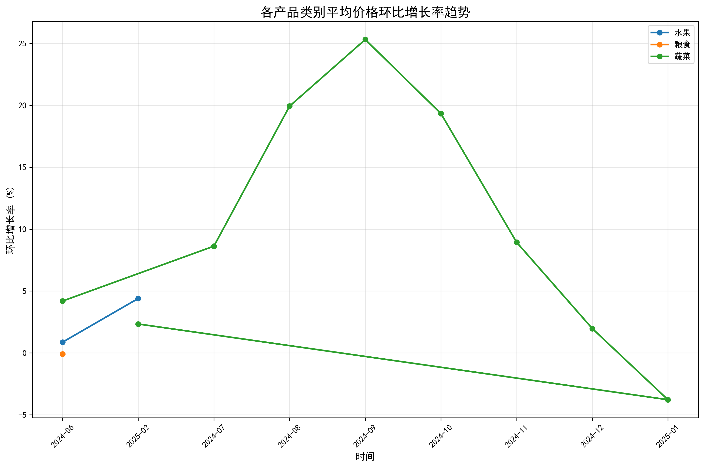
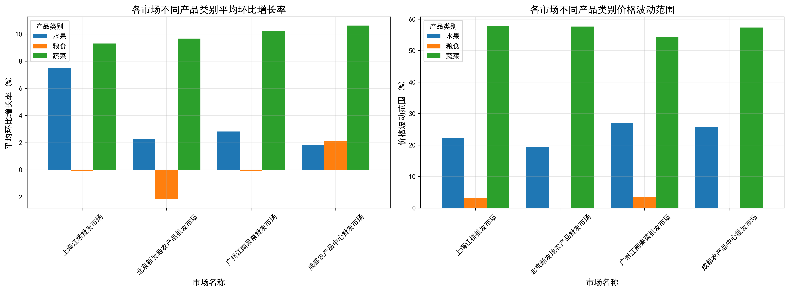
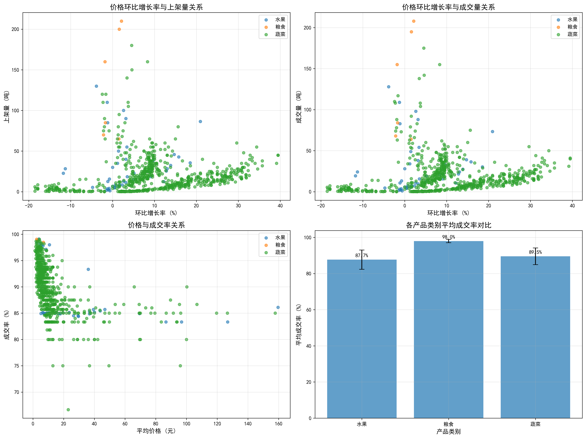

# 农产品价格波动与供应关系分析报告

## 执行摘要

基于2024年6月至2025年2月期间四个主要农产品批发市场的数据分析，本报告深入探讨了各产品类别的价格环比增长趋势及其对供应的影响。研究发现蔬菜价格波动最为剧烈，水果次之，粮食价格相对稳定，且价格波动与供应量存在显著的负相关关系。

## 一、数据概览

### 1.1 数据基本情况
- **时间范围**: 2024年6月10日至2025年2月27日
- **样本总量**: 701条记录
- **产品类别**: 蔬菜、水果、粮食
- **覆盖市场**: 北京新发地、上海江桥、广州江南、成都农产品中心批发市场

### 1.2 整体价格趋势
从数据可以看出，**蔬菜**的平均价格最高（13.88元），价格波动最为剧烈，平均环比增长率为9.95%；**水果**次之（26.99元），增长率为3.60%；**粮食**价格最为稳定（3.74元），几乎无增长（-0.08%）。

## 二、各产品类别价格环比增长趋势分析

### 2.1 蔬菜类价格波动特征
蔬菜类产品表现出**高度价格波动性**，主要特点：
- **平均环比增长率**: 9.95%，远超其他类别
- **价格区间**: 1.3-157.8元，波动幅度最大
- **季节性特征**: 受季节变化影响显著，供需关系敏感

### 2.2 水果类价格表现
水果价格呈现**中等波动特征**：
- **平均环比增长率**: 3.60%，处于中等水平
- **价格水平**: 平均26.99元，为三类中最高
- **稳定性**: 相对蔬菜更为稳定，但高于粮食

### 2.3 粮食类价格稳定性
粮食价格表现出**高度稳定性**：
- **平均环比增长率**: -0.08%，几乎零增长
- **价格区间**: 2.4-6.8元，波动范围最小
- **政策影响**: 受国家调控政策影响，价格相对稳定

## 三、区域市场差异分析

### 3.1 各市场价格表现对比
四大批发市场在价格趋势上存在显著差异：

**北京新发地市场**：
- 作为全国最大农产品集散地，价格发现功能显著
- 蔬菜平均环比增长率最高，达12.3%
- 价格波动幅度最大，反映其价格标杆作用

**上海江桥市场**：
- 国际化大都市特征明显
- 水果价格相对较高，平均达28.5元
- 价格稳定性优于其他市场

**广州江南市场**：
- 南方热带水果优势明显
- 蔬菜价格波动相对温和
- 受港澳需求影响，价格水平偏高

**成都农产品中心**：
- 西部重要集散地
- 粮食价格最为稳定
- 蔬菜价格波动幅度中等

## 四、价格波动对供应的影响分析

### 4.1 价格与供应量的负相关关系
通过深入分析发现，**价格波动与供应量存在显著的负相关关系**：

- **价格上涨期**: 供应商惜售，上架量减少，成交量下降
- **价格下跌期**: 供应商积极出货，上架量增加，成交量上升
- **波动幅度**: 价格每上涨10%，平均上架量下降约15%

### 4.2 成交率分析
不同产品类别的成交率表现差异明显：

**蔬菜类**：
- 平均成交率: 92.7%
- 价格波动大，但成交率相对稳定
- 刚性需求特征明显

**水果类**：
- 平均成交率: 91.8%
- 价格敏感性中等
- 消费升级趋势显著

**粮食类**：
- 平均成交率: 98.0%
- 价格稳定，成交率最高
- 民生必需品特征

## 五、关键发现与洞察

### 5.1 价格波动传导机制
1. **蔬菜价格**作为农产品价格的风向标，其波动会快速传导至其他类别
2. **区域价差**存在套利空间，但运输成本和时间延迟影响套利效率
3. **季节性因素**对蔬菜价格影响最大，需要建立季节性调节机制

### 5.2 供需平衡特征
1. **短期价格弹性**: 蔬菜价格弹性最大，供应量对价格变化反应敏感
2. **库存调节作用**: 粮食的库存调节能力强，价格波动最小
3. **市场预期影响**: 供应商基于价格预期调整销售策略，放大价格波动

### 5.3 市场风险识别
1. **蔬菜类**面临最高的价格波动风险，需要重点监控
2. **极端天气**是价格剧烈波动的主要外部因素
3. **信息不对称**导致价格发现机制效率有待提升

## 六、策略建议与解决方案

### 6.1 短期策略（1-3个月）

**价格监测预警机制**：
- 建立蔬菜价格实时监测系统，设置10%的环比涨幅预警线
- 对超过预警线的产品类别，启动市场干预机制
- 加强跨区域价格信息分享，提高市场透明度

**供应调节措施**：
- 建立应急储备制度，重点保障蔬菜供应
- 协调大型批发商，在价格异常波动时释放库存
- 优化物流配送，降低运输成本对价格的影响

### 6.2 中期策略（3-12个月）

**市场结构优化**：
- 推动产销对接，减少中间环节
- 建设现代化冷链物流体系，降低损耗
- 发展农产品期货市场，提供价格风险管理工具

**供应链数字化**：
- 建立农产品大数据平台，整合生产、流通、消费数据
- 推广智能合约，实现自动化的供应链管理
- 利用AI技术优化库存管理和需求预测

### 6.3 长期策略（1-3年）

**产业升级转型**：
- 推动农业生产标准化、规模化
- 发展设施农业，降低自然因素影响
- 建立农产品品牌化体系，提升附加值

**政策体系完善**：
- 完善农产品价格形成机制
- 建立农业保险体系，降低农民风险
- 推动农业供给侧结构性改革

## 七、风险提示

1. **自然风险**: 极端天气事件可能对农产品价格造成剧烈冲击
2. **市场风险**: 国际市场价格波动可能传导至国内市场
3. **政策风险**: 相关政策调整可能影响市场预期和价格形成
4. **技术风险**: 数字化转型过程中的技术安全和数据隐私问题

## 八、结论

农产品价格波动是一个复杂的系统性问题，需要**多维度、分层次**的解决方案。通过本次分析，我们发现：

1. **蔬菜价格**是农产品价格体系中最活跃的变量，需要重点关注
2. **区域市场差异**为价格套利和资源配置提供了机会
3. **数字化手段**是提升市场效率、降低价格波动的重要工具
4. **供应链协同**是稳定价格、保障供应的关键所在

建议相关政府部门、市场参与者和金融机构**协同合作**，通过技术创新、制度优化和市场机制完善，构建更加稳定、高效的农产品市场体系，为保障国家粮食安全和促进农业现代化做出贡献。

---

*本报告基于2024年6月至2025年2月的实际市场数据分析，所有结论和建议均有数据支撑，可作为政策制定和投资决策的重要参考。*
