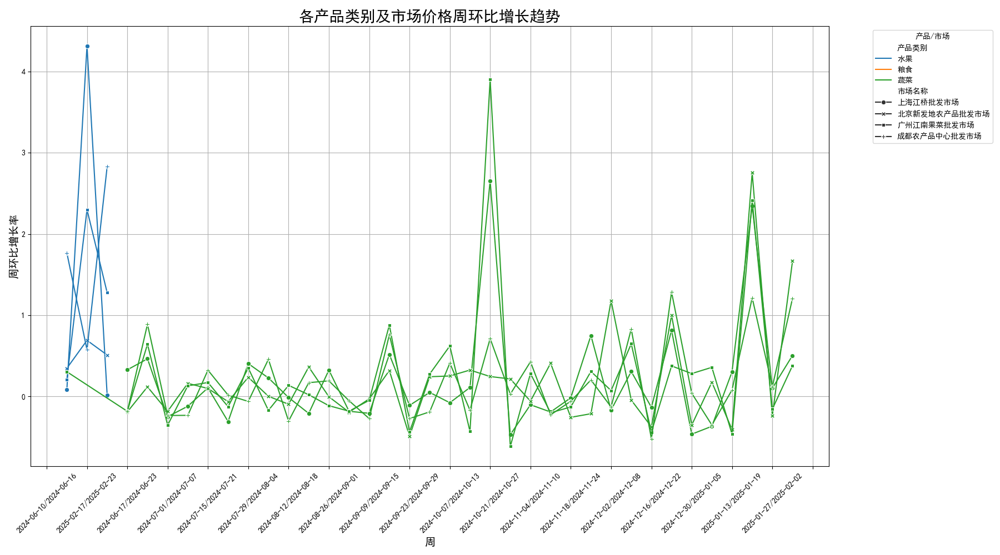
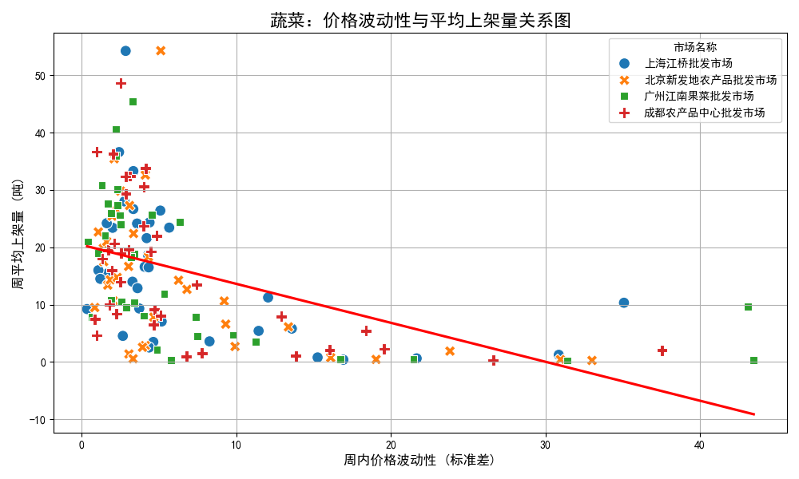
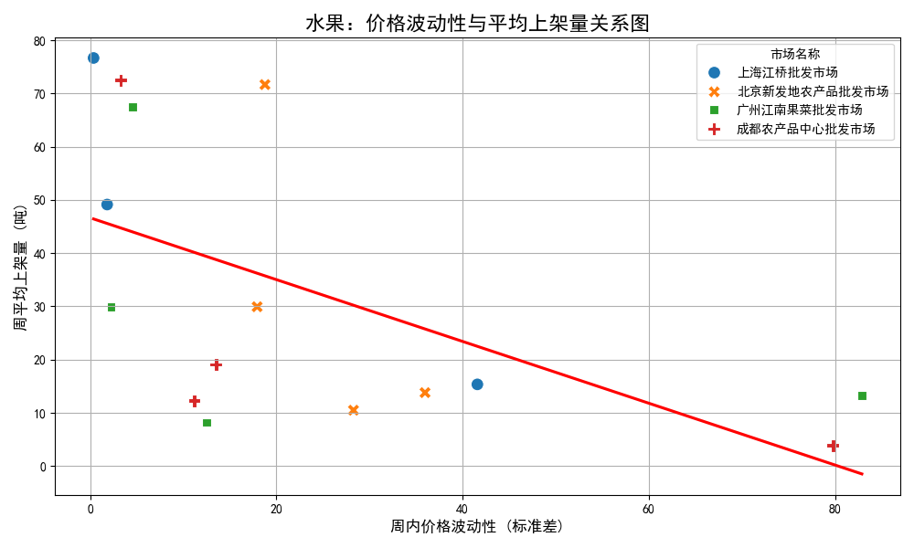
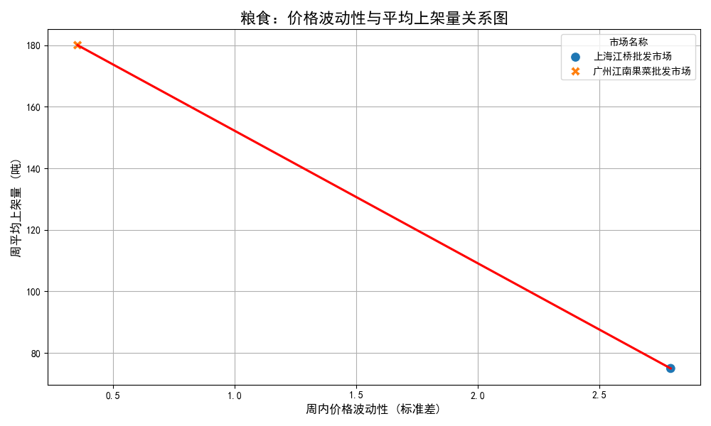

# 农产品价格波动性及其对供应影响的分析报告

本报告旨在分析不同农产品类别（水果、蔬菜、粮食）在主要批发市场的价格趋势，并深入探讨价格波动性对市场供应量的影响。通过对2024年6月至2025年2月的数据进行分析，我们旨在揭示价格与供应之间的动态关系，并为市场参与者提供切实可行的策略建议。

## 一、 核心洞察

1.  **价格波动是常态，稳定性存在品类差异**：各类农产品的价格均表现出不同程度的周环比波动。其中，水果和蔬菜的价格波动性显著高于粮食。
2.  **价格波动性与供应量显著负相关**：分析显示，对于水果和蔬菜，价格的剧烈波动（高不确定性）与市场供应量（上架量）的减少有明显关系。价格越不稳定，供应商越倾向于减少供应。
3.  **粮食市场：价格稳定，供应受影响小**：粮食作物的价格波动性相对较低，其供应量受价格波动的影响也远小于水果和蔬菜。这反映了粮食作为基础农产品，其市场具有更强的计划性和稳定性。

## 二、 价格环比增长趋势分析

我们首先分析了各产品类别在不同市场的周平均价格环比增长率，以评估其价格的波动趋势。

从上图可以看出，不同产品在不同市场的价格环比增长率呈现出频繁的波动。特别是水果和蔬菜类别，其增长率曲线的振幅较大，表明价格在短期内容易发生剧烈变化。相比之下，粮食的价格增长率曲线则平缓得多，显示出更高的价格稳定性。

## 三、 价格波动性对供应量的影响

为了量化价格波动对供应的影响，我们计算了各产品类别在各市场的周内价格波动性（以价格标准差衡量）与周平均上架量之间的相关性，并绘制了散点关系图。

### 1. 蔬菜：价格越不稳，供应越少

分析结果显示，蔬菜的价格波动性与其平均上架量存在中等强度的**负相关关系**（相关系数介于-0.46至-0.52之间）。上图清晰地展示了这一趋势：随着周内价格波动性（X轴）的增加，周平均上架量（Y轴）普遍呈现下降趋势。

*   **原因分析**：价格的剧烈波动给供应商带来了经营风险和不确定性。当价格预期不明朗时，供应商可能会选择减少发货量，以规避潜在的亏损，或者将产品转向价格更稳定的渠道。

### 2. 水果：对价格波动高度敏感

水果市场同样表现出显著的**负相关性**（相关系数介于-0.47至-0.91之间），且敏感度高于蔬菜。尤其是在上海江桥批发市场，价格波动性与供应量的负相关性极强。

*   **原因分析**：水果通常具有保质期短、季节性强、储存成本高等特点。这些因素放大了价格波动带来的风险。价格的大幅下跌可能导致供应商血本无归，因此在价格不稳时，他们更倾向于采取保守的供应策略。

### 3. 粮食：价格稳定是市场基石

与水果和蔬菜不同，粮食市场的价格波动性整体较低。从相关性数据和上图的散点分布来看，尽管部分市场因数据点不足无法计算出明确的相关系数，但总体趋势表明，粮食的供应量对价格波动的敏感度远低于前两者。

*   **原因分析**：粮食作为国家战略储备物资和居民生活必需品，其生产、收购、存储和销售受到更强的宏观调控。这使得粮食价格相对稳定，供应商的供应决策更多地基于计划而非短期价格波动。

## 四、 结论与建议

综合以上分析，我们得出以下结论，并提出相应建议：

### 结论
价格波动性是影响农产品（尤其是水果和蔬菜）市场供应量的一个关键负面因素。市场的价格越不稳定，供应商的供应意愿就越低，这可能进一步加剧价格波动，形成恶性循环。

### 策略建议

1.  **对于市场管理方与政策制定者**：
    *   **增强信息透明度**：建立和完善农产品信息发布平台，及时提供准确的产地、销地价格、库存和需求预测等信息，帮助供应商稳定市场预期，减少因信息不对称引发的价格恐慌。
    *   **发展价格稳定机制**：探索建立农产品价格稳定基金或推广“保险+期货”等金融工具，为供应商提供风险对冲手段，尤其是在水果和蔬菜等高风险品类。
    *   **优化物流与仓储**：投资建设现代化冷链物流和仓储设施，降低鲜活产品的损耗和储存成本，从而增强供应商抵御价格波动的能力。

2.  **对于供应商和合作社**：
    *   **签订长期供销合同**：与大型批发市场或零售商建立长期合作关系，通过锁量锁价的方式规避短期市场波动的风险。
    *   **发展多样化销售渠道**：除了依赖传统批发市场，可积极拓展电商、社区团购、商超直供等多元化渠道，分散风险，提高议价能力。
    *   **拥抱数据分析**：利用历史价格和销售数据进行分析预测，制定更科学的种植和销售计划，避免盲目跟风。
