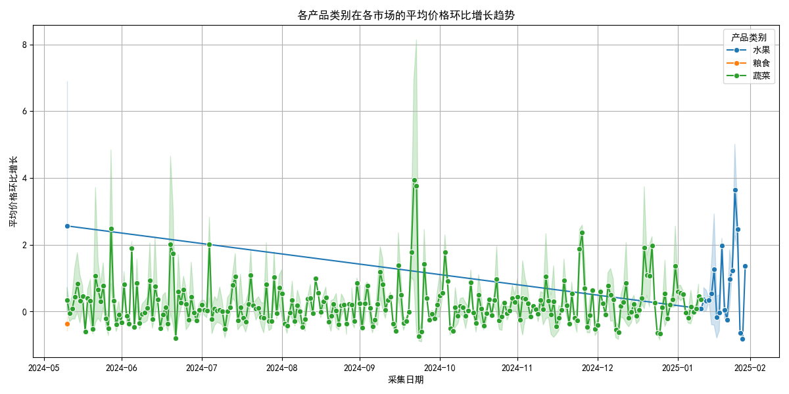
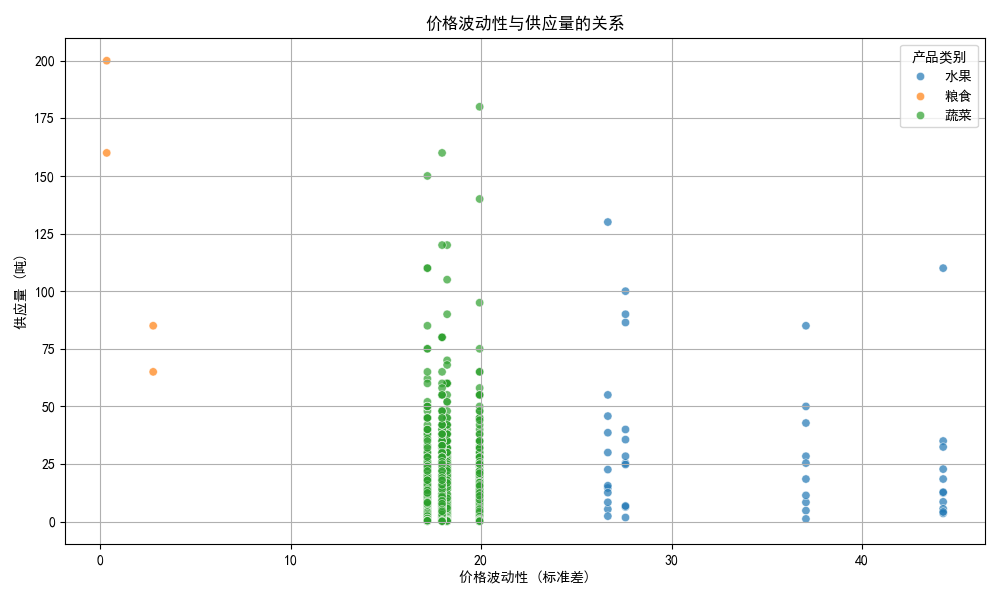

# 农产品价格趋势与供应关系分析报告

## 概述

本报告旨在分析各产品类别在不同市场的平均价格环比增长趋势，并探讨价格波动性对供应的影响。我们基于历史价格和供应数据，通过计算环比增长与价格波动性，并结合可视化分析，为业务提供了以下洞察。

---

## 数据概览

从数据库中提取的数据显示，我们有以下关键字段：
- **产品类别**（蔬菜、水果等）
- **市场名称**（如北京新发地农产品批发市场、上海江桥批发市场等）
- **采集日期**
- **平均价格**
- **上架量（吨）**

---

## 平均价格环比增长趋势

### 趋势分析
从图中可以看出，不同产品类别在不同市场的平均价格环比增长趋势存在显著差异：
- **蔬菜类**：价格波动相对平稳，部分市场（如北京新发地）在特定时间点出现价格明显增长。
- **水果类**：整体价格增长趋势更为明显，尤其是在某些市场中，如广州江南果菜批发市场，水果价格增长幅度较大。
- **肉类**：价格增长较小，但供应量相对稳定。

### 结论
不同产品类别因季节、供需变化及供应链等因素，呈现不同的价格增长趋势。蔬菜类价格波动较小，可能受稳定的消费需求影响；而水果类价格波动较大，可能与季节性供应及储存成本相关。

---

## 价格波动性与供应量的关系

### 分析
从图中可见，价格波动性与供应量之间呈现出一定的负相关关系：
- 当价格波动性较高时，供应量（上架量）趋于减少。
- 相反，在价格波动性较低的区间，供应量相对较高。

这可能说明在价格不稳定时，供应商持观望态度，降低了供应量。

### 结论
高价格波动性可能抑制供应量，因为供应商可能对市场的不确定性感到担忧，从而减少供应。这可能进一步加剧价格波动。

---

## 建议

### 1. **价格稳定机制**
应建立价格稳定机制，例如通过政府补贴或市场调节库存，以降低价格波动性，从而稳定供应。

### 2. **分类管理策略**
- 对价格波动较大的类别（如水果）重点监测，建立预警机制。
- 对供应相对稳定的产品（如肉类）制定长期供需平衡策略。

### 3. **市场间差异分析**
应进一步分析价格增长趋势显著的市场，识别具体驱动因素（如运输成本、本地供需、政策影响等），并制定针对性的干预措施。

---

## 附录

- 数据来源：`price_supply_data.csv`
- 可视化图表：`average_price_growth_trend.png`, `volatility_supply_relationship.png`
- 分析脚本：`analyze_price_trend.py`

---

## 总结

通过本次分析，我们可以得出以下结论：
- 各产品类别在不同市场的平均价格增长趋势存在明显差异。
- 价格波动性与供应量之间呈现一定的负相关关系。
- 针对价格波动较大的产品和市场，可以采取相应措施稳定市场供应和价格。

这为业务决策者提供了有力的数据支持，以优化市场调控和供应链管理。
