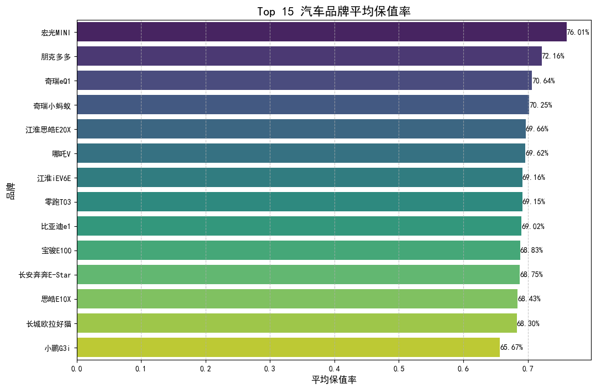

# 二手车回收价值分析报告

## 一、引言

本报告旨在通过对现有二手车数据的深入分析，识别出哪些车型或配置具有更高的市场回收价值，从而为二手车经销商制定更精准、高效的车辆回收策略提供数据驱动的建议。我们的核心分析指标是**保值率**（二手车售价 / 新车含税价），它可以直观地反映车辆在市场上的受欢迎程度和价值留存能力。

---

## 二、核心洞察与建议

### 洞察一：经济型微/小型电动车是保值率冠军

通过对不同汽车品牌的保值率进行计算和排名，我们发现了一个显著的趋势：**尺寸小、价格亲民的经济型纯电动车占据了保值率榜单的绝对头部位置。**

**图表解读:**
如上图所示，在保值率排名前15的品牌中，绝大多数是微型或小型车，例如**宏光MINI、奇瑞小蚂蚁/eQ1、朋克多多、零跑T03**等。这些车型的平均保值率普遍高达70%左右，显著高于其他级别的车型。

**原因分析:**
1.  **刚需市场巨大**: 此类车型完美契合了城市通勤、短途代步的核心需求，是许多家庭的第二辆车或年轻人的第一辆车。
2.  **低廉的拥有成本**: 较低的购车门槛和极低的使用成本（电费远低于油费，保养项目少）使其对价格敏感的消费者具有极强的吸引力。
3.  **市场供需关系**: 由于新车和二手车价格都相对较低，价值下跌的绝对空间有限，加上旺盛的市场需求，共同推高了其在二手市场的保值率。

**回收建议:**
**建议经销商将业务重心向经济型纯电动小车倾斜。**
*   **增加回收力度**: 主动寻找并增加对宏光MINI、奇瑞小蚂OS系列、长安奔奔E-Star等热门微型电动车的回收量。
*   **开辟特色专区**: 在销售端可以设立“城市代步神器”、“省钱小能手”等特色专区，吸引目标客户，加速车辆周转。
*   **优化定价策略**: 鉴于其高保值率，可以采用更自信的定价策略，同时保证有竞争力的回收价格以吸引车主。

### 洞察二：主流新能源技术路线保值率差异不大

在新能源领域，纯电动、插电混动和增程式是目前市场上的三大主流技术路线。我们的分析显示，这三者在保值率方面表现出了惊人的一致性。

**图表解读:**
上方的箱线图清晰地展示了不同燃料类型车辆的保值率分布情况。纯电动、插电混动和增程式车型的**平均保值率均在68%至70%之间**，差异非常微小。这表明在当前二手车市场，消费者对于这三种技术路线没有表现出明显的偏好。

**原因分析:**
*   **各有优势，覆盖不同需求**:
    *   **纯电动**: 使用成本最低，驾驶体验好，在一二线充电设施完善的城市备受欢迎。
    *   **插电混动**: 短途用电，长途用油，完美解决了“里程焦虑”，适用场景更广泛。
    *   **增程式**: 原理类似插电混动，提供了接近纯电的驾驶感受，同样有效缓解了里程焦虑。
*   **市场接受度均衡**: 这三种技术都已得到市场的广泛验证和接受，形成了各自稳定的消费群体。

**回收建议:**
**在回收新能源车时，不必过分拘泥于特定的燃料类型，应采取均衡、多元化的回收策略。**
*   **根据地区调整**: 在充电设施非常普及的大城市，可适当增加纯电动车的回收比例；在充电设施相对不足或长途出行需求更高的地区，可侧重于插电混动和增程式车型。
*   **关注明星车型**: 无论哪种技术路线，都应重点关注其中的“明星车型”，例如特斯拉系列（纯电）、比亚迪DM-i系列（插电混动）、理想系列（增程式），这些车型的市场认知度和需求量通常更高。

---

## 三、总结与综合建议

为了最大化二手车回收业务的利润和效率，我们提出以下综合性建议：

1.  **优先聚焦高价值品类**: **将经济型纯电动微/小型车作为回收的战略核心**。它们是当前市场上价值最稳固、需求最旺盛的“硬通货”。

2.  **保持技术路线的多元化**: 在新能源车领域，**均衡回收纯电动、插电混动和增程式车型**，避免将资源过度集中在单一技术路线上，以分散风险、覆盖更广泛的客户群体。

3.  **回归基本面评估**: 除了品牌和燃料类型，**车龄、表显里程、车况、颜色和配置**等传统因素依然是决定单车价值的关键。回收时必须结合这些维度进行综合评估，特别是对于车龄在3年内、里程在5万公里以下的“准新车”，应给予更高的关注度。

4.  **动态监控市场**: 新能源汽车技术迭代迅速，政策影响也较大，今天的保值率冠军可能明天就会被新的挑战者取代。建议建立持续的市场监控机制，定期重复此类分析，以确保回收策略始终与市场脉搏保持一致。
