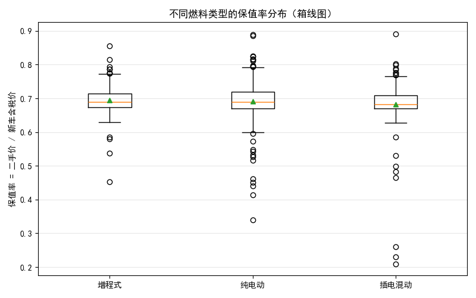
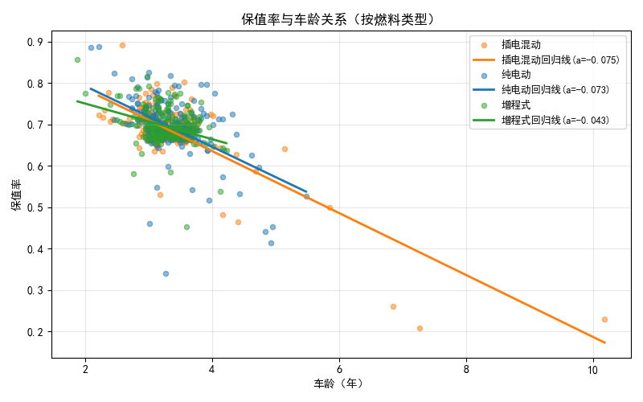
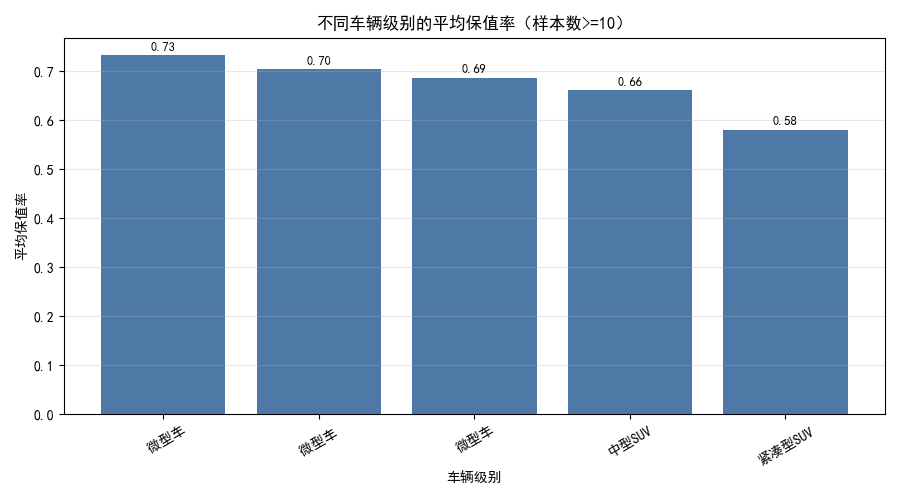
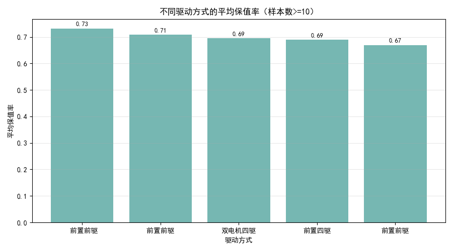
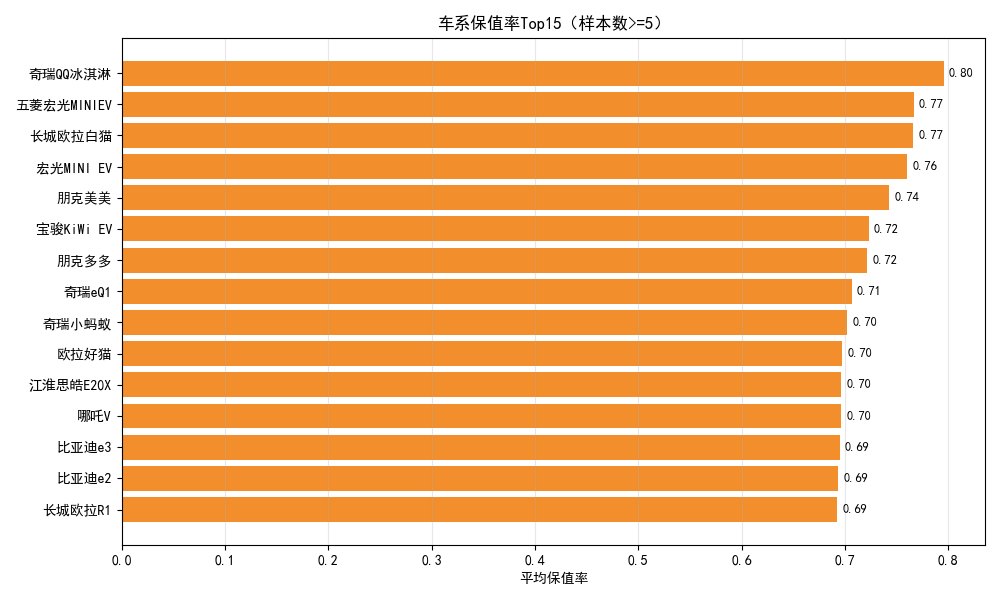

# 二手车回收价值分析与策略建议（基于“汽车之家”数据）

## 摘要
- 数据样本：675条二手车记录，覆盖纯电动、增程式、插电混动三类新能源车型与多种车辆级别、驱动方式。
- 核心指标：保值率=二手价/新车含税价（均以“万元”为单位），车龄（年）、里程（万公里）、配置维度（车辆级别、驱动方式、变速箱等）。
- 关键结论：
  - 燃料类型层面：增程式与纯电动平均保值率约0.69，插电混动约0.68；插电混动对车龄的敏感度（折旧斜率）更高，老龄化折价更快。
  - 车辆级别层面：微型/小型纯电微型车（城市代步小车）整体保值率更高；SUV类别整体保值率偏低，尤其紧凑型/小型SUV。
  - 驱动方式层面：双电机四驱、前置四驱与前置前驱的保值表现相对较好；后置后驱略偏弱。
  - 回归结果：保值率随车龄每年约降0.047、每1万公里里程约降0.0074；相对增程式基准，纯电动+0.042、插电混动-0.058；多数SUV级别相对基准为负向系数。

---

## 数据与方法
- 表结构（主要字段）：标题、价格、原始“新车含税价”、车辆级别、变速箱、燃料类型、排量、驱动方式、表显里程、上牌时间、过户次数等。
- 指标构造（SQL）：
  - 新车价万：从“新车含税价”文本抽取数值（去掉“万/万元”后转REAL）。
  - 里程万公里：将“x万公里”或“x公里”统一转为“万公里”。
  - 车龄年：用上牌时间计算至“当前”的年数差（julianday）。
  - 保值率：价格/新车价万。
  - 车系：从标题中截取年份之前的文本作为近似车系名。
- 统计与可视化：
  - 分组统计各燃料类型的样本量、平均保值率、保值率-车龄斜率与相关系数。
  - 生成箱线图、散点回归、柱状图等。

---

## 结果展示与解读

### 1) 保值率在不同燃料类型的分布
- 统计结果（SQL与Python）：
  - 增程式：平均保值率≈0.695；车龄-保值率斜率≈-0.043；相关系数r≈-0.366（负相关，中等强度）。
  - 纯电动：平均保值率≈0.692；斜率≈-0.073；r≈-0.502（负相关，较强）。
  - 插电混动：平均保值率≈0.683；斜率≈-0.075；r≈-0.772（负相关，强）。
- 解读：
  - 平均保值率层面，增程式与纯电动略优于插电混动。
  - 折旧敏感性层面，插电混动对车龄更敏感，随着年限增加保值率下降更快；纯电动次之；增程式相对“抗老化”。

可视化：
- 不同燃料类型的保值率箱线图



- 保值率与车龄关系（按燃料类型的散点+回归线）




### 2) 不同车辆级别的保值表现
- 统计（样本数≥10）：微型/小型城市代步车的平均保值率整体更高；SUV类别整体偏低，其中紧凑型/小型SUV更低（如紧凑型SUV约0.58、中型SUV约0.66）。
- 注意：原始字段存在少量格式差异（如前导空格导致“微型车”出现多行），本报告按原样统计，不做清洗。

可视化：




### 3) 驱动方式的保值表现
- 统计（样本数≥10）：
  - 双电机四驱≈0.695、前置四驱≈0.689、前置前驱表现良好（部分小样本可达≈0.732）。
  - 后置后驱相对略弱（回归系数为负）。
- 说明：存在前置前驱字段的空格差异导致统计出现两行，本报告保持原状展示。

可视化：




### 4) 车系的保值率Top榜（样本数≥5）
- Top车系以微型纯电城市代步车为主：
  - 奇瑞QQ冰淇淋、五菱宏光MINIEV、长城欧拉白猫、宏光MINI EV、朋克美美、宝骏KiWi EV、奇瑞eQ1/小蚂蚁、零跑T03、哪吒V等平均保值率在≈0.69–0.80区间。
- 解读：
  - 城市微型纯电车需求稳定、供给充足且购置成本低，二手市场交易半径短、预期用途明确，支撑更高保值。

可视化：




### 5) 多变量回归洞察（保值率 ~ 车龄年 + 里程万公里 + 燃料类型 + 驱动方式 + 车辆级别）
- 年龄影响：车龄每增加1年，保值率约下降0.0468。
- 里程影响：每增加1万公里，保值率约下降0.0074。
- 燃料类型（基准=增程式）：纯电动+0.042（更优），插电混动-0.058（更弱）。
- 驱动方式：前置四驱、双电机四驱为正向；后置后驱为负向；前置前驱总体为中性偏正（受字段差异影响）。
- 车辆级别：多数SUV级别相对基准为负向系数，意味着在其他条件相同下SUV对保值率存在下拉效应。
- 提示：由于原始字段存在书写差异（如空格），某些哑变量呈现重复/分裂；本报告不做清洗，仅据原始统计解释趋势。

---

## 规范性建议：回收策略与出价规则
基于以上诊断性与回归结果，提出可执行的车辆回收策略：

1) 主力回收池（优先收购）
- 车型与车系：微型/小型纯电城市代步车（如：奇瑞QQ冰淇淋、宏光MINI EV、零跑T03、哪吒V、欧拉好猫/白猫、奇瑞eQ1/小蚂蚁、宝骏KiWi EV等）。
- 配置特征：
  - 燃料类型优先纯电动或增程式（平均保值率≈0.69，且增程式对车龄敏感度低）。
  - 驱动方式优先双电机四驱、前置四驱/前置前驱（相对更抗折旧）。
- 车龄与里程阈值：优先≤3年、≤3万公里；避免插电混动的高龄高里程车源。

2) 谨慎回收池（需要更大折扣）
- 车型类别：紧凑型/小型SUV、部分中型SUV。
- 出价策略：在同等条件下相对微型/小型纯电车，应额外下调回收价。例如将保值率基线下调5–10个百分点；紧凑型SUV在样本中平均保值率约0.58，需明显压价。

3) 插电混动车型的策略
- 插电混动对车龄折旧更敏感（斜率≈-0.075/年，相关性强）。
- 出价规则：
  - 对≥3年车龄、≥3万公里的PHEV车源，谨慎出价，折价幅度相较纯电/增程式更大。
  - 优先收低龄低里程的PHEV，或带有较强配置项（四驱、品牌口碑好的车系）。

4) 驱动方式的加减分
- 加分：双电机四驱、前置四驱、前置前驱。
- 减分：后置后驱。
- 说明：加减分并非绝对值，而是在估价基准上做相对调整（如±1–3个百分点）。

5) 一条可操作的出价公式（经验法）
- 基线保值率（按燃料类型）：
  - 纯电动：0.69；增程式：0.69；插电混动：0.68。
- 再按年龄与里程调整：
  - 调整保值率 = 基线保值率 − 0.047×车龄（年） − 0.0074×里程（万公里）。
- 再按驱动与级别微调（示例）：
  - 双电机四驱/前置四驱/前置前驱 +0.01~0.03；后置后驱 -0.01~0.03。
  - 微型/小型纯电车 +0.01~0.03；紧凑型/小型SUV -0.03~0.08。
- 目标回收价 ≈ 新车含税价 × 调整后的保值率。
- 案例：一台纯电中型车，车龄2年、里程3万公里，新车含税价31.5万。预计保值率 ≈ 0.69 − 0.047×2 − 0.0074×3 ≈ 0.574；目标回收价 ≈ 31.5×0.574 ≈ 18.1万（再结合驱动/级别细调）。

6) 风险控制与库存结构
- 库存结构建议：加大微型/小型纯电与增程式的占比，降低SUV特别是紧凑型/小型SUV的占比。
- 车龄控制：二手新能源以≤3年为首选，>4年需明显压价。
- 里程控制：>5万公里的车源要明显下调估价，插电混动车型尤甚。

---

## 可视化与代码复现
本报告的图片均由Python生成，示例代码片段如下（完整脚本已运行生成图片）：

```python
import pandas as pd
import numpy as np
import matplotlib.pyplot as plt

# 字体设置，支持中文显示
plt.rcParams['font.sans-serif'] = ['SimHei']
plt.rcParams['axes.unicode_minus'] = False

df = pd.read_csv(\"enriched_cars.csv\")
df['保值率'] = pd.to_numeric(df['保值率'], errors='coerce')

# 不同燃料类型的保值率箱线图
fig, ax = plt.subplots(figsize=(8, 5))
data = df[['燃料类型', '保值率']].dropna()
order = data.groupby('燃料类型')['保值率'].median().sort_values(ascending=False).index.tolist()
groups = [data[data['燃料类型'] == f]['保值率'].values for f in order]
ax.boxplot(groups, showmeans=True)
ax.set_title('不同燃料类型的保值率分布（箱线图）')
ax.set_ylabel('保值率 = 二手价 / 新车含税价')
ax.grid(axis='y', alpha=0.3)
fig.tight_layout()
fig.savefig('保值率_燃料类型箱线图.png')
```

已生成的图片文件：
- 保值率_燃料类型箱线图.png
- 保值率_vs_车龄_散点回归.png
- 保值率_按车辆级别.png
- 车系保值率top15.png
- 保值率_按驱动方式.png

---

## 限制与后续优化
- 字段存在书写差异（如“前置前驱”有前导空格），本分析遵循“不清洗”原则，保持原始数据；实际业务使用时建议统一枚举值。
- 本数据为采样数据，结论反映样本期的市场状况；不同区域与时间会有差异，建议定期更新模型与策略。
- 回归未纳入品牌细分与具体配置（电池包容量、智能驾驶版本等），后续可扩展维度提高精准度。

---

## 总结
- 高回收价值的车群：微型/小型纯电城市代步车、增程式低龄低里程车型，驱动方式偏好双电机四驱/前置四驱/前置前驱。
- 折价敏感群：插电混动的高龄车与紧凑型/小型SUV。
- 具体建议：采用“燃料类型基线+车龄/里程线性调整+驱动/级别微调”的出价公式，结合车系Top榜制定优先收购清单与库存结构优化方案。
