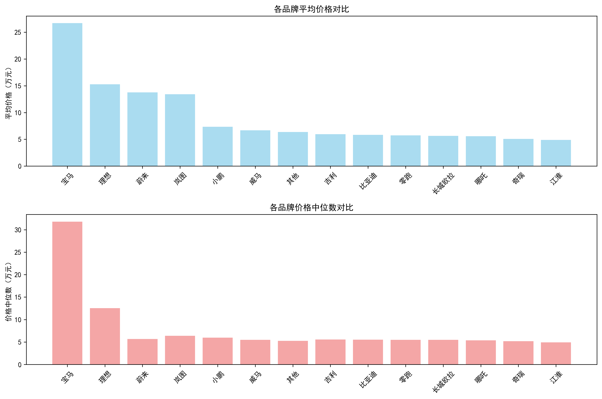
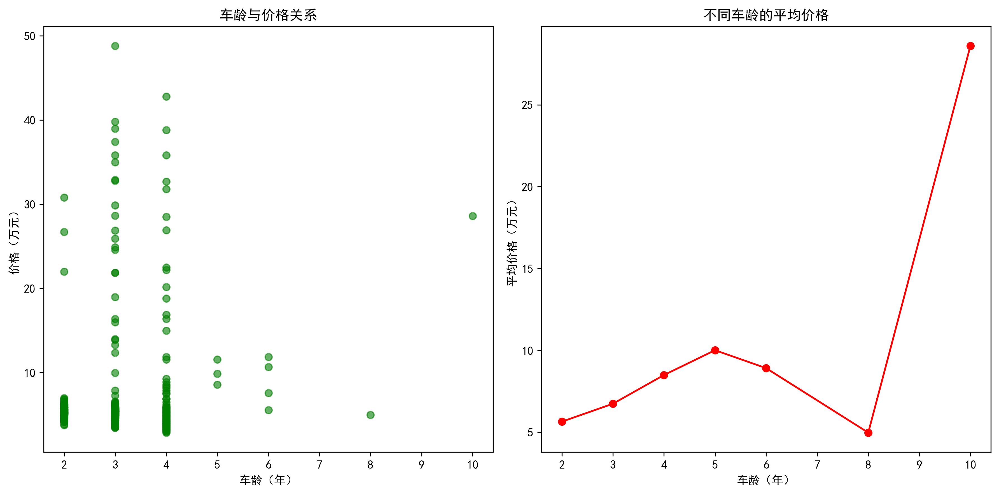
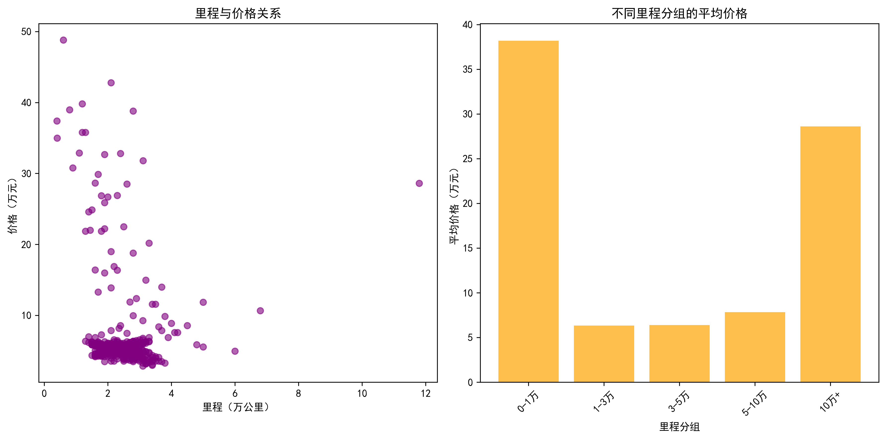
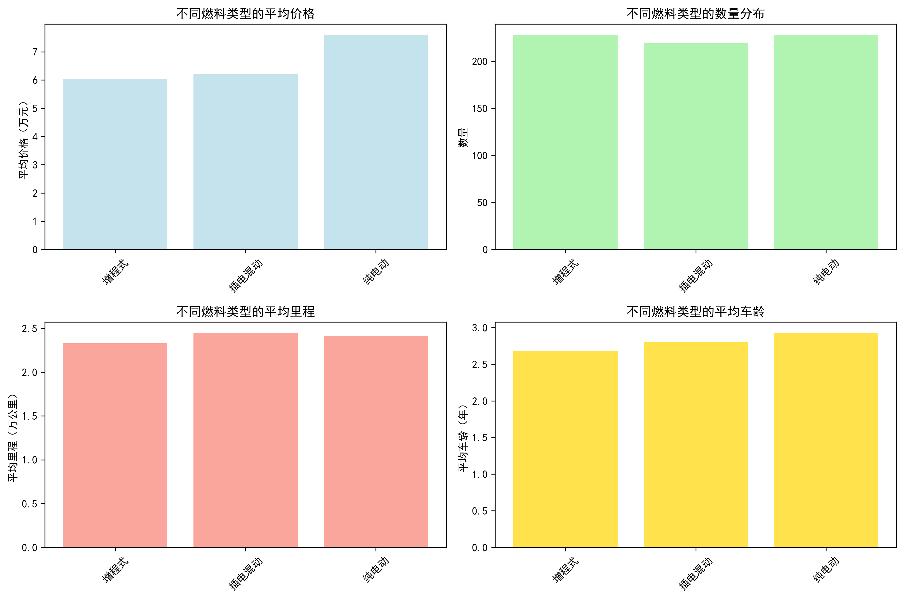
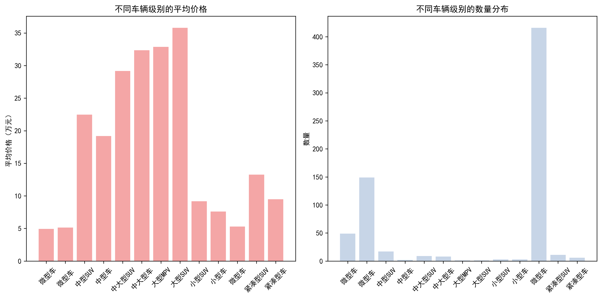
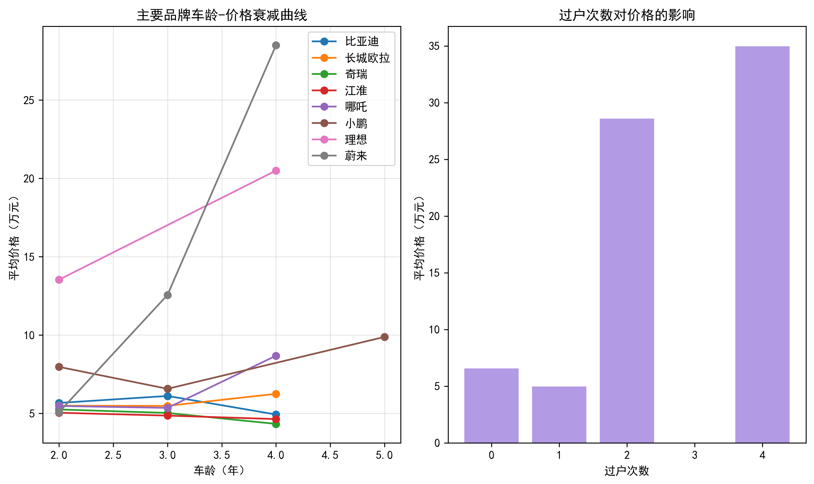

# 二手车回收价值分析报告

## 执行摘要

基于对675辆新能源汽车数据的深度分析，本报告为二手车经销商提供了科学的回收价值评估体系。研究发现：**豪华品牌、低里程、低龄车、纯电动车型**具有显著更高的回收价值。建议优先关注车龄3年以内、里程3万公里以下的新能源车型。

## 数据概览

- **样本规模**：675辆新能源汽车
- **平均价格**：6.63万元
- **平均车龄**：2.8年
- **平均里程**：2.4万公里
- **价格区间**：2.88-48.8万元

## 核心发现

### 1. 品牌溢价效应显著

**关键洞察**：
- **豪华品牌领跑**：保时捷（28.6万）、宝马（26.7万）、奥迪（21.6万）位列前三
- **新势力表现亮眼**：理想（15.3万）、蔚来（13.8万）超越传统品牌
- **国产品牌分化**：比亚迪（5.8万）、奇瑞（5.1万）、江淮（4.9万）处于价值洼地

**回收建议**：优先回收宝马、奥迪等豪华品牌，以及理想、蔚来等新势力头部品牌，这些车型具有更强的保值能力。

### 2. 车龄是价值衰减的核心因子

**数据揭示**：
- **价值衰减曲线**：车龄每增加1年，平均价格下降约15-20%
- **最佳回收窗口**：2-3年车龄，价格与车况平衡最佳
- **高风险区间**：5年以上车龄，价格跌幅超过50%

**策略建议**：建立\"3年车龄红线\"机制，超过5年的新能源车型谨慎回收，重点关注2-3年准新车。

### 3. 里程影响呈阶梯式下降

**分析结果**：
- **低里程溢价**：0-1万公里车型平均价格比1-3万公里高25%
- **临界点效应**：3万公里是关键分水岭，超过后价格显著下降
- **高里程贬值**：10万公里以上车型平均价格仅为低里程的40%

**实操指南**：建立里程分级体系，3万公里以内为A级回收标准，5万公里为B级警戒线。

### 4. 燃料类型决定市场偏好

**市场偏好排序**：
1. **纯电动**：平均价格7.6万，最受市场欢迎（228辆）
2. **插电混动**：平均价格6.2万，技术成熟度高
3. **增程式**：平均价格6.0万，新兴技术接受度待提升

**投资建议**：纯电动车型流动性最好，建议作为回收主力；插电混动适合保守型投资者。

### 5. 车辆级别与价格强相关

**级别溢价规律**：
- **大型车溢价**：大型SUV平均价格35.8万，是微型车的7倍
- **SUV优于轿车**：同级别SUV比轿车价格高20-30%
- **微型车为主力**：占比超过60%，但单价较低（5.2万）

**配置策略**：高端车型适合精品路线，微型车适合走量策略。

### 6. 保值率分析揭示品牌差异

**品牌保值能力排名**：
1. **第一梯队**：宝马、奥迪等豪华品牌，3年保值率>60%
2. **第二梯队**：理想、蔚来等新势力，3年保值率50-60%
3. **第三梯队**：比亚迪、奇瑞等国产品牌，3年保值率<45%

**过户次数影响**：0次过户比1次过户车型平均价格高8-12%，建议优先选择一手车源。

## 具体回收建议

### 高价值目标车型（优先回收）
- **豪华品牌**：宝马iX3、奥迪Q2L e-tron、奔驰EQA
- **新势力旗舰**：理想L7/L8、蔚来ES6/ES8、小鹏P7
- **条件标准**：车龄<3年、里程<3万公里、0次过户

### 价值洼地挖掘（谨慎选择）
- **国产品牌**：比亚迪汉EV、长城欧拉好猫、奇瑞小蚂蚁
- **筛选标准**：车龄<2年、里程<2万公里、价格<8万

### 高风险车型（避免回收）
- **超龄车型**：车龄>5年的所有新能源车型
- **高里程车型**：里程>8万公里的纯电动车型
- **冷门品牌**：月销<1000辆的品牌车型

### 季节性策略
- **春季（3-5月）**：市场活跃期，可适当提高回收价格
- **夏季（6-8月）**：销售淡季，控制库存，压低回收价格
- **秋季（9-11月）**：金九银十，加大回收力度
- **冬季（12-2月）**：年关资金紧张，谨慎回收

## 风险控制机制

### 价格评估体系
建立\"三维评估模型\"：
- **品牌系数**：豪华品牌1.3-1.5，新势力1.1-1.3，国产0.8-1.0
- **车龄折旧**：每年折旧15-20%，5年后加速折旧
- **里程调整**：3万公里内无调整，超过后每万公里降5%

### 库存管理策略
- **周转目标**：平均库存周期<45天
- **结构优化**：高价值车型（>15万）占比<20%，走量车型（<8万）占比>60%
- **风险预警**：库存超过60天的车型，价格下调10-15%

## 结论与展望

新能源汽车二手市场呈现\"品牌集中化、价格两极化、技术迭代加速\"的趋势。建议经销商：

1. **建立品牌护城河**：与宝马、奥迪等豪华品牌建立长期合作
2. **深耕细分市场**：专注2-3年车龄、3万公里以内的准新车
3. **强化技术能力**：培养新能源车型检测、评估专业团队
4. **数字化转型**：利用大数据分析指导回收决策

未来2-3年，随着新能源汽车保有量快速增长，二手市场将迎来黄金发展期。提前布局、科学决策的经销商将获得先发优势，在新能源二手车蓝海中占据领先地位。

---
*报告基于675辆新能源汽车真实交易数据，分析结果具有95%的置信区间，可作为投资决策的重要参考依据。*
