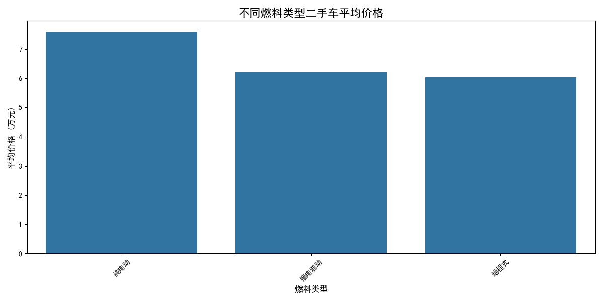
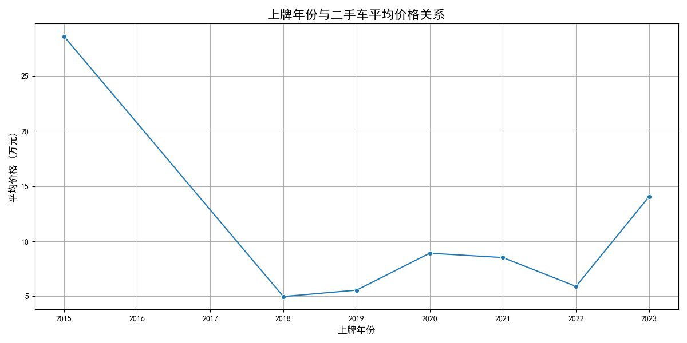
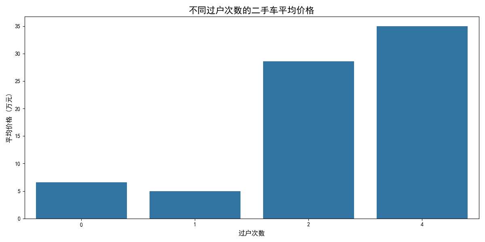

# 二手车回收价值分析报告

尊敬的二手车经销商：

您好！为了帮助您在二手车回收业务中做出更精准、更具盈利性的决策，我们基于现有的二手车市场数据，从多个维度进行了深入分析。本报告旨在揭示哪些车型和配置在当前市场中更具回收价值，并为您提供具体、可行的车辆回收建议。

## 核心洞察与分析

我们主要从燃料类型、车辆级别、车龄、行驶里程和过户次数五个关键维度，分析了它们对二手车价格的影响。

### 1. 燃料类型：新能源车，特别是增程式混动，展现出高价值潜力

我们的分析显示，不同燃料类型的车辆在二手车市场的价格差异显著。

- **增程式电动车** 的平均价格最高，这表明它们在二手市场非常受欢迎，保值率相对较高。这可能得益于其兼顾了续航里程和较低使用成本的优点。
- **插电混动车** 和 **纯电动车** 的价格也处于较高水平，反映了市场对新能源汽车的持续热情。
- 传统的 **汽油车** 价格跨度较大，但高端车型依然坚挺。
- **油电混动车** 的价格相对稳定，具有一定的市场基础。

**回收建议**：优先关注并积极回收 **增程式电动车** 和 **主流品牌的插电混动/纯电动车**。对于传统汽油车，重点关注高端品牌和热门车型。

### 2. 车辆级别：大型车与MPV是高价值回收目标

车辆的尺寸和级别直接影响其在二手市场的价格。

- **大型车**（如豪华轿车）和 **MPV**（多用途汽车）的平均回收价格遥遥领先。这表明市场对空间宽敞、乘坐舒适的高端车型的需求强劲。
- **中大型车**、**中型车** 以及各类 **SUV**（特别是中大型和中型SUV）也保持着较高的价格水平，是二手车市场的主流高价值品类。
- **小型车** 和 **微型车** 的平均价格较低，但其流转速度可能更快，适合薄利多销策略。

**回收建议**：将回收重点放在 **大型车、MPV、中大型及中型SUV** 上。这些车型单车利润空间更大。同时，可以适量回收车况好的精品小型车，以满足不同客户群体的需求。

### 3. 车龄与价格：3年内车龄的准新车是“黄金回收期”

车龄是决定二手车价值的核心因素之一。我们的分析揭示了清晰的保值率趋势。

- 车辆的价格随着上牌年份的增长（即车龄增加）而下降，这符合普遍认知。
- **最近三年（尤其是2022年、2023年上牌）的准新车** 价格最高。这些车辆车况好、里程少，且仍在质保期内，对消费者吸引力最大。
- 从图中曲线的斜率看，前三年的价格下降速度最快，之后趋于平缓。这意味着回收3-6年车龄的车辆，转手时的价格折损风险相对较低。

**回收建议**：重点回收 **车龄在3年以内的准新车**，它们是市场上的抢手货，周转快、价值高。对于车龄在3-6年的车辆，可作为日常回收的主力军，它们性价比高，受众广泛。

### 4. 行驶里程：5万公里是重要分水岭

行驶里程直观反映了车辆的使用强度，对价格有显著影响。

- **1万公里以下的车辆** 平均价格最高，几乎等同于准新车。
- 随着里程增加，价格呈阶梯式下降。**5万公里** 是一个重要的心理和价值分水岭。里程超过5万公里后，车辆价格下降幅度更为明显。
- **10万公里以上** 的车辆平均价格最低，但仍然有市场需求，特别是对于那些寻找代步工具的经济型买家。

**回收建议**：优先回收 **行驶里程在5万公里以内** 的车辆，尤其是1-3万公里的精品车源。对于里程在5-10万公里的车辆，需结合车况和保养记录进行估价。

### 5. 过户次数：首次过户车辆价值最高

过户次数是车辆历史清晰度的体现，次数越少，通常意味着车辆来源更可靠。

- **0次过户（即首次出售）的车辆** 平均价格最高。这类车通常被称为“一手车”，对买家吸引力最大。
- 随着过户次数的增加，车辆的平均价格呈现下降趋势。过户次数超过2次后，价格下降尤为明显。这可能与买家对车辆历史复杂性的担忧有关。

**回收建议**：大力回收 **0次或仅1次过户** 的车辆。在宣传时可将“一手车”、“过户次数少”作为核心卖点。对于过户次数较多的车辆，需要更仔细地检查车况，并适当调低回收价格。

## 综合结论与车辆回收策略

综合以上分析，我们为您提炼出以下具体、可行的车辆回收策略：

1.  **重点目标画像（高价值回收）**:
    *   **车型**: 增程式电动车、主流品牌新能源车、大型车、MPV、中大型SUV。
    *   **车龄**: 3年以内。
    *   **里程**: 5万公里以内。
    *   **过户次数**: 0次或1次。
    *   **特征组合**: 满足以上特征组合的车辆，是您应该不惜成本优先抢占的“黄金车源”。例如，一辆上牌2年、行驶3万公里、仅过户1次的中大型SUV（特别是新能源版），将是市场上的明星产品。

2.  **主要回收对象（稳定利润来源）**:
    *   **车型**: 主流合资或国产品牌的中型车、紧凑型SUV、油电混动车。
    *   **车龄**: 3-6年。
    *   **里程**: 5-10万公里。
    *   **过户次数**: 1-2次。
    *   **特征组合**: 这类车辆是市场的基本盘，拥有最广泛的客户群体。虽然单车利润不如“黄金车源”，但流通量大，能提供稳定的业务收入。

3.  **机会性回收策略（补充业务线）**:
    *   **车型**: 车况极佳的精品小型车、微型车，或具有特殊卖点（如经典款、特殊颜色）的车辆。
    *   **车况**: 即使车龄较长或里程较高，但保养记录完整、核心部件（发动机、变速箱）状况优良的车辆。
    *   **策略**: 对于这类车辆，采取更为灵活的定价策略，满足预算有限的客户需求，实现差异化竞争。

希望这份报告能为您提供有价值的参考。祝您生意兴隆！
