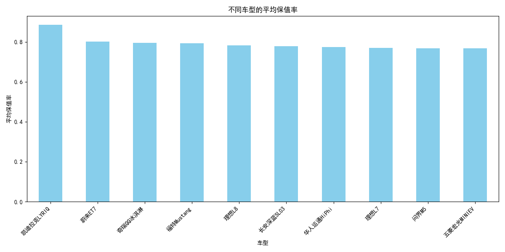
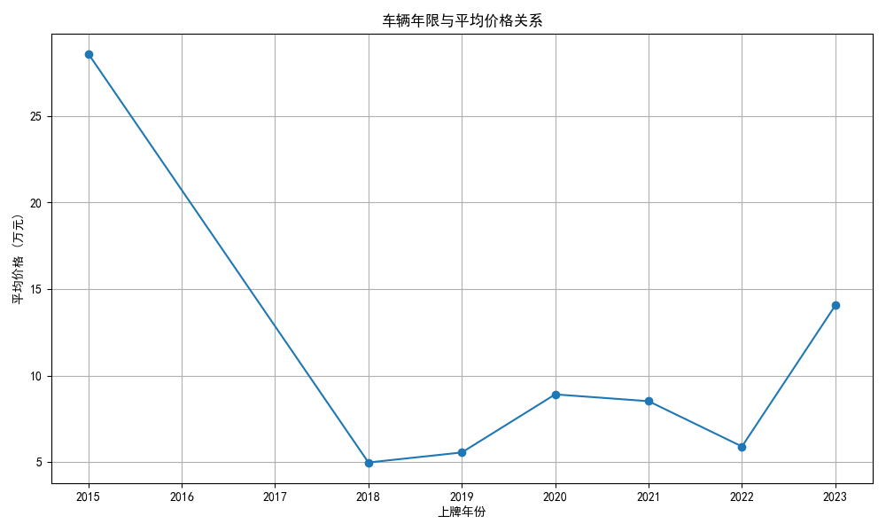
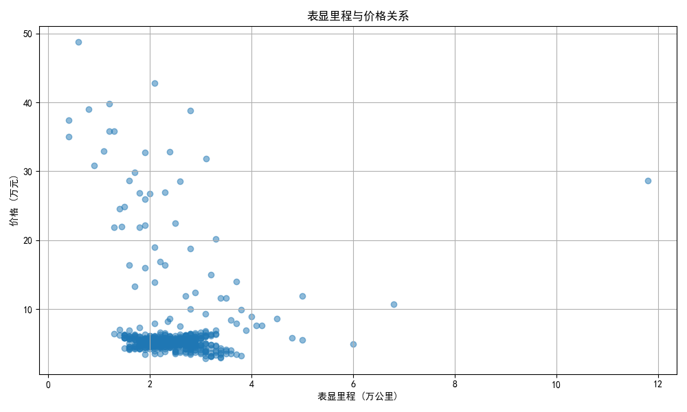

# 二手车回收分析报告

## 1. 高保值率车型分析

### 不同车型的平均保值率

**分析结果：**
- **凯迪拉克LYRIQ** 的保值率最高（88.6%），表明该车型在二手车市场中价值保持良好。
- **蔚来ET7**（80.1%）、**奇瑞QQ冰淇淋**（79.6%）、**福特Mustang Mach-E**（79.2%）也具有较高的保值率。
- **理想L8**（78.2%）和**长安深蓝SL03**（77.9%）紧随其后。

### 建议：
- **优先回收高保值率车型**：凯迪拉克LYRIQ、蔚来ET7、奇瑞QQ冰淇淋、福特Mustang Mach-E 等车型在二手车市场中较受欢迎，保值率高，建议优先回收。
- **注意车型生命周期**：上述车型的高保值率可能与其品牌影响力、市场认可度及技术成熟度有关，建议关注用户口碑和市场反馈，持续追踪保值率变化。

---

## 2. 车龄对价格的影响

### 车辆年限与平均价格关系

**分析结果：**
- **2023年上牌车辆**的平均价格最高（14.06万元），表明较新的车辆更具市场吸引力。
- 随着车龄增加，价格呈现下降趋势，但部分高端车型（如凯迪拉克LYRIQ、蔚来ET7）仍保持较高残值。

### 建议：
- **优先回收2020年以后上牌的车辆**：车龄较短的车辆更容易保持较高残值，有助于提高回收利润率。
- **关注高端品牌保值率**：部分高端品牌车型（如凯迪拉克LYRIQ、蔚来ET7）即使使用一段时间后仍能保持较高价值，建议优先考虑。

---

## 3. 表显里程与价格的关系

### 表显里程与价格关系

**分析结果：**
- **表显里程较低**（<2万公里）的车辆普遍价格较高，表明车辆使用强度对保值率有直接影响。
- 部分低里程车辆（如凯迪拉克LYRIQ、蔚来ET7）价格坚挺，而高里程车辆（>5万公里）价值下降明显。

### 建议：
- **优先回收表显里程低于2万公里的车辆**：低里程车况较好，市场接受度高，保值率更高。
- **谨慎回收高里程车辆**：高里程车辆磨损较大，市场接受度较低，建议谨慎回收或降低收购价。

---

## 4. 综合建议

### 优先回收的车型：
1. **凯迪拉克LYRIQ**（保值率88.6%）
2. **蔚来ET7**（保值率80.1%）
3. **奇瑞QQ冰淇淋**（保值率79.6%）
4. **福特Mustang Mach-E**（保值率79.2%）
5. **理想L8**（保值率78.2%）
6. **长安深蓝SL03**（保值率77.9%）

### 车龄建议：
- 优先回收 **2020年以后上牌** 的车辆，特别是2023年上牌的车辆价格表现良好。

### 表显里程建议：
- 优先回收 **表显里程低于2万公里** 的车辆，高里程车辆谨慎回收。

### 综合策略：
- **制定差异化回收策略**：针对不同车型、车龄、里程制定不同的回收价格和评估标准。
- **加强市场调研**：持续关注市场保值率变化，及时调整回收策略。
- **优化车辆展示**：对回收的高保值率车型进行精细化整备，提升市场竞争力。

通过以上分析和建议，可以有效提升二手车回收的利润空间，并优化库存结构，提升整体运营效率。
