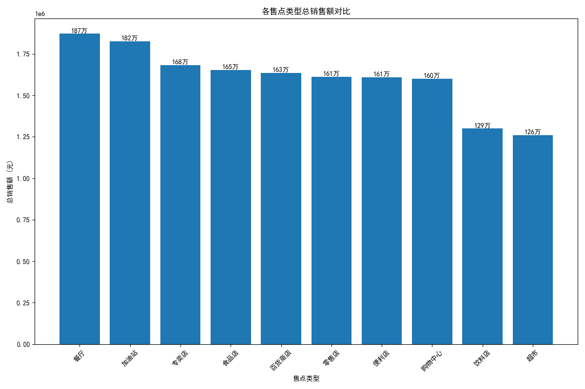
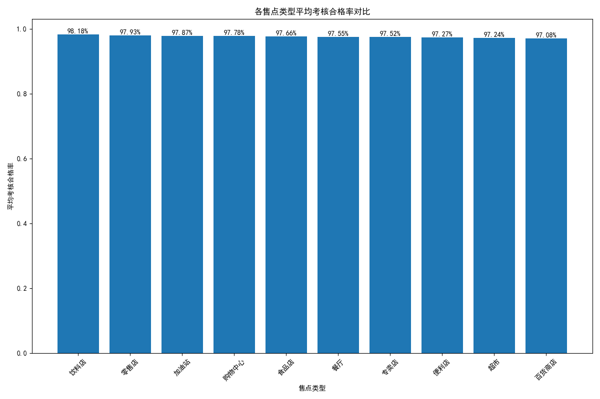
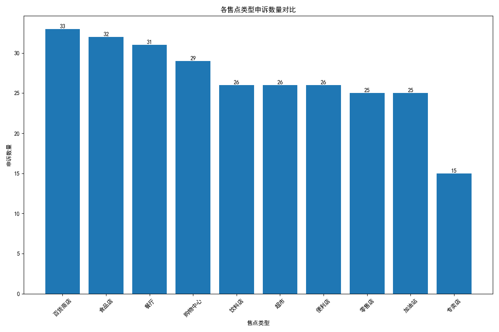

# 可口可乐售点签约策略分析报告

作为可口可乐的销售负责人，为了更有效地分配资源，提升销售业绩，我们对不同售点类型的关键数据进行了综合分析。本报告旨在基于销量、目标达成率和客诉数据，为未来的售点签约策略提供明确的建议。

## 1. 各售点类型销售额表现

首先，我们分析了不同售点类型的总销售额贡献。

**洞察:**
- **购物中心、超市、百货商店**是销售额的绝对主力，是我们需要重点维护的核心渠道。
- **餐厅、专卖店**也表现出不俗的销售潜力。
- **零售店、便利店、饮料店、食品店**等渠道的销售额相对较低，贡献度有限。

## 2. 各售点类型目标达成率分析

为了评估售点执行公司策略的有效性，我们分析了各售点类型的平均考核合格率。

**洞察:**
- **专卖店、餐厅、饮料店** 在考核合格率上表现突出，说明这类售点能够很好地遵循公司的运营标准和销售策略，是高质量的合作伙伴。
- **购物中心、超市**等核心销售渠道的合格率也处在较高水平。
- **食品店、加油站、零售店、便利店**的合格率偏低，说明在执行层面存在一定的挑战。

## 3. 各售点类型客诉问题分析

客诉数量是衡量售点运营稳定性和合作顺畅度的重要指标。

**洞察:**
- **超市、购物中心、零售店**的客诉数量最多，这可能与其庞大的客流量和复杂的运营环境有关，需要我们投入更多精力进行沟通和管理。
- **餐厅、饮料店、百货商店**的客诉数量相对较少，表明其运营较为稳定，与公司的合作关系也更为融洽。

## 4. 综合结论与签约建议

结合以上三个维度的分析，我们对不同售点类型进行归类，并提出以下签约策略建议：

### **大力增加签约量：优质潜力股**

- **售点类型:** **餐厅、专卖店**
- **理由:** 这两类售点实现了**高销售额、高目标达成率和低客诉**的完美结合。它们不仅是稳定的销量贡献者，更是品牌形象的优质展示窗口。增加这类售点的签约，将为我们带来高质量的增长。

### **维持并优化签约：核心贡献者**

- **售点类型:** **购物中心、超市、百货商店**
- **理由:** 作为销售额的基石，这些渠道的重要性不言而喻。尽管存在客诉较多的问题，但我们应采取积极策略进行优化，而非减少合作。
- **优化建议:**
    - **加强培训与沟通:** 针对高频客诉问题，提供专项解决方案和培训。
    - **提供现场支持:** 对大型售点派驻专人，及时解决问题，提升执行效率。
    - **优化激励政策:** 激励售点在追求销量的同时，兼顾服务质量与合规性。

### **谨慎签约，优化现有：待观察与提升者**

- **售点类型:** **零售店、便利店、食品店、加油站、饮料店**
- **理由:** 这些售点在销量、目标达成率和客诉方面均表现不佳。盲目扩张可能会导致管理成本的急剧上升，但收效甚微。
- **优化建议:**
    - **提高准入门槛:** 对新签约售点进行更严格的筛选。
    - **实施分级管理:** 对现有售点进行评估，对有潜力的进行扶持，对长期表现不佳的考虑淘汰。
    - **探索新合作模式:** 针对不同渠道特性，试点新的产品组合和促销活动，寻找新的增长点。

**总结：** 未来的资源投入应当有所侧重。我们应**优先发展餐厅和专卖店**，**深化与购物中心、超市和百货商店的合作**，并**对零售店、便利店等其他渠道采取更为精细化的管理和优化策略**，从而实现整体销售业绩和渠道健康度的双重提升。
