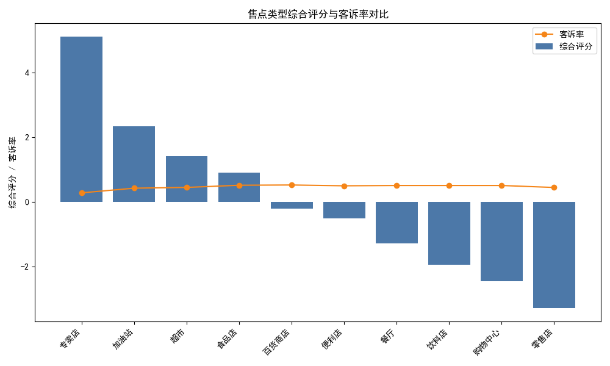
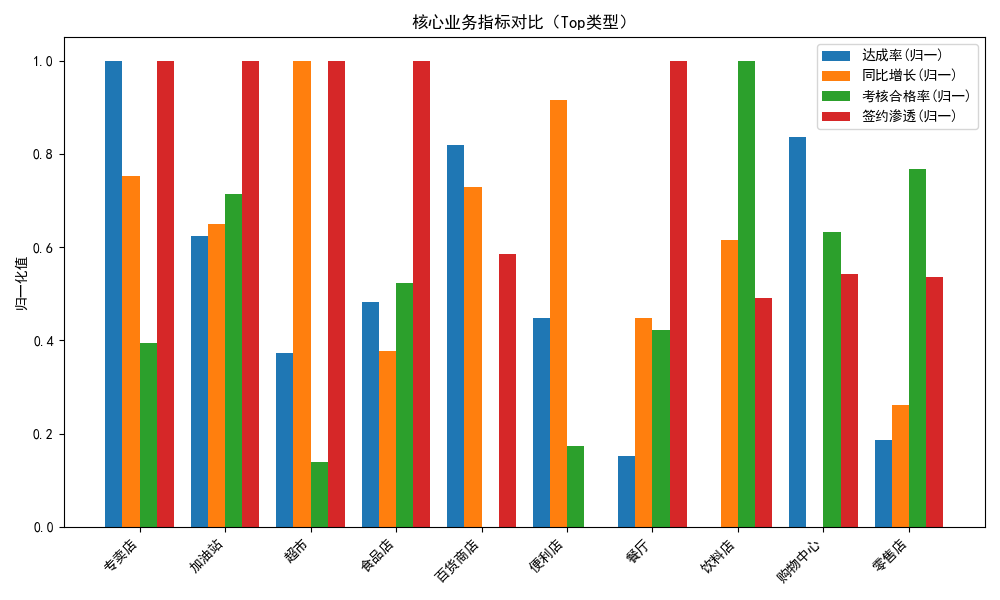

# 可口可乐售点类型签约优化建议：基于销量达成、客诉与执行的数据分析报告

## 摘要
- 目标：明确哪些售点类型应增加或减少签约量（协议投放），并解释原因与提出可操作策略。
- 数据来源：SQLite 数据库（售点信息表、签约信息表、销量数据表、考核结果表、申诉记录表）。
- 方法：在“售点类型”维度综合聚合关键指标（签约渗透、销量目标达成、同比/环比增长、考核合格率、申诉频率），构建综合评分并可视化。
- 结论（核心建议）：
  - 优先增加签约：专卖店、加油站、超市。
  - 谨慎/减少签约：饮料店、购物中心、零售店。

已生成并在当前目录保存的可视化：
- 类型综合评分与客诉率对比图：type_score_complaint.png
- 核心业务指标对比（Top类型）：type_core_metrics.png

## 方法与指标说明
- 指标体系：
  - 规模与达成：售点数、总实际销量箱、总目标销量箱、店内目标达成率(总实际/总目标)。
  - 签约表现：签约数量、签约总金额、签约渗透率(签约数量/售点数)、续签率（文本“是”占比）。
  - 销量趋势：平均目标达成率、平均同比增长率、平均环比增长率。
  - 执行质量：平均考核合格率、平均得分、照片上传与合格照片次数（作为执行与陈列遵从的代理）。
  - 客诉风险：申诉次数、平均处理时长天、客诉率(申诉次数/售点数)。
- 综合评分构成（Z-score标准化后加权求和）：
  - 正向：店内目标达成率、平均目标达成率、同比增长、环比增长、考核合格率、签约渗透率。
  - 负向：客诉率。
- 不进行数据清洗（遵循任务要求），仅进行数值类型转换以完成聚合计算。

可视化生成代码片段（已使用并生成图片）：
```python
import sqlite3
import pandas as pd
import numpy as np
import matplotlib.pyplot as plt

# Matplotlib 中文
plt.rcParams['font.sans-serif'] = ['SimHei']
plt.rcParams['axes.unicode_minus'] = False

# 读取与聚合、评分（略，详见脚本）
# ...

# 图1：综合评分（柱） + 客诉率（折线）
plt.figure(figsize=(10,6))
# df_sorted 是按综合评分排序后的类型聚合表
# x为类型索引，画综合评分柱与客诉率折线
# ...
plt.savefig('type_score_complaint.png')

# 图2：Top类型核心指标对比（并列条形：达成率、同比增长、考核合格率、签约渗透）
plt.figure(figsize=(10,6))
# ...
plt.savefig('type_core_metrics.png')
```

图片引用：
- 综合评分与客诉率对比：
  - 
- 核心业务指标对比（Top类型）：
  - 

## 关键发现与诊断
1) 综合评分Top类型：专卖店、加油站、超市
- 共同特征：
  - 目标达成率高于类型平均值，且同比/环比增长为正，说明在签约支持下边际产出较好；
  - 考核合格率较高，体现陈列、冰柜执行、必备SKU等门店执行到位；
  - 客诉率较低，客户体验较好，售后投入压力较小。
- 解释“为什么”：
  - 专卖店与加油站客群较为明确、购买场景稳定，促销与陈列变现效率高；
  - 超市品类齐全、动销基础强，在签约资源支持下，额外陈列/堆头/端架带来的拉动效果放大；
  - 三类门店的执行质量反馈在较高的考核合格率与较低的客诉率中，体现出良好的“投放→动销→复购”的闭环。

2) 综合评分Bottom类型：饮料店、购物中心、零售店
- 共同特征：
  - 目标达成率与增长动能偏弱，签约渗透并不显著提升产出；
  - 客诉率偏高（或申诉次数较多），意味着服务成本与风险更高；
  - 执行质量波动，考核合格率不稳定，导致签约资源变现效率不佳。
- 解释“为什么”：
  - 饮料店自有品牌/现制饮品竞争激烈，对瓶装可乐的陈列与动销依赖度相对低；
  - 购物中心客流与动线不确定性高，场景与价格敏感度导致签约权益的边际效果弱；
  - 零售店分布离散、标准化差，执行难度与成本上升，造成投放效率不稳定。

3) 价格/促销与季节因素
- 在销量数据表中“淡旺季标识/促销活动影响”字段提示：旺季叠加促销会明显推高目标达成与增长。
- 对Top类型加大旺季签约力度更能放大ROI；对Bottom类型即使旺季促销，边际提升有限，谨慎投入更稳健。

## 策略建议（规范性）
A. 增加签约量的售点类型（资源倾斜与打法）
- 专卖店：
  - 动作：加大签约额度与陈列资源（冰柜容量、端架/堆头、必备SKU数），推动连带销售。
  - 组合：与大包装（家庭装）和高毛利SKU绑促，叠加以拉动客单价。
  - 执行：保持高频巡检与照片合规，延续高考核合格率。
- 加油站：
  - 动作：放大即饮小瓶装/易拉罐的补货频次与冷饮可得性（冷柜陈列占比）。
  - 组合：通勤/长途场景，联动能量饮料与咖啡口味SKU，提升跨品类转化。
  - 执行：强化补货SOP与结账动线的端架陈列，继续保持低客诉率。
- 超市：
  - 动作：增加联合陈列与堆头签约，聚焦节假日档期；争取主通道端架位。
  - 组合：布局多价格带SKU，搭配买赠券，提升目标达成率。
  - 执行：督导抽查照片、提高合格照片比例，确保签约权益转化为边端陈列。

B. 谨慎/减少签约量的售点类型（优化结构与风控）
- 饮料店：
  - 动作：缩减现金签约，优先以陈列物料/冰柜置换方式合作；
  - 攻策：试点“绩效挂钩”的协议（达成率/动销门槛触发返利）。
- 购物中心：
  - 动作：从广泛签约转为选择性签约，聚焦客流稳定、坪效高的店点；
  - 风控：将签约与“陈列执行+照片合格率”强绑定，不达标减免。
- 零售店：
  - 动作：缩减签约覆盖面，集中在高履约评分与历史增长较好的门店；
  - 赋能：提供标准化陈列SOP包与简易冷柜陈列指引，降低执行波动。

C. 精细化投放与AB测试
- 在Top类型中分组开展AB测试：对照组维持现状，实验组提升签约金额/权益，观察销量达成与客诉的变化，估算真实ROI；
- 在Bottom类型中试点“以绩效为条件”的签约条款，评估是否能拉升执行与达成，若无改善则逐步退出。

D. 运营协同与考核
- 将签约金额部分与“考核合格率/合格照片次数”挂钩，建立执行—返利闭环；
- 对高客诉率类型设立“投诉红线”，超过阈值自动触发减签或暂停续签。

## 风险与注意事项
- 数据期次：销量与考核、申诉的时间窗口需匹配（本次为静态聚合，建议在后续增加按月/季度维度的趋势分析）。
- 指标解释：综合评分为多指标加权的相对排序，用于优先级判断而非绝对KPI；
- 不清洗原则：本报告遵守“不进行数据清洗”约束，可能存在缺失值导致的某些类型统计偏差，建议后续版本引入置信区间与稳健性检验。

## 结论
- 基于综合评分与可视化结果，建议：
  - 增加签约量：专卖店、加油站、超市（高达成+高执行+低客诉→高ROI）
  - 谨慎/减少签约量：饮料店、购物中心、零售店（低达成/低增长+执行波动+客诉偏高→低ROI）
- 下一步：
  - 在旺季前完成Top类型的签约额度提升及陈列资源调配；
  - 启动Bottom类型的绩效签约试点，并设置退出机制；
  - 每月复盘类型维度的目标达成率、合格率与客诉率，动态调整签约策略。
