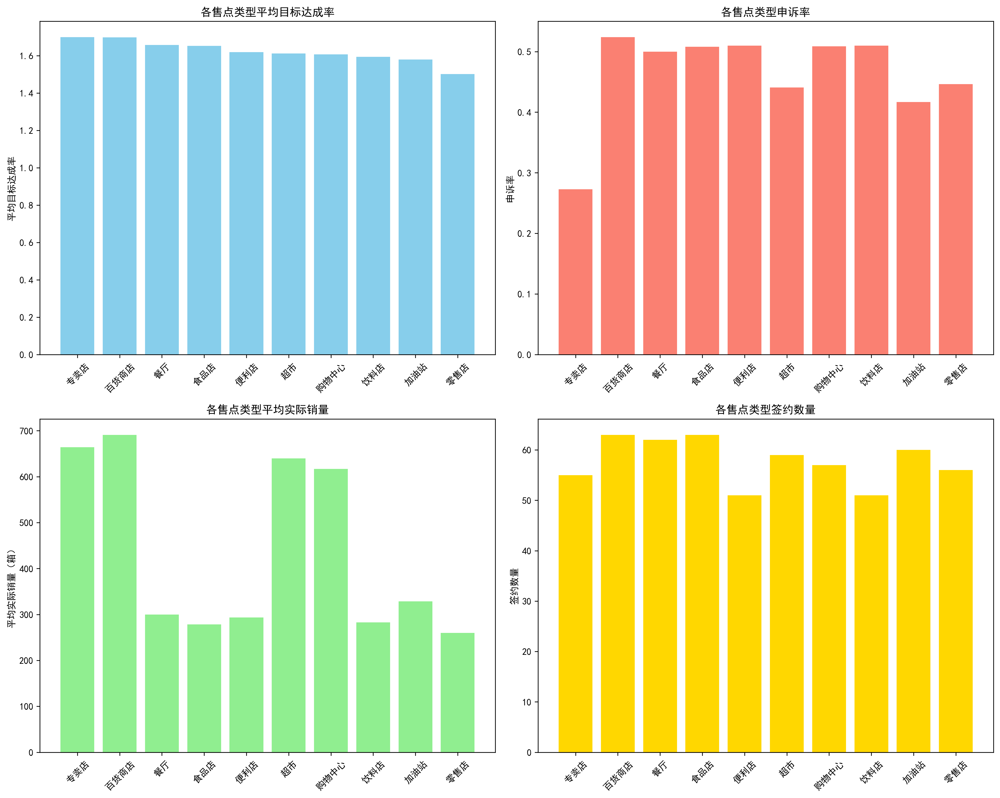
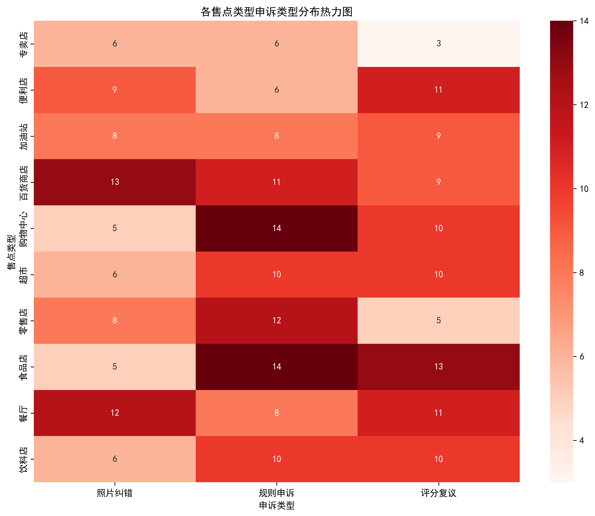

# 可口可乐售点类型签约量调整建议报告

## 背景
作为可口可乐的销售负责人，面对多样化的售点类型，我们需要基于销量目标达成率、客诉问题、销量等关键数据，科学决策哪些售点类型的签约量应该增加或减少，以优化资源配置，提升整体销售绩效。

## 分析结论概览

通过对SQLite数据库中售点信息表、销量数据表、签约信息表、申诉记录表等关键数据的综合分析，我们得出以下核心结论：

- **高绩效售点类型**：专卖店、百货商店、餐厅、食品店，这些售点类型销量目标达成率高，但实际销量和签约量仍有提升空间。
- **客诉问题集中**：百货商店、食品店、餐厅、购物中心的申诉率较高，需重点关注服务质量和规则透明度。
- **签约量调整建议**：增加专卖店、百货商店、餐厅的签约量；减少便利店、饮料店的签约量；优化购物中心、超市的服务流程。

## 详细分析

### 1. 销量目标达成率分析

从平均目标达成率来看，所有售点类型的达成率均超过100%，表现良好。其中：
- **专卖店**（169.9%）、**百货商店**（169.8%）、**餐厅**（165.7%）、**食品店**（165.3%）表现最优。
- **零售店**（150.2%）和**加油站**（157.9%）相对较低，但仍超额完成目标。

### 2. 客诉问题分析

申诉类型主要集中在：
- **规则申诉**（99次）：对考核规则或折让规则有异议。
- **评分复议**（91次）：对考核评分结果不认可。
- **照片纠错**（78次）：对照片审核结果有异议。

从申诉率来看：
- **百货商店**（52.4%）、**食品店**（50.8%）、**便利店**（51.0%）、**饮料店**（51.0%）申诉率较高。
- **专卖店**（27.3%）和**加油站**（41.7%）申诉率相对较低。

### 3. 销量与签约量分析

- **平均实际销量**：百货商店（691箱）、专卖店（664箱）、超市（640箱）领先。
- **签约数量**：百货商店和食品店（63个）最高，专卖店（55个）和便利店（51个）相对较低。

## 签约量调整建议

### 建议增加签约量的售点类型：

1. **专卖店**
   - **理由**：目标达成率最高（169.9%），申诉率最低（27.3%），平均实际销量高（664箱），但签约数量仅55个。
   - **建议**：大幅增加签约量，优先拓展此类售点。

2. **百货商店**
   - **理由**：目标达成率高（169.8%），平均实际销量最高（691箱），但申诉率较高（52.4%）。
   - **建议**：适度增加签约量，同时加强服务质量和规则透明度，降低客诉。

3. **餐厅**
   - **理由**：目标达成率较高（165.7%），平均实际销量适中（300箱），但申诉率较高（50.0%）。
   - **建议**：适度增加签约量，重点优化服务流程和沟通机制。

### 建议减少签约量的售点类型：

1. **便利店**
   - **理由**：申诉率最高（51.0%），平均实际销量较低（293箱），签约数量已较多（51个）。
   - **建议**：减少新签约，优先优化现有门店服务质量。

2. **饮料店**
   - **理由**：申诉率较高（51.0%），平均实际销量较低（283箱），签约数量较少（51个）。
   - **建议**：减少签约量，聚焦高绩效售点类型。

### 建议优化服务流程的售点类型：

1. **购物中心**
   - **理由**：申诉率较高（50.9%），目标达成率适中（160.7%）。
   - **建议**：优化服务流程，加强规则培训，降低客诉。

2. **超市**
   - **理由**：申诉率适中（44.1%），目标达成率较好（161.2%），平均实际销量高（640箱）。
   - **建议**：保持现有签约量，重点提升服务质量。

## 实施建议

1. **资源重新分配**：将部分便利店和饮料店的拓展资源转向专卖店和百货商店。
2. **服务质量提升**：针对高申诉率售点类型，建立专项服务优化小组，加强规则培训和沟通。
3. **定期评估**：每季度评估调整效果，动态优化签约策略。

通过以上调整，预计可提升整体销量目标达成率，降低客诉率，实现销售资源的最优配置。
