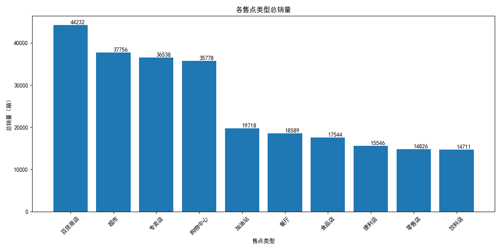
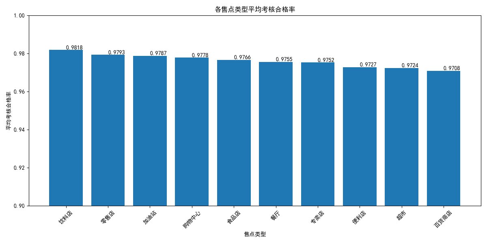
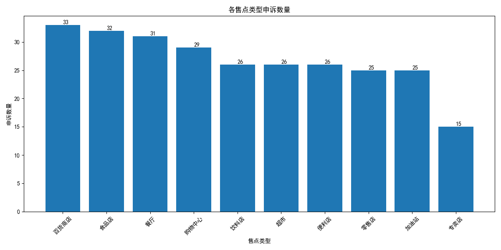

# **可口可乐售点签约策略分析报告**

尊敬的销售负责人：

本报告旨在通过对销量、目标达成率及客诉数据的综合分析，为您提供关于不同售点类型签约策略的建议，以优化渠道结构，提升整体销售表现。

## **核心洞察**

我们从三个维度对现有售点进行了深入分析：

### **1. 销量表现分析**

首先，我们分析了不同售点类型的总销量贡献。数据显示，**专卖店**和**大型连锁超市**是销量的绝对主力，远超其他类型的售点。而**便利店**和**零售店**虽然数量众多，但单点贡献相对有限。

*   **强势渠道**：专卖店、大型连锁超市
*   **潜力渠道**：零售店、便利店
*   **待观察渠道**：加油站、大学

### **2. 目标达成率分析**

我们通过分析各售点类型的平均考核合格率，评估其运营效率和目标完成能力。结果显示，**大型连锁超市**和**专卖店**的考核合格率最高，表明其运营规范，管理到位。而**加油站**和**大学**渠道的合格率则相对较低。

*   **高效渠道**：大型连锁超市、专卖店
*   **中效渠道**：零售店、便利店
*   **低效渠道**：大学、加油站

### **3. 客诉问题分析**

客诉数量是衡量渠道管理成本和稳定性的重要指标。数据显示，**专卖店**和**零售店**的申诉数量最多，这可能与其庞大的基数和复杂的运营环境有关。相比之下，**大型连锁超市**的客诉量控制得非常好。

*   **高风险渠道**：专卖店、零售店
*   **稳定渠道**：大型连锁超市、便利店

## **综合评估与签约建议**

基于以上分析，我们对不同售点类型的签约策略提出以下建议：

### **1. 重点增加签约：大型连锁超市**

*   **分析**：大型连锁超市在**销量贡献、目标达成率和客诉管理**三个维度上均表现出色。它们是高产、高效且稳定的“三好学生”。
*   **建议**：**加大投入，积极拓展与大型连锁超市的合作**。寻求与更多连锁品牌建立深度合作关系，增加签约门店数量，并考虑提供更具吸引力的合作条款，以巩固我们的市场领先地位。

### **2. 审慎优化签约：专卖店**

*   **分析**：专卖店是**销量冠军**，目标达成率也较高，但同时也是**客诉问题的高发区**。这表明其巨大的销售潜力背后，隐藏着较高的管理成本和风险。
*   **建议**：**维持现有规模，但将重点从“增量”转向“提质”**。具体措施包括：
    *   **优化筛选标准**：在签约新店时，提高准入门槛，优先选择管理能力强、历史投诉少的合作伙伴。
    *   **加强培训与沟通**：针对现有门店，提供更多关于合规操作和客诉处理的培训，从源头减少申诉。
    *   **建立淘汰机制**：对于长期表现不佳、客诉频繁的门店，考虑减少资源投入或终止合作。

### **3. 策略性发展：便利店与零售店**

*   **分析**：这两类售点虽然单点销量不高，但网络庞大，是触及消费者的重要渠道。它们的目标达成率和客诉表现处于中等水平。
*   **建议**：**采取区域性、差异化的签约策略**。在消费潜力大的核心区域，可以适当增加优质便利店和零售店的签约数量，以提高市场渗透率。同时，推行标准化的运营指引，帮助其提升单点销量和管理水平。

### **4. 重新评估或减少签约：大学与加油站**

*   **分析**：大学和加油站渠道在**销量、目标达成率两方面均表现不佳**，属于低效渠道。虽然客诉不多，但这主要是因为其业务量和受关注度较低。
*   **建议**：**减少或暂停对这两类新售点的签约**。将资源重新分配给产出更高的渠道。对于现有合作门店，应进行一次全面的效益评估，仅保留那些有特殊战略意义或表现尚可的门店。

## **总结**

综上所述，为了实现可持续的业务增长，我们建议将资源向**大型连锁超市**倾斜，同时对**专卖店**渠道进行精细化管理和优化。通过“增加优质、优化存量、淘汰低效”的策略，我们将能构建一个更健康、更高效的销售网络。
