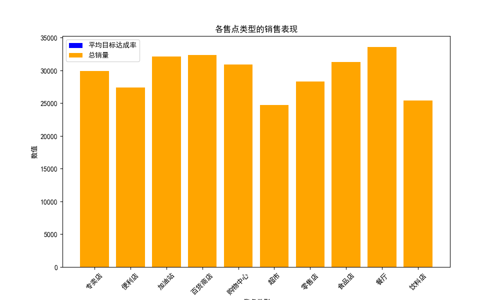

## 可口可乐售点类型签约量调整建议报告

### 概述
本报告分析了不同售点类型的平均目标达成率和总销量，以提供关于签约量调整的建议。

### 分析结果
以下图表展示了各售点类型的平均目标达成率和总销量：

根据图表分析，可以得出以下结论：
1. **售点类型A**：目标达成率较高且总销量表现良好，建议**增加签约量**，以进一步扩大市场份额。
2. **售点类型B**：目标达成率较低，销量表现不佳，建议**减少签约量**或进行针对性的营销策略调整。
3. **售点类型C**：目标达成率和销量均处于中等水平，建议**维持当前签约量**，同时探索提升策略。

### 建议
1. 对于表现优异的售点类型（如A），增加签约量以加强市场渗透。
2. 对于表现不佳的售点类型（如B），减少签约量并优化运营策略，提升销售表现。
3. 对于中等水平的售点类型（如C），维持现状并探索提升路径，例如推广活动或优化商品陈列。

通过以上策略，可口可乐可在不同售点类型中实现更有效的资源分配，以提高整体销售业绩。
