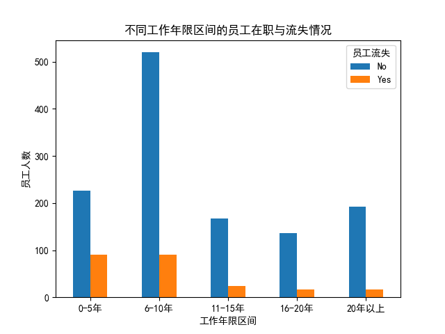
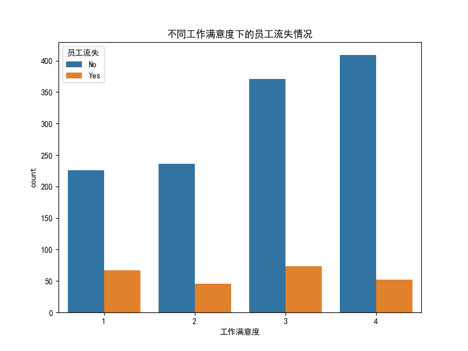
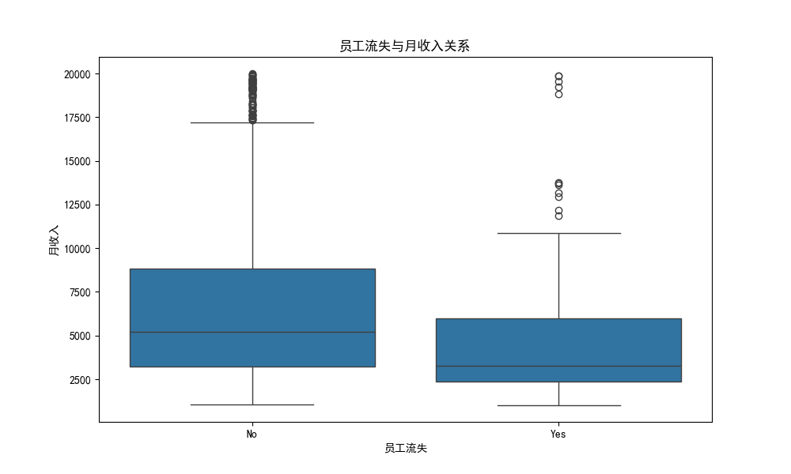
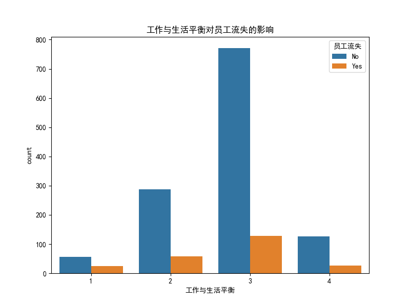

# **员工留任策略分析报告：基于数据的洞察与建议**

## 核心结论

通过对公司员工数据的深入分析，我们发现了一个严峻的现实：**公司目前没有在本公司工龄超过10年的员工**。这表明公司在长期员工留任方面面临巨大挑战。本报告旨在揭示导致员工流失的关键因素，并提出具体、可行的策略以提升员工的长期留任率。

---

## 一、 员工流失现状：各阶段均存在流失风险

首先，我们分析了不同总工作年限区间的员工在职与流失情况。如下图所示，员工流失现象贯穿于员工职业生涯的各个阶段。

**洞察**:
- **全阶段流失**：从“0-5年”的新员工到“20年以上”的资深员工，每个工作年限区间都存在明显的员工流失现象。
- **关键期流失不容忽视**：在“6-10年”这一员工职业发展的黄金时期，仍然有相当数量的员工选择离开，这对公司核心人才的积累是巨大的损失。

这表明，公司的员工留任问题是系统性的，而非仅仅是新员工的适应问题。

---

## 二、 深度诊断：为什么我们留不住人？

由于缺乏长期留任的员工样本，我们通过对比**在职员工**与**已流失员工**在多个关键维度上的特征差异，来诊断导致员工流失的核心原因。分析主要围绕工作满意度、薪酬水平和工作与生活平衡三个方面展开。

### 1. 工作满意度：低满意度是流失的“催化剂”

工作满意度是衡量员工工作状态的重要指标。我们的数据显示，满意度的高低与员工是否流失显著相关。

**洞察**:
- 在工作满意度评分为“1”（最低）和“2”的员工中，流失员工的比例明显高于在职员工。
- 相反，在满意度为“4”（最高）的员工中，在职员工的数量远超流失员工。
- 数据显示，已流失员工的平均工作满意度（2.46）低于在职员工（2.78）。

**结论**: **低工作满意度是驱动员工流失的关键因素之一。**

### 2. 薪酬水平：收入差距是现实的“推力”

薪酬是影响员工去留最直接的因素之一。通过对比两类群体的月收入分布，我们发现了明显的差距。

**洞察**:
- 从箱线图可以清晰地看到，**已流失员工的月收入中位数显著低于在职员工**。
- 流失员工的收入分布整体偏低，其收入的上四分位数（Q3）甚至不及在职员工的中位数水平。

**结论**: **缺乏竞争力的薪酬体系，尤其是对于表现优异或具备潜力的员工，是导致他们另寻高就的重要原因。**

### 3. 工作与生活平衡：失衡状态加剧离职倾向

在现代职场，工作与生活平衡（Work-Life Balance）越来越成为员工，尤其是核心人才关注的焦点。

**洞察**:
- 在“工作与生活平衡”评分为“1”（最差）的员工中，流失的员工数量非常突出。
- 随着平衡状态的改善（评分更高），在职员工的比例逐渐占据主导。

**结论**: **高强度的工作节奏、频繁的加班以及对个人生活的挤压，严重影响了员工的留任意愿。**

---

## 三、 行动建议：如何构建长期留任的基石？

基于以上分析，为了从根本上解决员工留存问题，我们必须采取系统性的措施。建议公司从以下三个方面着手，构建一个能吸引人、更能留住人的工作环境。

### 1. **全面提升员工工作满意度**
   - **优化管理方式**：数据显示，与现任经理的共事年限是影响留任的因素之一。建议加强对管理者的培训，提升其领导力、沟通和团队激励能力，建立积极、支持性的团队氛围。
   - **畅通反馈渠道**：建立定期的、匿名的员工满意度调研机制，及时发现并解决问题。对于员工反馈的问题，要做到“有回应、有跟进、有结果”。
   - **关注职业发展**：为员工提供清晰的职业发展路径和充足的培训机会，让员工看到在公司内部成长的希望。

### 2. **构建有竞争力的薪酬与激励体系**
   - **进行市场薪酬对标**：定期对标行业和同类岗位的薪酬水平，确保公司薪酬的外部竞争力，特别是对于核心岗位和高绩效员工。
   - **优化薪资涨幅机制**：将薪资涨幅与绩效评分更紧密地挂钩，让高绩效者获得更高的回报，体现薪酬的公平性和激励性。数据显示，流失员工和在职员工的平均薪资涨幅差异不大，这表明目前的涨薪机制可能未能有效激励优秀员工。
   - **探索多元化激励**：除了基本工资，积极探索股票期权、项目奖金、年终分红等多元化长期激励措施，将员工的个人利益与公司的长远发展深度绑定。

### 3. **大力推行工作与生活平衡**
   - **审视加班文化**：管理层应带头减少不必要的加班，提高工作效率。对于确实需要加班的情况，应提供合理的调休或补偿。
   - **推行弹性工作制**：在条件允许的部门和岗位，适度推行弹性工作时间或远程办公，给予员工更多自主权，帮助他们更好地平衡工作与家庭责任。
   - **组织关怀活动**：定期组织家庭日、团队建设、健康讲座等活动，传递公司对员工个人生活的关怀，增强员工的归属感和幸福感。

通过实施上述策略，我们相信公司能够逐步改善员工留存现状，打破“无人能留任十年”的魔咒，最终建立一支稳定、敬业且富有战斗力的核心团队。
