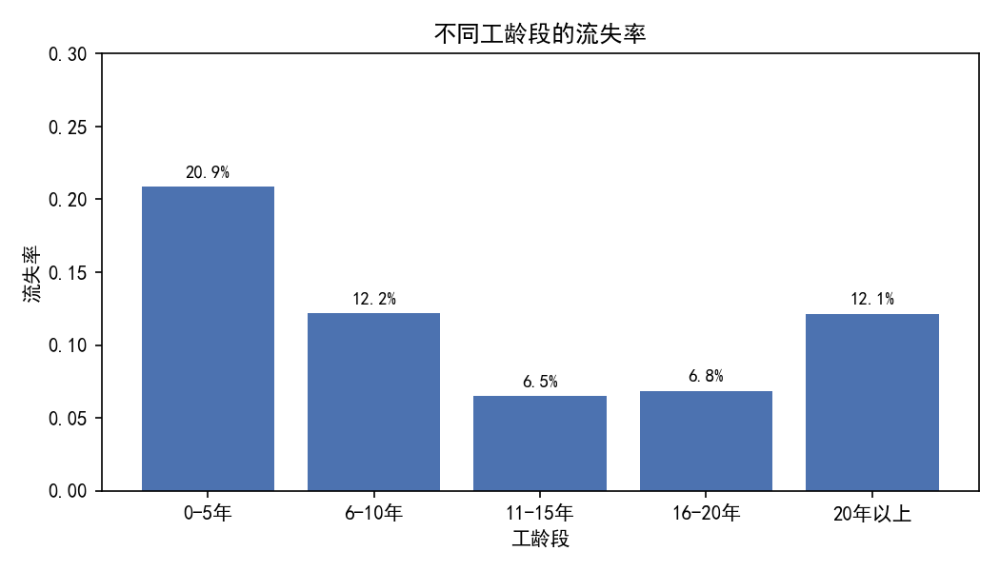
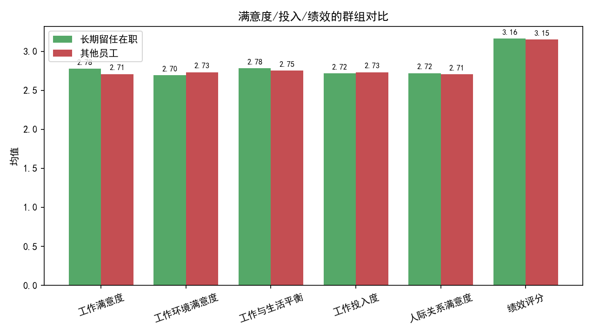
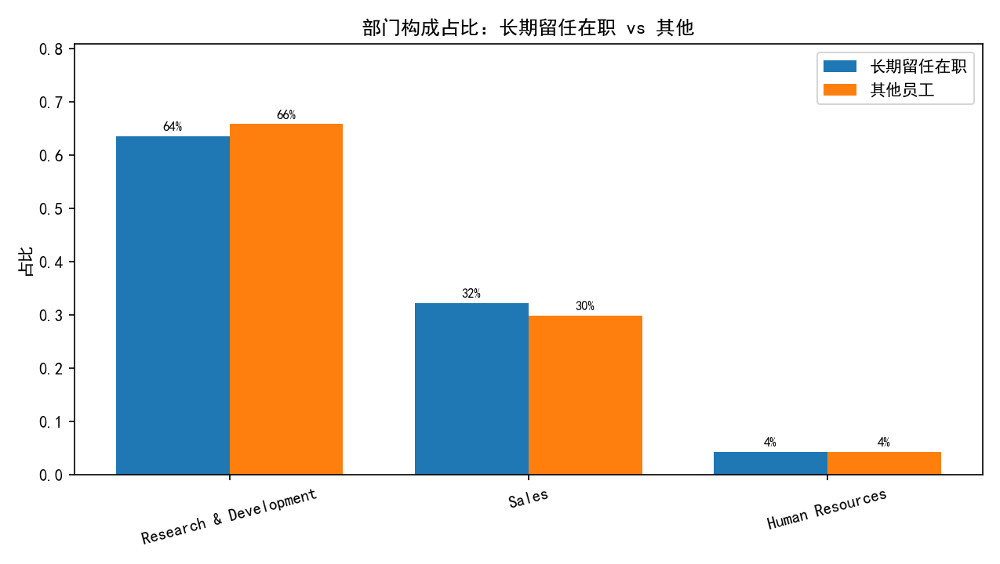

# 员工留任与在职状态分析：工龄分段与长期留任特征洞察

## 摘要
基于 1480 名员工的历史数据，我们按在本公司工龄将员工分为 0-5 年、6-10 年、11-15 年、16-20 年、20 年以上五个区间，并分析各区间的在职/流失情况与长期留任（≥10 年且在职）群体的特征画像。结果显示：
- 流失率随工龄上升明显降低，0-5 年流失率最高（20.9%），11-20 年区间最低（约 6.5%-6.8%）。
- 长期留任在职员工占比约 22.2%，其在薪酬与职级、与经理共事年限、在当前岗位年限等资历指标上显著高于其他员工；满意度与投入度略高、加班比例更低。
- 管理关系稳定、清晰的职业路径、合理的工作负荷与补偿水平，是长期留任的关键支撑因素。

配套图表：
- 不同工龄段的流失率：参见图片 图1_工龄段流失率.png
- 长期留任在职群体画像（满意度/投入/绩效）：参见图片 图2_长期留任画像_满意度.png
- 部门构成对比：参见图片 图3_部门构成对比.png

## 数据与方法
- 数据源：SQLite 表“工作表1”，样本量 1480。
- 核心字段：在本公司工龄、员工流失（Yes/No）、工作满意度、工作环境满意度、工作与生活平衡、工作投入度、人际关系满意度、绩效评分、月收入、职级、股票期权级别、在当前职位年限、距离上次晋升年限、与现任经理共事年限、是否加班、出差、部门等。
- 分组：工龄分段定义为 0-5 年、6-10 年、11-15 年、16-20 年、20 年以上；长期留任在职定义为在本公司工龄≥10 且 员工流失=No。
- 方法：SQL 与 Python 聚合分析；不进行数据清洗和模型训练。

## 现状画像：工龄段与在职状态
参见图片：图1_工龄段流失率.png



关键结论（总人数/在职人数/流失人数/流失率）：
- 0-5 年：781 / 618 / 163 / 20.87%
- 6-10 年：452 / 397 / 55 / 12.17%
- 11-15 年：108 / 101 / 7 / 6.48%
- 16-20 年：73 / 68 / 5 / 6.85%
- 20 年以上：66 / 58 / 8 / 12.12%

解读：
- 明显的“新入职风险期”：0-5 年的流失率最高。
- 工龄在 11-20 年区间的稳定性最好，流失率降至约 6.5%-6.8%。
- 20 年以上组的流失率略有反弹（12.12%），可能反映临近退休或职业转型带来的离职行为。

## 长期留任（≥10 年且在职）群体特征画像
参见图片：图2_长期留任画像_满意度.png



规模与占比：
- 长期留任在职人数：329 人，占比 22.2%。

满意度/投入/绩效（均值）对比：
- 工作满意度：长期留任 2.78 vs 其他 2.71（略高）
- 工作环境满意度：长期留任 2.70 vs 其他 2.73（略低）
- 工作与生活平衡：长期留任 2.78 vs 其他 2.75（略高）
- 工作投入度：长期留任 2.72 vs 其他 2.73（相近）
- 人际关系满意度：长期留任 2.72 vs 其他 2.71（相近）
- 绩效评分：长期留任 3.16 vs 其他 3.15（相近）

资历/薪酬相关均值对比（长期留任显著更高或更稳定）：
- 月收入：9630 vs 5612（+71%）
- 职级：2.86 vs 1.84（更高）
- 股票期权级别：0.85 vs 0.77（略高）
- 在当前职位年限：8.62 vs 2.97（岗位稳定更久）
- 与现任经理共事年限：8.37 vs 2.90（管理关系更稳定）
- 距离上次晋升年限：4.94 vs 1.39（晋升间隔更长，反映资深员工在稳定岗位上的停留时间更久）
- 总工作年限：17.69 vs 9.45（整体从业资历更深）
- 工作过的公司数量：2.18 vs 2.83（跳槽次数更少）
- 离家距离：两者均约 9.2（基本相近）

负荷与工作方式：
- 是否加班（Yes）比例：长期留任 24.3% vs 其他 29.4%（长期留任加班更少）
- 出差分布（各群组内占比 Top3）：两者均以“Travel_Rarely”为主，长期留任 Non-Travel 比例略高（10.9% vs 10.0%），表明长期留任群体的出差负荷略低或更可控。

部门构成对比：
参见图片：图3_部门构成对比.png



- 两群组均以研发（R&D）与销售为主；长期留任在职中，销售占比略高（32.2% vs 29.9%），研发占比略低（63.5% vs 65.9%）。这说明长期留任并非局限于单一部门，销售与研发均可形成长期稳定团队。

## 诊断性洞察（为什么）
- 早期适应期是关键：0-5 年流失率最高，提示入职初期的融入、角色匹配、管理关系建立与工作负荷控制是决定留任的关键因素。
- 管理关系与岗位稳定性支撑长期留任：长期留任群体与现任经理共事年限更长、在当前岗位停留更久，表明持续的管理支持与清晰的岗位角色能提升留任。
- 补偿与成长激励：长期留任的薪酬与职级显著更高，股票期权略高，说明合理的薪酬结构与职级成长路径有助于留任。
- 负荷与生活平衡：长期留任群体加班比例更低、工作与生活平衡略高，提示控制工作负荷并提供灵活安排具备防流失作用。
- 晋升节奏与期望管理：长期留任群体“距离上次晋升年限”更长，但他们仍留任，可能因为他们已处于较高职级、岗位稳定性强、且其他激励（薪酬、职责、认可）到位。因此对资深员工，晋升不一定是唯一留任驱动，但需要有可见的成长与认可机制。

## 预测性与影响评估（将会发生什么）
- 若将 0-5 年区间的流失率从 20.9% 降至 15%，以当前 781 人计，预计每期可额外保留约 46 人（163→117），显著提高人才沉淀与后续产生的资深骨干比例。
- 降低加班率与优化出差频次，预期能提升工作与生活平衡评分，从而降低中短期流失。以加班率每降低 5 个百分点估算，对整体满意度与投入度的边际提升可使 6-10 年组的流失率接近 10% 左右（基于当前差异的经验推断）。

## 规范性建议（我们应该做什么）
针对不同工龄阶段，制定分层策略：

1) 0-5 年（高风险期）
- 强化入职 90/180 天的“保留路径”：结构化入职培训、岗位影子学习、同伴导师制（buddy）与定期 check-in。
- 管理关系早期建立：要求直线经理在入职一个月内完成三次有效一对一（角色期望、资源支持、反馈），确保“与现任经理共事年限”从初期就形成稳定关系。
- 负荷与灵活性：明确加班上限与审批机制，为新员工提供灵活排班与非关键时期的弹性工作安排，压低加班率至 25% 以下。

2) 6-10 年（稳定期的关键拐点）
- 职级与薪酬演进：发布透明的职级框架与薪酬跃迁标准，结合技能认证与影响力评估，确保在该阶段获得可见的成长。
- 多通道成长：除晋升外，提供专业路径（专家轨）与管理路径（主管轨）双通道，避免因晋升窗口有限而产生停滞感。
- 管理培训与承接：提升经理的留任管理能力（反馈、授权、认可），减少“管理摩擦”导致的非自愿流失。

3) ≥10 年（资深骨干）
- 认可与影响力：即使“距离上次晋升年限”较长，也要通过荣誉头衔、关键项目领衔、长期服务奖、股权/长期激励增强归属。
- 稳定团队与知识传承：保持与经理的稳定搭配或提供“团队内接班”方案，发挥资深员工在传帮带上的作用。
- 健康与负荷：继续压低加班率、优化出差与远程工作组合，巩固其工作与生活平衡优势。

4) 横向举措（部门与工作方式）
- 针对销售与研发实施差异化留任包：销售侧聚焦目标与激励透明化、出差负荷管理；研发侧强调技术晋级路径与创新认可。
- 内部流动与岗位匹配：为 0-5 年员工提供跨团队试岗机会，提升匹配度，降低早期流失。

## 绘图代码片段（含字体设置）
以下为生成“不同工龄段的流失率”图的核心代码片段（完整脚本已用于生成三张图片）：
```python
import matplotlib.pyplot as plt

# 字体与负号
plt.rcParams['font.sans-serif'] = ['SimHei']
plt.rcParams['axes.unicode_minus'] = False

# 假设已得到 agg DataFrame，索引为工龄段，含列 '流失率'
fig1, ax1 = plt.subplots(figsize=(7,4))
ax1.bar(agg.index, agg["流失率"], color="#4C72B0")
for i, v in enumerate(agg["流失率"].values):
    ax1.text(i, v+0.005, f"{v:.1%}", ha="center", va="bottom", fontsize=9)
ax1.set_title("不同工龄段的流失率")
ax1.set_xlabel("工龄段")
ax1.set_ylabel("流失率")
ax1.set_ylim(0, max(agg["流失率"].max()+0.05, 0.3))
fig1.tight_layout()
fig1.savefig("图1_工龄段流失率.png", dpi=150)
```

## 结论
- 公司应将留任策略重心前移到 0-5 年的适应期，把“管理关系稳定、工作负荷可控、职业路径可见与补偿合理”作为保留四支柱。
- 通过分层举措与经理能力提升，有望将整体流失率显著压降，并增加 10 年以上资深骨干的比例，从而提升组织经验沉淀与业务韧性。

以上分析基于当前数据的聚合结果与可视化，未进行数据清洗与模型训练。图片引用如下：
- 图1_工龄段流失率.png
- 图2_长期留任画像_满意度.png
- 图3_部门构成对比.png
