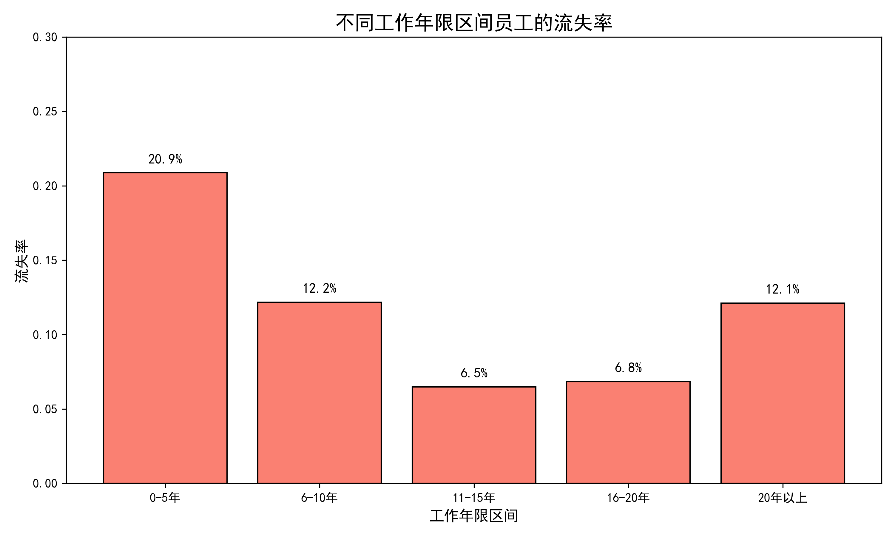
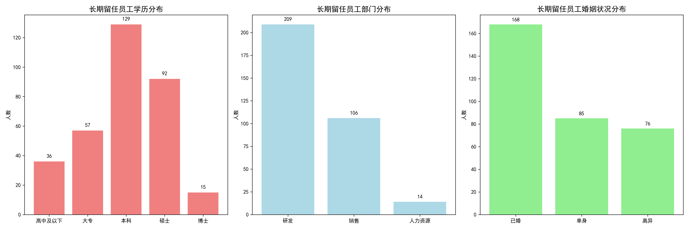
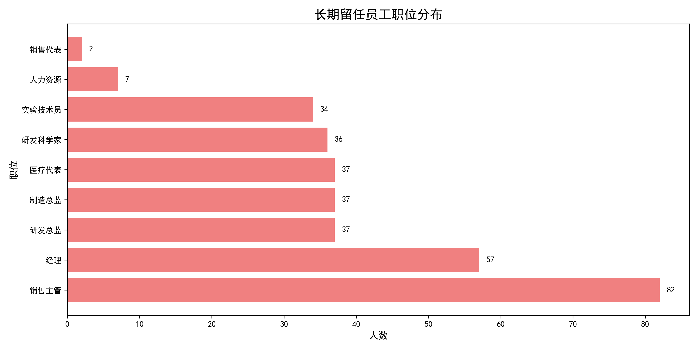
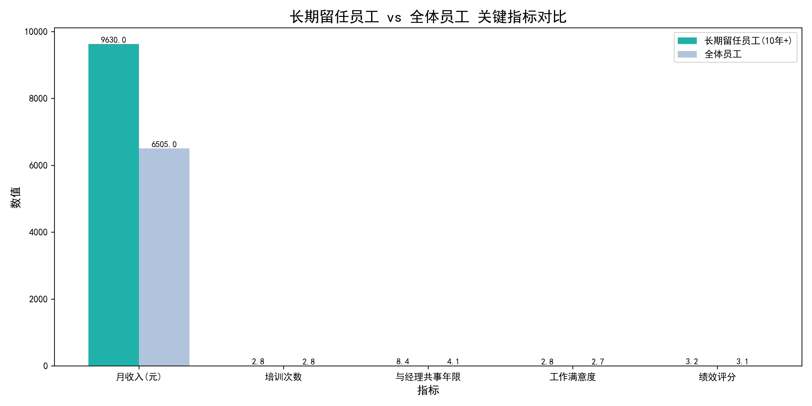

# 员工长期留任特征分析与留任策略建议

## 一、分析背景

本报告基于公司人力资源数据库，分析不同工作年限区间员工的当前在职状态，重点挖掘在本司长期留任（10年及以上）的员工具备哪些特征，并提出提升员工留任时间的具体举措。

## 二、不同工作年限区间员工流失率分析

通过对员工按工作年限划分为0-5年、6-10年、11-15年、16-20年、20年以上五个区间，统计各区间流失率如下：

**关键发现：**
- **0-5年员工流失率高达20.9%**，是新员工流失的重灾区
- **6-10年员工流失率下降至12.2%**，说明员工逐渐稳定
- **10年以上员工流失率均低于10%**，其中16-20年区间最低（6.8%）

这表明员工在公司工作越久，忠诚度越高，因此提升员工留任时间的关键在于**前10年的员工体验与激励机制**。

## 三、长期留任员工（10年+）特征画像

### 3.1 人口特征分布

**学历特征：**
- 本科及以上学历占比高达78.5%（本科44.8%，硕士31.9%，博士5.2%）
- 高学历员工更倾向于长期留任

**部门特征：**
- 研发部门长期留任员工最多（209人，占比63.3%）
- 销售部门次之（106人，占比32.1%）
- 人力资源部门最少（14人，占比4.2%）

**婚姻状况：**
- 已婚员工占比最高（50.9%），家庭稳定可能是留任因素之一

### 3.2 职位分布特征

**关键职位：**
- 销售主管（82人）和经理（57人）是长期留任最多的职位
- 研发类职位（研发总监、研发科学家、实验技术员）也有较多长期留任员工
- 管理层和技术专家是长期留任的核心群体

### 3.3 关键指标对比分析

**长期留任员工 vs 全体员工：**
- **月收入显著更高**：9630元 vs 6505元（高出48%）
- **与现任经理共事年限更长**：8.37年 vs 4.12年（高出103%）
- **工作满意度和绩效评分略高**，但差异不大
- **培训次数差异微小**（2.83 vs 2.80）

## 四、长期留任员工的关键成功因素

### 4.1 薪资竞争力是核心因素
长期留任员工的实际月收入比全体员工高出48%，但月薪标准差距很小，说明**长期留任员工获得了更多的绩效奖金和晋升机会**。

### 4.2 与上级关系稳定至关重要
长期留任员工与现任经理共事年限（8.37年）是全体员工（4.12年）的两倍多，表明**稳定的上下级关系是员工留任的重要保障**。

### 4.3 工作强度适中
- 75.7%的长期留任员工不需要加班
- 69.7%的员工出差频率较低（Travel_Rarely）
说明**合理的工作强度有助于员工长期留任**。

### 4.4 股权激励效果有限
虽然股票期权级别为1的员工最多（150人），但级别为0的员工也有123人，说明**股权激励并非决定性因素**。

## 五、提升员工留任时间的具体举措

### 5.1 针对0-5年新员工的留任策略
**问题**：新员工流失率高达20.9%
**建议**：
1. **完善新员工导师制度**：为每位新员工配备经验丰富的导师，帮助其快速适应公司文化
2. **优化入职培训体系**：增加实践性培训，减少理论灌输
3. **建立定期反馈机制**：入职后3个月、6个月、1年进行定期绩效反馈和职业发展规划
4. **提供具有竞争力的起薪**：确保新员工薪资不低于市场平均水平

### 5.2 建立有效的薪资激励机制
**依据**：长期留任员工月收入高出48%
**建议**：
1. **建立透明的晋升薪资体系**：让员工清楚看到职业发展路径和对应的薪资增长
2. **强化绩效与薪资挂钩**：确保高绩效员工获得相应的薪资回报
3. **设立长期服务奖**：为服务满5年、10年、15年的员工提供额外奖金或福利
4. **定期进行薪资市场对标**：确保公司薪资水平具有竞争力

### 5.3 优化管理层与员工关系
**依据**：长期留任员工与经理共事年限高出103%
**建议**：
1. **加强中层管理者培训**：提升管理者的领导力和沟通技巧
2. **建立管理者评估机制**：将员工满意度和留任率纳入管理者绩效考核
3. **促进内部轮岗机制**：在保持业务连续性的前提下，允许员工在不同团队间轮岗
4. **建立员工申诉渠道**：确保员工与上级发生矛盾时有公正的解决机制

### 5.4 改善工作环境和福利
**依据**：75.7%的长期留任员工不加班，69.7%出差频率低
**建议**：
1. **推行弹性工作制度**：允许员工根据工作需要灵活安排工作时间
2. **控制加班文化**：建立加班审批制度，避免无效加班
3. **优化出差政策**：减少不必要的出差，提供出差补贴和调休
4. **改善办公环境**：提供舒适的办公设施和休息区域

### 5.5 重点关注高学历人才
**依据**：78.5%的长期留任员工拥有本科及以上学历
**建议**：
1. **建立技术人才职业发展通道**：为技术人员提供与管理岗位平行的职业发展路径
2. **增加研发投入**：为研发人员提供更好的实验条件和项目资源
3. **建立学术交流合作**：鼓励员工参与行业会议和学术交流
4. **提供继续教育支持**：为员工提供在职学习和深造的机会

## 六、结论

通过深入分析发现，员工长期留任的关键在于**前10年的员工体验**。公司应重点关注新员工的融入过程，建立具有竞争力的薪资体系，维护稳定的上下级关系，并提供合理的工作强度。同时，要特别重视高学历人才和研发人员的留任，因为他们是公司长期发展的核心力量。

**预期效果**：通过实施上述建议，预计可以将0-5年新员工的流失率从20.9%降低至15%以下，整体提升员工平均留任时间2-3年，为公司节省大量招聘和培训成本，同时保持核心人才的稳定性。
