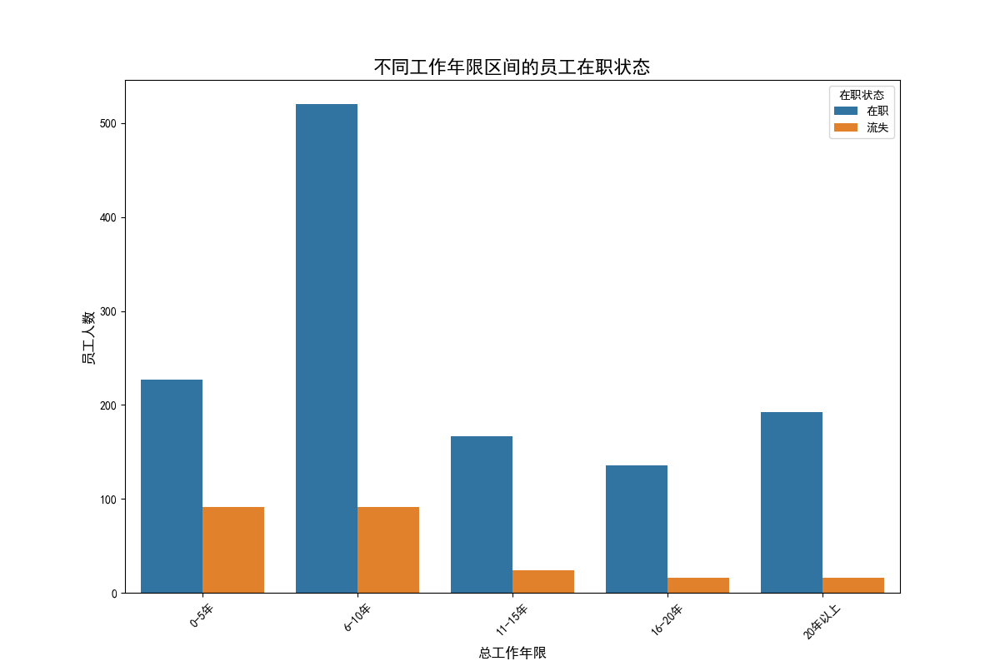
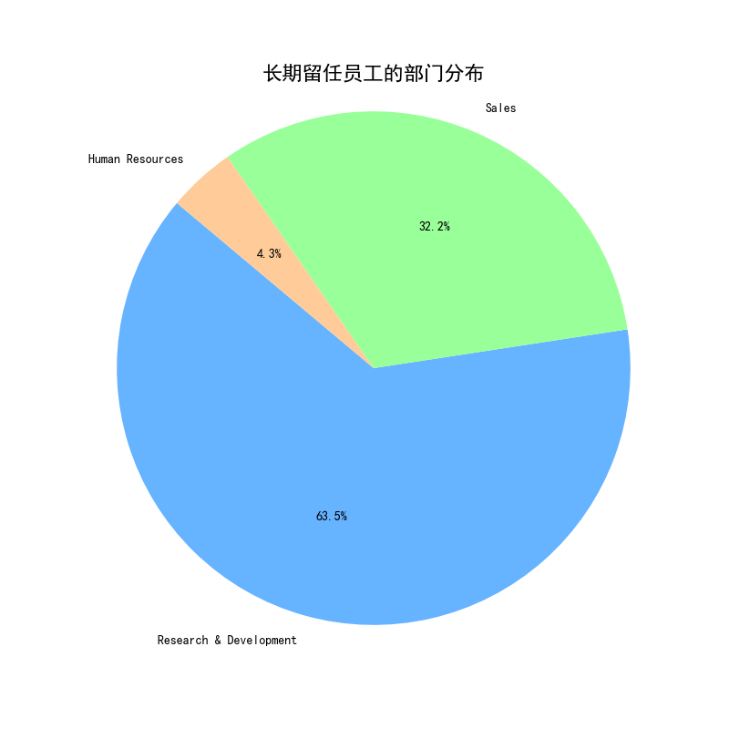

# 关于提升员工留任率的数据分析报告

## 一、引言
本报告旨在通过分析公司现有员工数据，挖掘影响员工长期留任的关键因素，并为公司制定提升员工留任时间的策略提供数据支持。我们主要围绕以下两个核心问题展开分析：
1.  不同工作年限区间的员工在职与流失情况如何？
2.  在本司长期留任（10年及以上）的员工具备哪些共同特征？

## 二、不同工作年限区间的员工在职状态分析

为了解员工在职业生涯不同阶段的稳定性，我们将员工按总工作年限划分为五个区间，并分析了每个区间的流失情况。

**分析洞察:**
- **年轻员工流失率显著偏高**：从上图可以清晰地看到，绝大多数的员工流失集中在 **0-5年** 工作经验的群体中。这个阶段的员工尚处于职业探索期，对公司的归属感尚未完全建立，是流失风险最高的群体。
- **员工稳定性随工龄增长而提升**：随着工作年限的增加，员工的在职率显著提高。特别是工作年限超过10年的员工，流失人数非常少，表现出极高的忠诚度。

这表明，**要想有效提升整体员工留任率，关键在于降低入职早期（0-5年）员工的流失率**。

## 三、长期留任员工（工龄≥10年）特征深度挖掘

为了解如何让员工更长久地为公司服务，我们对在职超过10年的员工群体进行了深度画像分析，总结出以下核心特征：

### 关键特征概览：
1.  **经验丰富且稳定**：平均年龄约40岁，超过一半（51%）已婚，家庭状态稳定。
2.  **高工作满意度和投入度**：他们对当前的工作、人际关系普遍感到满意（超过63%的员工满意度评分高），并且对工作本身有极高的投入感（近67%的员工投入度评分高）。
3.  **稳定的管理关系**：平均与现任经理共事时间长达8.3年，说明管理层连续性好，与下属建立了长久的信任关系。
4.  **部门集中度高**：研发部和销售部是长期员工的主要聚集地。

### 部门分布特征：

**分析洞察:**
- **研发部是人才的“压舱石”**：高达 **63.5%** 的长期留任员工来自研发部门。这表明研发部的工作环境、技术挑战、团队文化或激励机制在留住核心人才方面非常成功。
- **销售部是公司骨干的重要来源**：销售部贡献了 **32.2%** 的长期员工，是公司业务稳定的基石。

## 四、提升员工留任时间的具体举措建议

基于以上分析，我们提出以下五个方面的具体建议，旨在系统性地提升员工的长期留任率：

1.  **实施“新员工护航计划”，降低早期流失率**
    *   **目标群体**: 0-5年工龄的员工。
    *   **具体举措**:
        *   推行**“一对一”导师制**，由长期留任的优秀老员工担任导师，帮助新员工快速融入团队、熟悉业务。
        *   为新员工提供**清晰的短期（1-2年）职业发展路径图**，让他们看到成长的希望和方向。
        *   增加早期的团队建设活动和跨部门交流，增强归属感。

2.  **深耕研发与销售部门，固化成功经验**
    *   **目标群体**: 研发部和销售部全体员工。
    *   **具体举措**:
        *   深入调研这两个部门的**激励机制、团队文化和管理模式**，总结出可复制的成功因子。
        *   将成功经验**推广到其他部门**，特别是人员流动性较高的部门，以提升整体组织健康度。

3.  **优化中长期职业发展通道，打破晋升瓶颈**
    *   **目标群体**: 5-10年工龄的核心骨干。
    *   **具体举措**:
        *   建立除管理通道外的**“专业技术职级”通道**，让技术专家即使不担任管理职，也能获得职级和薪酬的提升。
        *   定期（如每两年）进行一次职业发展面谈，为长期未晋升的绩优员工量身定制发展计划或提供跨领域轮岗机会。

4.  **推行“家庭友好”福利政策，增强员工归属感**
    *   **目标群体**: 全体员工，尤其是有家庭的员工。
    *   **具体举措**:
        *   在条件允许的情况下，试行**弹性工作制**或远程工作日。
        *   定期举办**公司家庭日**活动，增进员工家人对公司的了解与认同。
        *   提供子女教育、健康讲座等关怀服务，体现公司的人文关怀。

5.  **倡导和培训“伙伴式”管理文化**
    *   **目标群体**: 全体管理者。
    *   **具体举措**:
        *   在管理者选拔和晋升中，将**“团队稳定性”和“下属敬业度”**作为重要考核指标。
        *   开展领导力培训，教导管理者如何与下属建立长期信任、提供有效辅导和支持，而不是简单分派任务。

通过实施上述策略，公司不仅可以有效降低高风险群体的流失率，还能进一步巩固核心人才的忠诚度，从而构建一个更稳定、更具凝聚力的人才队伍。
