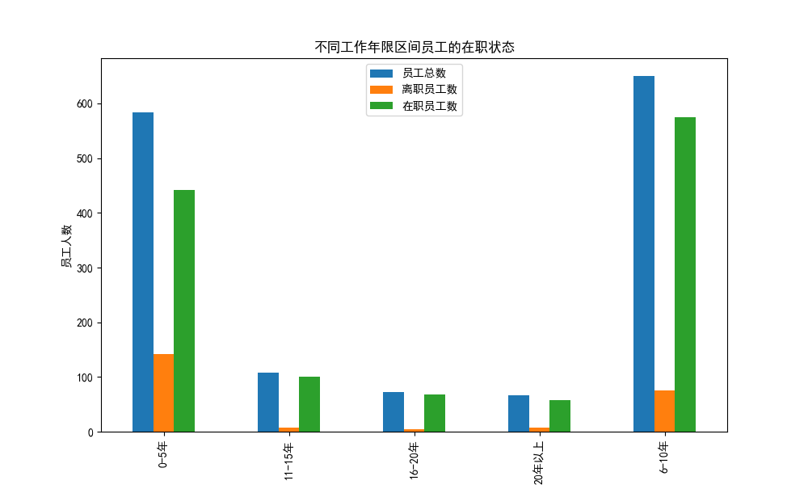

# 员工留任分析报告

## 不同工作年限区间员工的在职状态

根据以上图表，我们可以看到不同工作年限区间的员工总数、离职员工数和在职员工数。大部分员工在公司工作时间较长，但也有一部分员工在较短时间内离职。

## 长期留任员工的特征分析

### 学历分布
学历分布如下：
- 学历3：140人
- 学历4：109人
- 学历2：61人
- 学历1：40人
- 学历5：17人

### 工作满意度分布
工作满意度分布如下：
- 满意度4：118人
- 满意度3：111人
- 满意度1：69人
- 满意度2：69人

### 薪资等级分布
薪资等级分布如下：
- 5k-10k：124人
- Upto 5k：86人
- 10k-15k：82人
- 15k+：75人

## 建议

1. **提高员工满意度**：提高员工的工作满意度可以通过提供更好的工作环境、改善人际关系和提供更好的工作与生活平衡来实现。

2. **提供有竞争力的薪资**：从薪资等级分布来看，薪资较高的员工更可能长期留任。因此，公司应确保提供具有竞争力的薪资。

3. **提供职业发展机会**：长期留任的员工可能更看重职业发展机会。公司应提供晋升机会和培训，以帮助员工提升技能并实现职业发展。

4. **优化招聘策略**：从学历分布来看，学历较高的员工更可能长期留任。公司在招聘时可以更注重高学历的候选人，同时也可以提供内部培训，帮助低学历员工提升技能。

通过采取以上措施，公司可以提高员工的留任时间，从而减少员工流失，提高公司的稳定性和效率。
