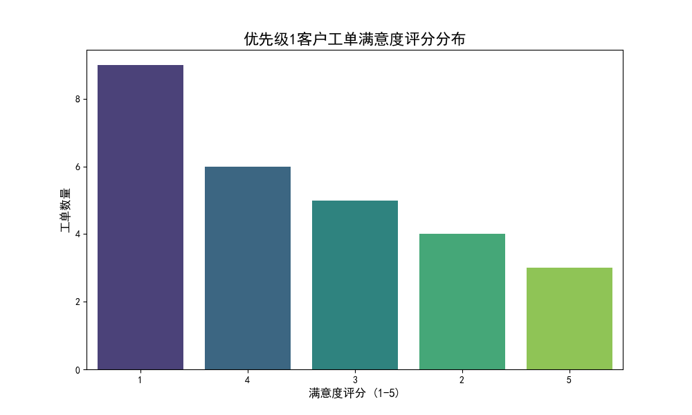
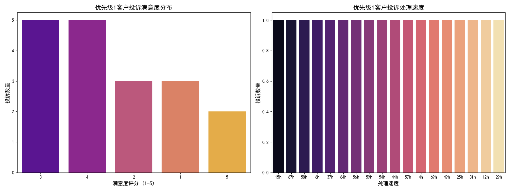

# 报告：关于联系优先级为1的客户服务质量分析

本报告旨在深入分析服务人员对联系优先级为1的客户所提供的服务质量。我们通过对客户的工单处理情况和投诉数据进行挖掘，旨在发现当前服务流程中的关键问题，并提出切实可行的优化建议。

## 一、核心发现

综合分析表明，我们对最高优先级客户的服务质量**存在显著不足**，未能满足该客户群体的高期望值。主要体现在以下两方面：

1.  **工单处理满意度严重偏低**：客户在获得服务后，表现出极高的不满意度。
2.  **服务问题引发大量投诉**：糟糕的服务体验直接导致了与其工单数量不成比例的高投诉率。

## 二、工单处理情况分析

我们共分析了27个来自优先级1客户的客服工单，数据显示出令人担忧的趋势。

-   **满意度评分两极分化，但负面评价占主导**：如下图所示，在1-5分的满意度评分中，给出最低分**1分的客户占比高达33.3%**，是所有评分中比例最高的。相比之下，给出4分和5分好评的客户总共才占33.3%。这清晰地表明，超过三分之一的高优先级客户对我们的服务极其不满意。

-   **处理耗时中等，但可能未达预期**：工单的平均处理时间约为33分钟。虽然这个数字本身不一定代表效率低下，但结合极低的满意度来看，服务人员可能在规定时间内“完成”了工作，却没有“解决”客户的根本问题，导致客户认为浪费了时间且问题依旧。

## 三、客户投诉情况分析

在27个工单中，竟然产生了18起投诉，这是一个非常危险的信号，表明服务失败是普遍现象，而非个例。

-   **投诉处理后的满意度有所改善，但仍不理想**：投诉处理后，客户的满意度分布比工单处理后要好一些，1分和2分的不满评价合计占比降至33.3%，而4分和5分的满意评价占比提升至38.9%。这说明投诉处理流程在一定程度上起到了弥补作用，但仍未能完全赢回客户的信任。

-   **处理速度与升级情况**：数据显示，仅有不到6%的投诉被启动了升级处理，绝大部分投诉由一线人员关闭。这可能意味着我们的处理流程倾向于“快速关闭”而非“彻底解决”，特别是对于复杂问题，缺乏有效的升级和专家介入机制，导致客户在投诉后仍感到失望。

## 四、结论与建议

**结论**：当前，我们对优先级为1的客户所提供的服务质量与其重要性严重不符。服务流程存在的主要问题是**重“完成”而轻“解决”**，导致客户问题悬而未决，满意度低下，并最终通过大量投诉表达不满。

为了改善这一状况，我们提出以下**规范性建议**：

1.  **对低分工单进行专项复盘**：
    -   **诊断性分析**：立即成立专项小组，对所有评分为1分和2分的工单进行深度复盘，找出导致客户不满的根本原因（是技能不足、流程僵化还是态度问题？）。

2.  **优化投诉处理与升级机制**：
    -   **规范性策略**：重新定义投诉升级标准。当一线处理无法提升客户满意度或问题涉及跨部门协作时，应强制启动升级流程，确保问题能由更高级别的专家或管理人员跟进。

3.  **为高优先级客户建立专属服务标准 (SLA)**：
    -   **预测性与规范性策略**：预测到这类客户未来仍会有高标准的服务需求。为他们设立专门的服务通道，指派经验最丰富的服务专家，并承诺更短的响应和解决时间。通过主动管理客户预期，防止不满情绪的产生。

4.  **加强服务人员培训**：
    -   **规范性策略**：加强对服务人员“解决问题”而非“关闭工单”的思维培训，并赋予他们更多解决问题的权限和资源，鼓励他们为彻底解决客户问题而努力。
