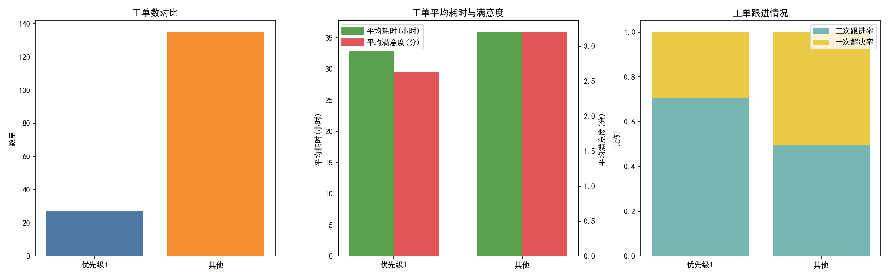
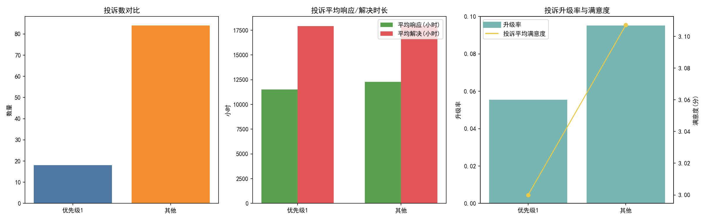
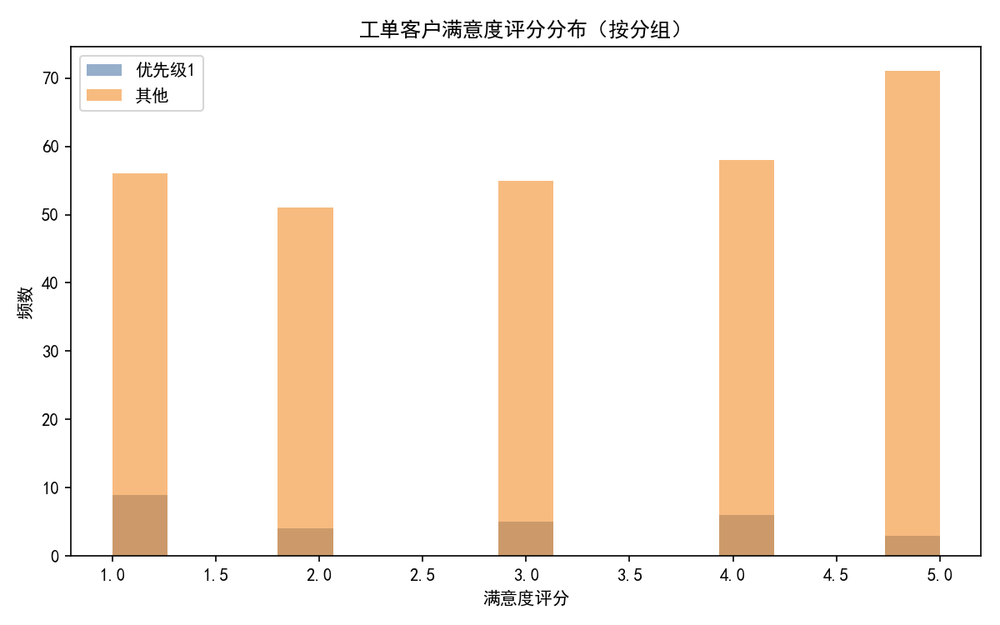
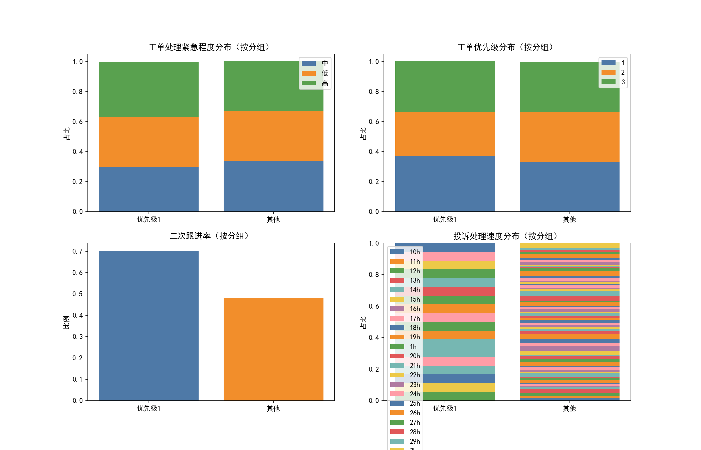

# 针对联系优先级为1客户的服务质量评估（基于工单与投诉）

> 核心问题：对于联系优先级为1的客户，从客户投诉和工单处理情况等方面，服务人员的服务质量如何？是否达成更优体验？

## 数据来源与分析方法
- 数据库表：客户联系人表（识别联系优先级）、合同管理表（客户-合同-工单关联）、客服工单表（工单耗时/满意度/跟进）、投诉处理表（投诉满意度/响应与解决时长/是否升级）。
- 关联路径：客户联系人表 → 客户ID → 合同管理表 → 合同ID → 客服工单表/投诉处理表。
- 分组：
  - 优先级1：客户联系人表中联系优先级=1的客户（客户数=105）。
  - 其他：其他优先级客户（客户数=422）。
- 输出与可视化：以SQL聚合生成 tickets_metrics.csv、complaints_metrics.csv，并导出 tickets_raw.csv、complaints_raw.csv 原始明细。使用Python绘制对比图，图片保存在当前目录并在报告中引用。

## 核心结论（概览）
- 工单维度（优先级1 vs 其他）：
  - 工单满意度更低：2.63分 vs 3.20分（聚合）；统计效应量 Cohen's d≈-0.34（负值表示优先级1更低）。
  - 二次跟进率更高：约70.37% vs 49.63%（聚合）；两比例差近似z=2.21，p≈0.0269（统计上显著更高）。
  - 平均耗时略低：32.85小时 vs 35.93小时（聚合），差异不大。
- 投诉维度：
  - 投诉满意度略低：3.00分 vs 3.11分（差异较小）。
  - 升级率更低：5.56% vs 9.52%（优先级1更少升级）。
  - 响应时长略短：11501小时 vs 12288小时；解决时长相近：17912小时 vs 17978小时。注：响应/解决时长整体数值偏大，可能反映积压或时间口径为自然时长而非工时（但按既有字段计算，不进行清洗）。

## 可视化结果与结构性洞察
- 工单/投诉关键指标对比：见“工单指标对比图”和“投诉指标对比图”。





- 工单满意度分布（直方图）：优先级1的满意度分布整体更偏低段。



- 影响因素分布（结构对比）：工单处理紧急程度、工单优先级、投诉处理速度的分布如下图所示。



- 结构性补充（SQL快速分布）显示工单紧急程度分布在两个分组上较为均衡：
  - 优先级1：高10/中8/低9；
  - 其他：高96/中98/低97；
  这意味着“紧急程度”的结构差异并不能解释优先级1满意度更低与二次跟进率更高的现象。

## 诊断性分析（为什么会这样）
- 高二次跟进率与较低满意度的共振：
  - 优先级1客户的工单二次跟进率显著更高，意味着同一问题需要重复沟通或多次处理。这通常会拉低满意度，且与一次解决率明显偏低（29.63% vs 50.37%）一致。
- 升级率更低但满意度并无更好：
  - 优先级1投诉升级率更低（5.56% vs 9.52%），可能代表前线团队倾向“自我闭环而非升级”。在复杂问题场景中，过度压制升级可能导致更频繁的重复跟进、延长客户的感知等待，进而拉低满意度。
- 响应与解决时长整体偏长：
  - 两类客户的投诉响应/解决时长均非常高，优先级1虽略有更快响应，但解决时长几乎持平，提示投诉闭环链条普遍较慢。若客户对优先级1寄予更高期望，则“响应更快但解决不更快”会造成更强烈的不满感。
- 结构分布未能解释差异：
  - 紧急程度/工单优先级/投诉速度的分布差异不显著，说明问题更多来自流程策略（例如是否及时升级、一次解决能力）而非任务本身的优先级设定。

## 风险与预测（如果不改善会发生什么）
- 若维持当前策略，优先级1客户的低满意度与高重复跟进将延续，带来更高流失风险与更频繁的投诉。二次跟进率的统计显著差异表明这不是偶然波动。
- 投诉解决周期长期高位，可能导致客户对品牌服务承诺的信任下降。优先级1人群通常具有较高价值或影响力，其声量与外溢影响更大。

## 规范性建议（我们应该做什么）
1. 提升一次解决率：
   - 为优先级1客户设立专属“快速处置”清单与知识库路径；
   - 增强前线赋能（授权变更/补偿权限、快捷工具），减少因权限不足导致的反复转单。
2. 优化升级策略（适度前移升级阈值）：
   - 定义优先级1工单的“升级条件清单”（如二次跟进仍未闭环、预计解决超过设定阈值即升级），避免“拖而不升”。
   - 开设优先级1“值班专家”或SWAT小组，确保升级后有明确时限与闭环责任。
3. SLA双轨制：
   - 为优先级1客户设定更短的响应与解决SLA，并将其纳入考核；
   - 建立SLA预警机制：当预计解决时间超阈值，自动预警并触发资源调度或升级。
4. 沟通体验管理：
   - 建立“连续沟通责任制”，避免频繁更换处理人导致信息断层与重复沟通；
   - 在二次及以上跟进触发时，主动提供“进展摘要+下一步计划+承诺时间”，降低不确定性不满。
5. 质量复盘与根因定位：
   - 对优先级1客户的“多次跟进工单”进行问题类型与处理动作复盘，识别最常见的卡点（权限、跨部门协调、信息缺失等）；
   - 将根因与解决方案沉淀到知识库、培训与流程改造中。

## 关键图与数据引用
- 工单/投诉关键指标：见 tickets_metrics.png 与 complaints_metrics.png。
- 满意度分布：见 sat_distribution.png。
- 结构分布与影响因素：见 service_drivers.png。
- 统计摘要（部分）：
  - 二次跟进率：优先级1=0.704（19/27），其他≈0.481（统计近似z=2.21，p≈0.027）。
  - 工单满意度：优先级1均值≈2.63，其他≈3.13，Cohen's d≈-0.34。
  - 工单耗时：优先级1≈32.85小时，其他≈36.31小时。
  - 投诉响应/解决：优先级1响应≈11501小时，解决≈17913小时；其他响应≈12362小时，解决≈17808小时。

## 绘图代码片段（示例）
```python
import matplotlib.pyplot as plt
import pandas as pd
import numpy as np

# 字体设置（中文环境）
plt.rcParams['font.sans-serif'] = ['SimHei']
plt.rcParams['axes.unicode_minus'] = False

# 读取聚合指标
tickets_metrics = pd.read_csv('tickets_metrics.csv')
complaints_metrics = pd.read_csv('complaints_metrics.csv')

# 工单数与平均耗时/满意度可视化示例
fig, axes = plt.subplots(1, 3, figsize=(16, 5))
axes[0].bar(tickets_metrics['分组'], tickets_metrics['工单数'], color=['#4E79A7','#F28E2B'])
axes[0].set_title('工单数对比')
axes[0].set_ylabel('数量')

x = np.arange(len(tickets_metrics['分组']))
width = 0.35
ax2 = axes[1]
ax2_2 = ax2.twinx()
ax2.bar(x - width/2, tickets_metrics['工单平均耗时'], width=width, color='#59A14F')
ax2_2.bar(x + width/2, tickets_metrics['工单平均满意度'], width=width, color='#E15759')
ax2.set_title('工单平均耗时与满意度')
ax2.set_xticks(x)
ax2.set_xticklabels(tickets_metrics['分组'])

# 二次跟进率与一次解决率
once_rate = 1 - tickets_metrics['二次跟进率']
axes[2].bar(tickets_metrics['分组'], tickets_metrics['二次跟进率'], label='二次跟进率', color='#76B7B2')
axes[2].bar(tickets_metrics['分组'], once_rate, bottom=tickets_metrics['二次跟进率'], label='一次解决率', color='#EDC948')
axes[2].set_title('工单跟进情况')
axes[2].legend()

plt.tight_layout()
plt.savefig('tickets_metrics.png', dpi=150)
```

## 结论
- 针对联系优先级为1客户，当前服务质量并未优于其他客户：满意度更低、二次跟进率显著更高，一次解决率显著更低；投诉升级更少但并未带来更高满意度与更快解决。
- 建议将“优先级1”真正转化为“优先级处置”：以一次解决率与解决SLA为核心KPI，优化升级策略与前线授权，并对多次跟进的根因进行专项治理。上述动作可望降低重复跟进、缩短闭环时间、提升客户感知满意度。
