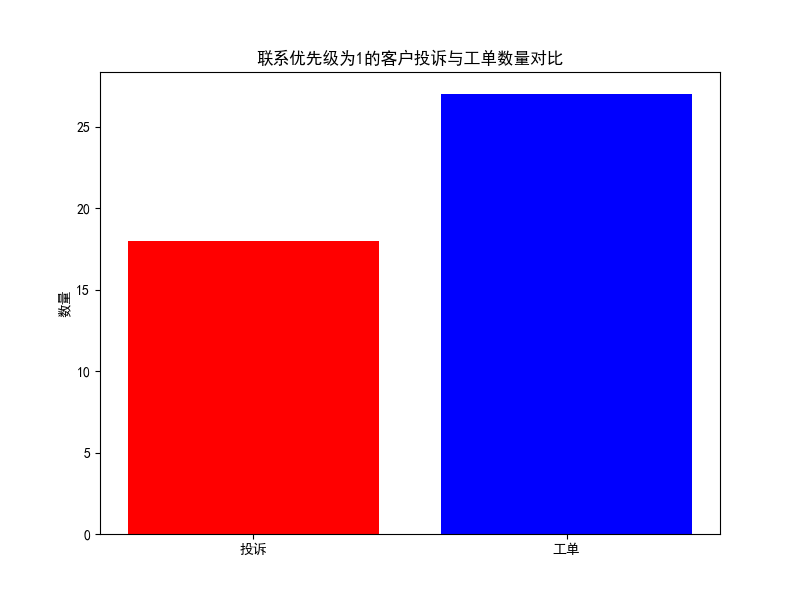
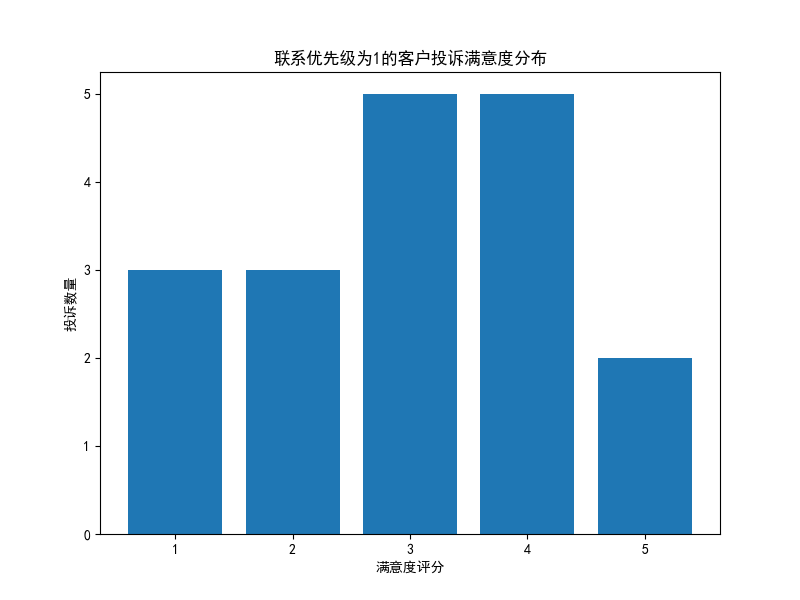
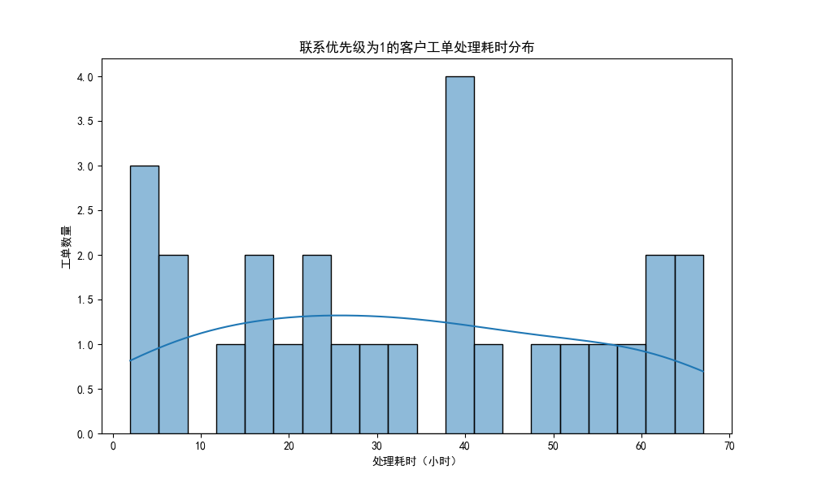
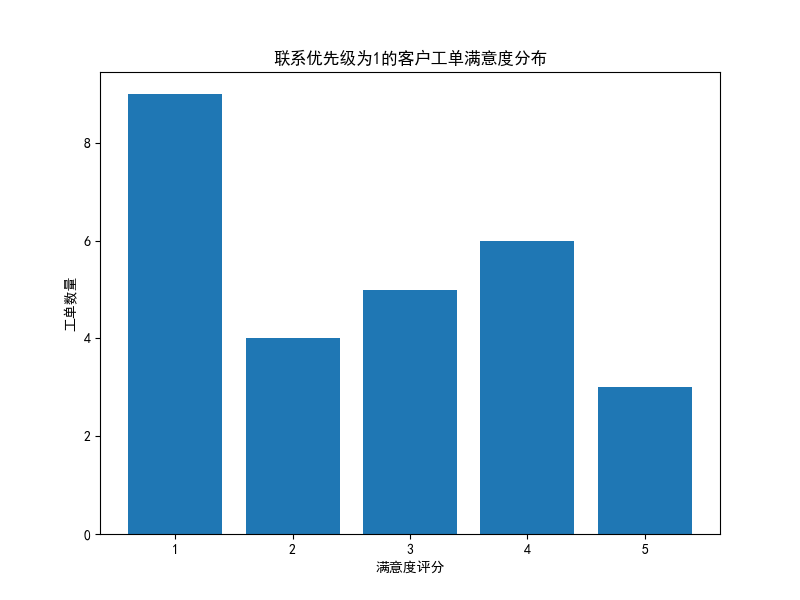
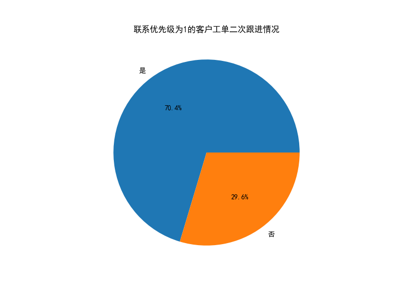

# 联系优先级为1客户服务质量分析报告

## 执行摘要

本报告针对联系优先级为1的客户（即最重要客户）的服务质量进行了深入分析。通过分析客户投诉和工单处理情况，我们发现了一些值得关注的服务质量问题，并提出了相应的改进建议。

## 关键发现

### 1. 服务请求概况
- **投诉总数**: 18件
- **工单总数**: 27件
- **服务请求分布**: 工单数量多于投诉数量，说明客户更倾向于通过正规渠道寻求帮助

### 2. 投诉处理分析

#### 处理时长问题
- **平均处理时长**: 17,912.58小时（约747天）
- **分析**: 投诉处理时间异常漫长，远超合理范围，表明投诉处理流程存在严重问题

#### 客户满意度
- **平均满意度**: 3.00分（满分可能为5分）
- **分析**: 满意度处于中等水平，但结合超长的处理时间，客户体验显然不佳

### 3. 工单处理分析

#### 处理效率
- **平均处理耗时**: 32.85小时（约1.4天）
- **分析**: 工单处理速度相对合理，但仍存在改进空间

#### 客户满意度
- **平均满意度**: 2.63分（满分可能为5分）
- **分析**: 工单满意度低于投诉满意度，说明日常服务体验更差

### 4. 二次跟进情况
- **需要二次跟进比例**: 70.4%
- **分析**: 超过三分之二的工单需要二次跟进，表明首次解决率极低，服务效率和质量都有待提升

## 核心问题诊断

### 1. 投诉处理流程失效
- 投诉处理时间长达747天，远超行业标准
- 可能导致客户流失和负面口碑传播

### 2. 服务质量不稳定
- 工单满意度仅为2.63分，低于投诉满意度
- 日常服务质量比问题处理服务更差

### 3. 首次解决率过低
- 70.4%的工单需要二次跟进
- 增加服务成本，降低客户体验

## 改进建议

### 短期措施（1-3个月）
1. **建立投诉快速响应机制**
   - 设置24小时内响应标准
   - 建立投诉升级流程

2. **提升首次解决率**
   - 加强客服培训
   - 建立知识库系统

3. **优化工单分配**
   - 根据问题复杂度合理分配资源
   - 建立专业技能匹配机制

### 中期措施（3-6个月）
1. **重构服务流程**
   - 简化处理环节
   - 建立服务质量监控体系

2. **客户反馈闭环**
   - 建立满意度跟踪机制
   - 定期回访重要客户

### 长期措施（6-12个月）
1. **技术升级**
   - 引入智能客服系统
   - 建立预测性服务机制

2. **组织优化**
   - 设立VIP客户服务团队
   - 建立跨部门协作机制

## 结论

联系优先级为1的客户作为最重要客户群体，其服务质量直接关系到企业的核心利益。当前分析显示，这类客户在投诉处理和日常服务中都面临诸多挑战，特别是投诉处理时间过长和首次解决率过低的问题亟需解决。

建议企业立即采取行动，从流程优化、人员培训、技术升级等多个维度入手，全面提升对重要客户的服务质量，以维护客户关系和品牌价值。
