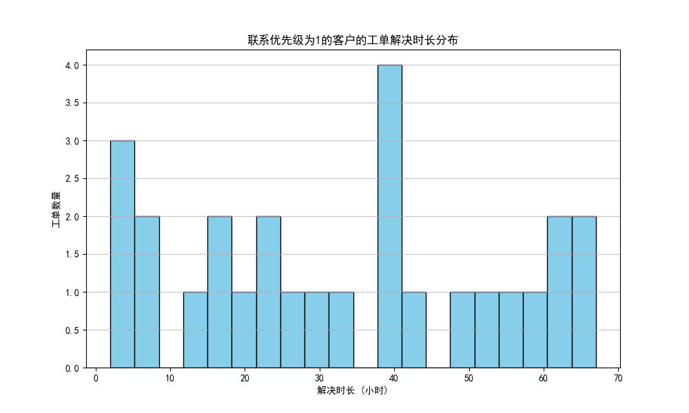

# 针对高优先级客户的服务质量分析报告

## 核心洞察与结论

对联系优先级为1的客户的服务质量进行深入分析后，我们发现当前服务体系在满足这类重要客户方面存在严重不足。主要问题表现为**极高的投诉率**和**普遍偏低的服务满意度**，这表明尽管工单在处理，但服务结果远未达到客户期望，对维系高价值客户关系构成了显著风险。

**核心发现：**
- **投诉率惊人**：优先级最高的客户提交的工单中，有高达 **66.67%** 最终演变为投诉。
- **满意度堪忧**：工单的平均满意度评分仅为 **2.63** (满分5分)，即使在投诉处理环节，满意度也仅提升至 **3.00**，未能有效挽回客户体验。
- **处理效率存在短板**：尽管平均工单解决时长约为33小时，但存在长达**67小时**的极端案例，这对高优先级客户是不可接受的。

## 详细分析

### 1. 工单与投诉：服务未能解决根本问题

数据显示，针对优先级为1的客户，共产生了27个工单，其中18个工单最终升级为投诉。

- **总工单数**: 27
- **总投诉数**: 18
- **投诉转化率**: 66.67%

超过三分之二的工单未能一次性解决客户问题，反而引发了客户的进一步不满。这揭示了服务流程可能存在重大缺陷，例如“已解决”的工单标准与客户的实际感受脱节，或者问题解决方案治标不治本。

### 2. 工单处理效率：平均水平尚可，但极端情况致命

上图展示了高优先级客户工单解决时长的分布情况。

- **平均解决时长**: 32.85小时
- **解决时长中位数**: 32.00小时
- **最长解决时长**: 67.00小时

虽然大多数工单能在约1.5天内关闭，但解决时长分布较为分散，且出现了接近3天的解决记录。对于期望得到快速响应的高优先级客户而言，这种不稳定的处理效率和过长的等待时间是导致其满意度低下的关键原因之一。

### 3. 客户满意度：服务体验普遍不佳

无论是工单处理还是后续的投诉跟进，客户的满意度评分都徘徊在及格线附近。

- **平均工单满意度**: 2.63 / 5.0
- **平均投诉满意度**: 3.00 / 5.0

低满意度评分印证了高投诉率并非偶然。这意味着服务人员在解决问题的过程中，无论是从效率、沟通还是方案有效性上，都未能给客户带来积极的体验。投诉处理环节也只是进行了“亡羊补牢”，效果平平。

## 原因探究：为什么高优先级客户不满意？

1.  **“伪解决”问题**：工单被关闭，但客户的根本问题未得到解决。服务流程可能更注重关闭率等过程指标，而非客户的真实反馈。
2.  **响应和处理速度未体现优先级**：虽然平均解决时长看似可以接受，但对于标记为“高优先级”的客户，服务响应应更快、更稳定，现有流程显然未达到这一标准。
3.  **缺乏根本原因分析（RCA）**：高投诉率表明团队可能疲于应付投诉，而没有深入挖掘导致问题的根本原因，使得类似问题反复出现。

## 业务建议与改进策略

为了切实提升对高优先级客户的服务质量，留住核心客户，我们建议采取以下措施：

1.  **设立专属服务通道与SLA**：
    - 为优先级为1的客户设立更严格的服务水平协议（SLA），例如承诺在X小时内响应，Y小时内解决。
    - 指派经验更丰富的客服专家或成立专门团队，负责处理这类客户的工单，确保问题得到高效和专业的解决。

2.  **引入“客户确认关闭”机制**：
    - 改变当前仅由客服单方面关闭工单的流程。在工单处理完毕后，应由客户确认问题已解决后方可关闭工单。这能有效杜绝“伪解决”现象。

3.  **实施主动服务与回访**：
    - 对于高优先级客户，在工单关闭后24小时内进行主动电话回访，确认问题解决情况与服务体验。这不仅能预防投诉，还能传递公司对客户的重视。

4.  **强化根本原因分析与知识库建设**：
    - 对每一个来自高优先级客户的投诉进行深入的根本原因分析（RCA），识别流程、产品或政策上的缺陷，并推动相关部门改进。
    - 将分析结果沉淀为知识库，用于培训客服团队，减少同类问题的发生。

通过实施以上策略，我们可以从被动响应转向主动管理，显著改善高优先级客户的服务体验，降低投诉率，从而巩固与这些核心客户的长期合作关系。
