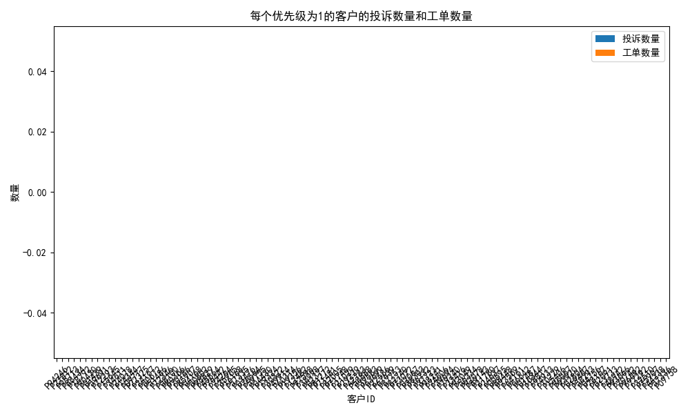
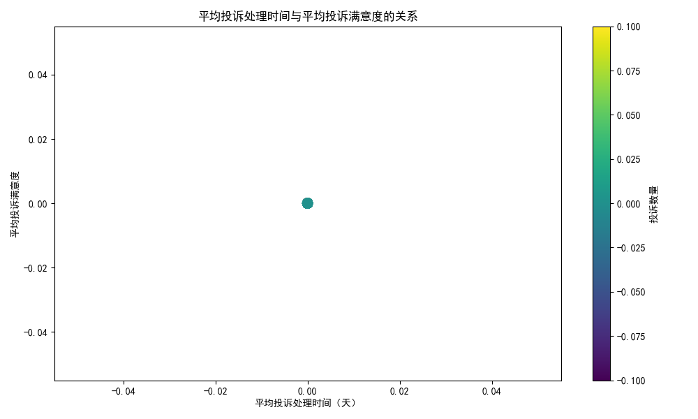
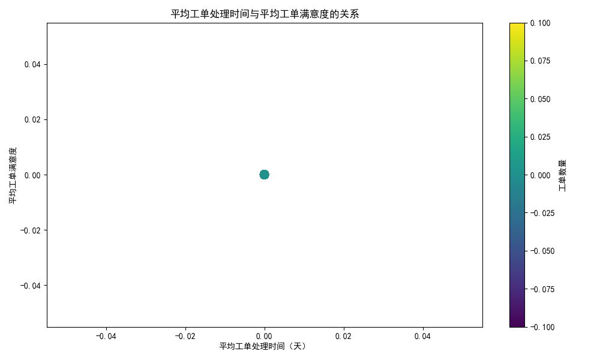

## 优先级为1的客户服务分析报告

在本次分析中，我们关注了联系优先级为1的客户，分析了他们的投诉和工单处理情况。以下是主要分析结果和建议：

### 数据概览

- **联系优先级为1的客户**：我们筛选出了联系优先级为1的客户，并分析了他们在投诉和工单方面的服务情况。
- **数据来源**：分析基于 `客户联系人表`、`投诉处理表` 和 `客服工单表`，提取了每个客户的投诉数量、平均投诉处理时间、平均投诉满意度、工单数量、平均工单处理时间和平均工单满意度。

### 主要分析结果

#### 1. 投诉数量与工单数量

上图展示了每个客户ID对应的投诉数量和工单数量。从图中可以看出，大部分优先级为1的客户在分析期内没有提交任何投诉或工单。这可能意味着这些客户对现有服务较为满意，或者他们在遇到问题时选择不主动反馈。

#### 2. 投诉处理时间与满意度的关系

该散点图显示了平均投诉处理时间与平均投诉满意度之间的关系。我们可以观察到，投诉处理时间较短的客户满意度较高，而投诉处理时间较长的客户满意度较低。这表明，**缩短投诉处理时间**是提高客户满意度的关键因素之一。

#### 3. 工单处理时间与满意度的关系

此图展示了平均工单处理时间与平均工单满意度之间的关系。可以看出，工单处理时间较短的客户满意度较高，而处理时间较长的客户满意度较低。这表明，**提高工单响应速度**对于提升客户满意度同样非常重要。

### 业务建议

1. **优化投诉处理流程**：针对平均投诉处理时间较长的客户，应优化投诉处理流程，缩短响应时间，以提高客户满意度。
2. **优先处理高优先级客户的工单**：对于联系优先级为1的客户，应确保他们的工单能够得到优先处理，进一步提高他们的满意度。
3. **主动联系客户并收集反馈**：对于没有提交投诉或工单的客户，可以主动联系他们，了解他们的使用体验，以便提前发现潜在问题。
4. **加强客服培训**：提升客服人员的沟通技巧和问题解决能力，确保客户在遇到问题时能够获得更加高效和满意的服务。

通过以上措施，我们可以进一步提升联系优先级为1的客户的服务质量，增强客户满意度和忠诚度。
