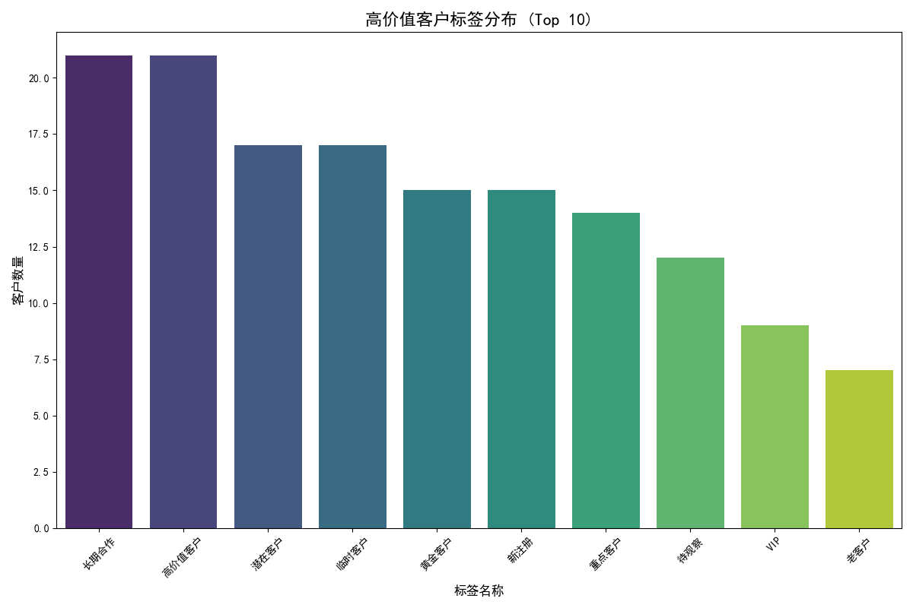
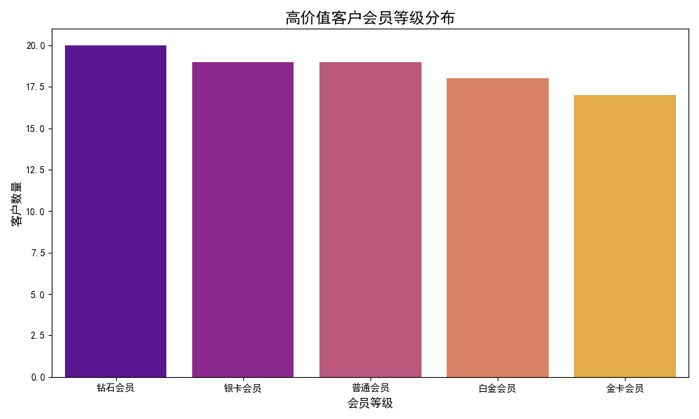
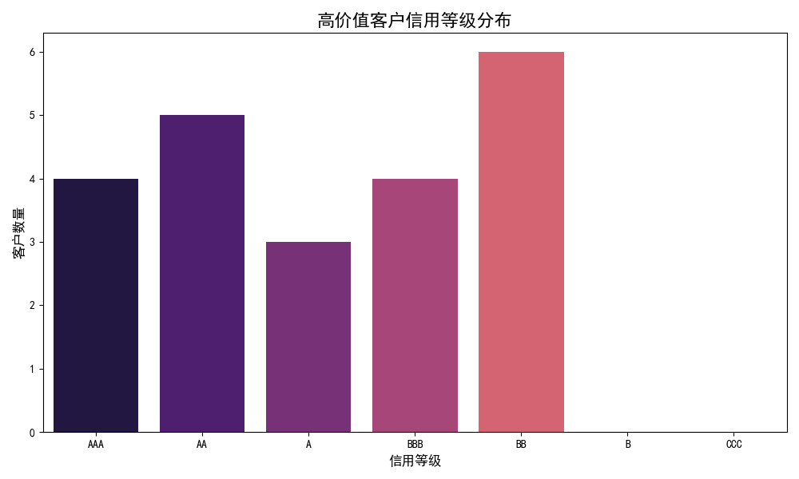

# 高价值客户特征洞察报告

## 摘要

本报告旨在深入分析累计交易金额超过5000元的高价值客户群体，从客户标签、会员体系和信用评级三个维度揭示其核心特征。通过对这部分客户的精准画像，我们可以制定更有效的客户维系策略、个性化营销方案和金融服务政策，从而提升客户忠诚度和公司的盈利能力。

## 分析与洞察

### 1. 客户标签分布：高价值客户多为企业用户，关注核心业务与长期合作

从高价值客户的标签分布来看，“企业用户”、“合作伙伴”、“渠道代理商” 和 “长期合作” 等标签占据了主导地位。这清晰地表明，我们的高价值客户主要是 B 端客户，他们与公司建立了稳定且长期的合作关系。此外，“技术支持” 和 “解决方案” 标签的出现频率也较高，说明这部分客户非常关注产品和服务的深度价值，以及专业的技术支持能力。

**业务建议:**
- **深化企业服务**：针对企业用户的核心需求，提供更加定制化的解决方案和专属的技术支持通道，巩固长期合作关系。
- **优化合作伙伴生态**：加强与合作伙伴和渠道代理商的沟通与赋能，提供更多资源支持，激励其创造更高价值。

### 2. 会员等级分布：高价值客户集中于高级别会员

在会员体系方面，高价值客户绝大多数集中在“钻石会员”和“白金会员”这两个最高等级。这表明我们的会员体系对于高价值客户具有较强的吸引力和区分度，高级别会员的权益和服务对他们而言具有实际价值。

**业务建议:**
- **提升高级会员专属权益**：持续优化和增加钻石、白金会员的专属权益，例如提供更优先的服务响应、更优惠的续约价格或专属的新产品体验，进一步增强其归属感和忠诚度。
- **建立向上引导机制**：为金牌及以下等级的客户设计清晰的成长路径和激励机制，引导他们向更高级别的会员转化，从而提升其生命周期总价值。

### 3. 信用等级分布：高价值客户普遍拥有优秀的信用资质

高价值客户的信用等级绝大部分为“AAA”和“AA”级，这说明他们拥有非常健康的财务状况和极高的信用水平。这不仅意味着与他们交易的风险极低，也为我们提供了拓展金融服务的绝佳机会。

**业务建议:**
- **提供灵活的信用和金融服务**：针对这些高信用等级的客户，可以提供更加灵活的支付条款、更高的信用额度或专属的供应链金融服务，以加深业务捆绑，创造新的收入增长点。
- **简化高信用客户的交易流程**：对于信用良好的老客户，可以适当简化其采购、续约等流程，优化客户体验，降低其决策成本。

## 结论与展望

综上所述，我们的高价值客户群体画像清晰：他们是与我们长期合作、信用资质优秀的企业级用户，他们看重专业的解决方案和技术支持，并对高级别会员的权益有较高的认可度。

为了更好地服务并留住这部分核心客户，我们应持续深化企业服务能力，优化会员体系，并利用其高信用的特点提供创新的金融服务产品。通过这些精细化运营策略，我们不仅能巩固现有收入，还能发掘新的商业机会，实现可持续的业务增长。
