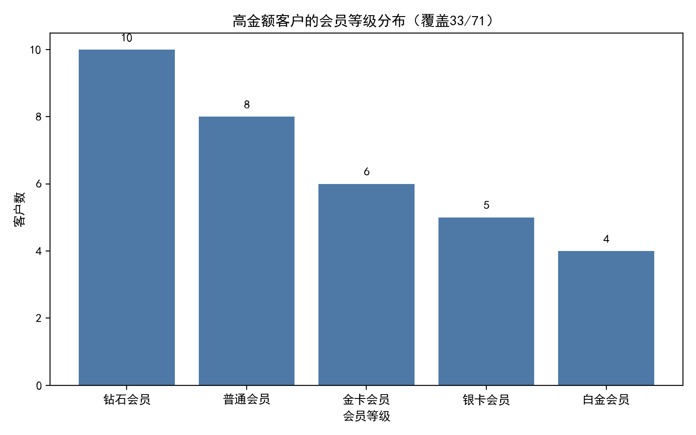
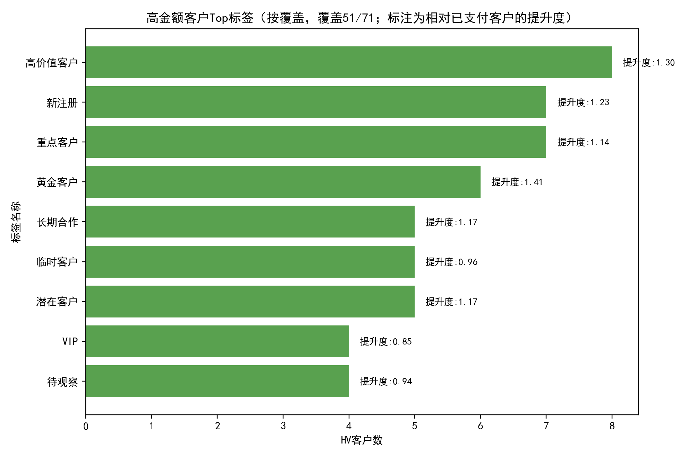
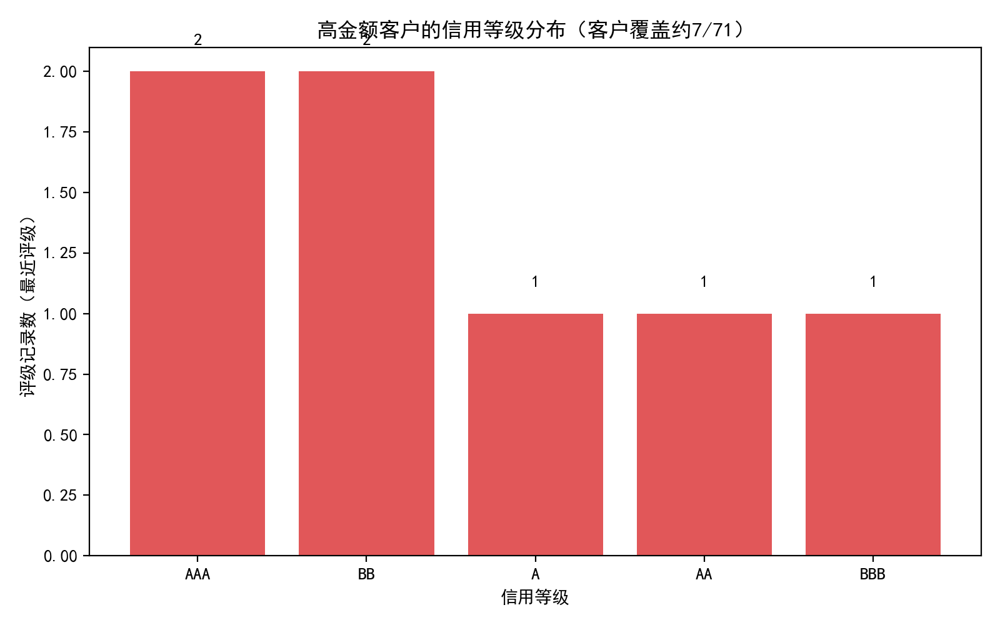

# 高金额已完成交易客户（累计≥5000）画像与策略建议报告

本文目标：聚焦累计已支付金额≥5000的客户（下称“高金额客户/HV”），从客户标签、会员体系、信用评级等维度洞察其特征、可能原因与可行策略。

数据与样本说明
- 数据库：dacomp-033.sqlite
- 口径：交易记录表中“交易支付状态=已支付”，按客户ID累计金额；阈值≥5000
- 基数与覆盖
  - 已支付客户总数：150
  - 高金额客户数：71（约占全部已支付客户的47.3%）
  - 会员信息覆盖：33/71
  - 标签覆盖：51/71
  - 信用评级覆盖（通过账户映射）：7/71

一、关键发现（总览）
- 单笔大额特征极强：71/71的高金额客户都是“单笔已支付”（占比100%）。这意味着高金额主要来自单笔大额支付，而非多笔累积。
- 会员画像：在有会员信息覆盖的客户中，钻石会员占比最高（10/33≈30.3%），但普通会员也不低（8/33≈24.2%）。积分与累计已支付金额呈中度到弱负相关（当前积分 r=-0.378，历史总积分 r=-0.147），提示“高金额单笔行为”和“长期积分累积”并不一致。
- 标签偏好：相对已支付全体，黄金客户（提升度≈1.41）、高价值客户（1.30）、新注册（1.23）、长期合作（1.17）、潜在客户（1.17）在高金额客户中更为集中；VIP/待观察/临时客户则低配。
- 信用评级：覆盖有限（7/71），在样本内“AAA/AA/A”与“BB/BBB”并存，平均信用评分≈762、平均授信额度≈52.4万，平均逾期次数≈2.43、平均逾期总金额≈1.07万，提示高金额客户中存在一定信用差异与潜在风险分层。

二、可视化展示与解读

1) 会员等级分布（覆盖33/71）


解读与要点：
- 覆盖范围内，钻石会员占比最高（10人），随后是普通、金卡、银卡、白金。高金额客户并非全由高等级会员构成，普通会员也占相当比例。
- 当前积分/历史积分与累计已支付金额呈负相关，印证“单笔大额支付”的特性：单笔大额未必带来高积分（或交易频次低），因此积分并非识别高金额客户的最优信号。

2) 高金额客户Top标签（覆盖与提升度并呈）


解读与要点：
- 提升度Top：黄金客户（1.41）、高价值客户（1.30）、新注册（1.23）、长期合作（1.17）、潜在客户（1.17）。这组标签在高金额客户中出现概率高于全体已支付客户，具有画像刻画与触达优先级意义。
- 低配标签：VIP（0.85）、待观察（0.94）、临时客户（0.96）在高金额客户中不占优势，需警惕“名不副实”的标签定义或流转规则；建议定期复盘标签策略，确保与实际价值相匹配。
- 特别现象：“新注册”进入高金额客户Top，说明新客中存在“首单高客单价”的可观潜力，值得建立新客高客单的早期识别与培育机制。

3) 信用等级分布（最近评级）


解读与要点：
- 尽管覆盖低，但已见“AAA/AA/A（优）”与“BB/BBB（次优）”并存的双峰特征；平均信用评分≈762偏高，但平均逾期次数≈2.43与逾期总额≈1.07万提示需关注尾部风险。
- 建议扩充信用评级覆盖并纳入账户-客户映射的统一治理，提升风控与差异化经营能力。

三、诊断性分析（为什么会这样）
- 单笔大额驱动：商品/服务结构可能存在“高客单价拳头品类”或一次性大额采购场景（如年费、年度服务包、硬件一次性采购），导致高金额客户集中为“单笔已支付”。
- 会员体系信号弱化：积分多反映频次与累积，而本群体由单笔驱动，故“积分-高金额”呈负相关；此外，普通会员占比不低，说明高金额并不必然依赖高会员等级特权。
- 标签侧“黄金客户/长期合作/潜在客户/新注册”增配：
  - 黄金客户/长期合作：可能由业务人员在大单发生或合作背景下标注，贴近真实商业价值。
  - 新注册：新客即大单，可能源于外部渠道导入、一次性采购或促销活动的引导。
- 信用分层：存在同时覆盖高信用与次优信用客户的情况，说明高金额不完全由信用优劣决定；但风险尾部（逾期次数/金额）提醒我们在高金额交易中仍需落实差异化风控。

四、预测性推断（将会发生什么）
- 若维持现有商品与营销结构，预计后续高金额客户仍将以单笔大额为主。新注册客户中将持续出现“首单大单”机会，但复购率可能有限（因非频购型）。
- 在标签维护准确与渠道策略稳定的情况下，“黄金客户/长期合作/潜在客户/新注册”这组标签将继续对识别高金额客户具有较高的先验价值。
- 信用评级覆盖扩大后，高金额客户的信用分布将更清晰，便于前置审批与授信策略优化；同时可观察到更清晰的风险尾部。

五、规范性建议（我们应该做什么）

A. 获取与转化：面向“新注册+潜在/黄金/长期合作”组合标签
- 早期识别：对新注册客户触发高客单级别的线索打分，结合标签提升度与近7-30日行为信号（浏览/咨询/报价）做优先分配。
- 首单转化组合拳：专属顾问+快速报价+风控预批额度（对AAA/AA/A）+安全支付/分期方案（对BB/BBB），缩短决策链路。
- 成交后72小时内的“复购种子行动”：赠送体验权益、升级券、次年续约锁价，避免高单后沉寂。

B. 留存与复购：针对“单笔大额”的专属运营
- 会员体系改造：为大客单但低频客户设计“权益包”（售后延保、服务升级、专属支持），而不是仅以积分驱动。
- 关键里程碑触发：在合同/服务到期前30/7/1天推送续费/升级方案；对“普通会员的大客单客户”，提供阶梯式会员升级（以价值贡献为依据，而非积分）。
- 标签治理：对“VIP/待观察/临时客户”低配情况进行标签规则校准（定义、设定流程、有效期），提升标签对价值的解释力与预测力。

C. 风控与授信：覆盖扩容与分层定价
- 覆盖扩容：将信用评级覆盖从7/71尽快提升，统一账户-客户映射，形成“客户维度的最新评级视图”。
- 分层策略：
  - AAA/AA/A：可开放更便捷的支付与分期方案，提高成交效率。
  - BB/BBB：引导预付款/阶段性验收付款或下调信用额度，降低逾期暴露；对历史逾期客户，设置更严格的审批与监控。
- 指标闭环：监控“高金额成交后30/60/90天逾期率与复购率”，动态调整授信与营销策略。

D. 组织与数据建设
- 跨表打通：建立客户-账户-交易-评级-会员-标签的统一主数据映射与定期校验机制。
- 实验机制：围绕“新注册高客单识别”与“普通会员大客单转化”为主线，设计AB实验评估策略成效。

六、附录：复现本报告的可视化Python代码片段
以下为绘图核心片段（完整脚本已运行并在当前目录生成图片）：
```python
import sqlite3, pandas as pd, matplotlib.pyplot as plt
plt.rcParams['font.sans-serif'] = ['SimHei']
plt.rcParams['axes.unicode_minus'] = False

# 以会员等级分布图为例
conn = sqlite3.connect('dacomp-033.sqlite')
mem_sql = '''
WITH hv AS (
  SELECT 客户ID
  FROM 交易记录表
  WHERE 交易支付状态='已支付'
  GROUP BY 客户ID
  HAVING SUM(交易金额) >= 5000
)
SELECT m.会员等级, m.客户ID
FROM 会员体系表 m JOIN hv h ON h.客户ID=m.客户ID
'''
mem = pd.read_sql_query(mem_sql, conn)
mem_dist = mem.groupby('会员等级').客户ID.nunique().reset_index(name='客户数').sort_values('客户数', ascending=False)

fig, ax = plt.subplots(figsize=(8,5))
ax.bar(mem_dist['会员等级'].astype(str), mem_dist['客户数'], color="#4E79A7")
for i, v in enumerate(mem_dist['客户数']):
    ax.text(i, v + max(mem_dist['客户数'])*0.02, str(v), ha='center', va='bottom', fontsize=10)
ax.set_title('高金额客户的会员等级分布')
ax.set_xlabel('会员等级'); ax.set_ylabel('客户数')
plt.tight_layout()
plt.savefig('hv_membership.png', dpi=200)
plt.close()
```

七、局限与后续
- 信用评级覆盖仅7/71，样本偏小；客户分群表在本数据中无关联记录输出，无法对“分群”维度做更深入比较。
- 未开展跨渠道/营销活动/产品品类的深入归因，未来可结合“营销活动参与表/渠道来源信息表/产品服务订购表”等，定位高金额的来源与杠杆点。
- 强建议：扩充评级覆盖、校准标签定义、对新客大单建立“前中后”全链路转化与留存机制，持续监测成效指标（复购率、续约率、逾期率）。

附：图文件清单
- hv_membership.png
- hv_top_tags.png
- hv_credit_level.png

以上分析与建议旨在帮助快速定位“高金额客户”的关键驱动与杠杆，从而在获取、转化、留存与风控方面形成闭环。
