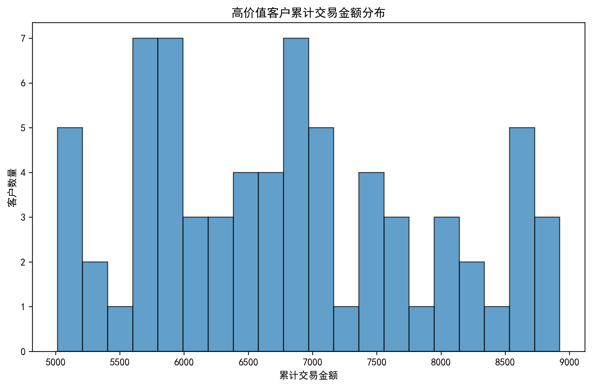
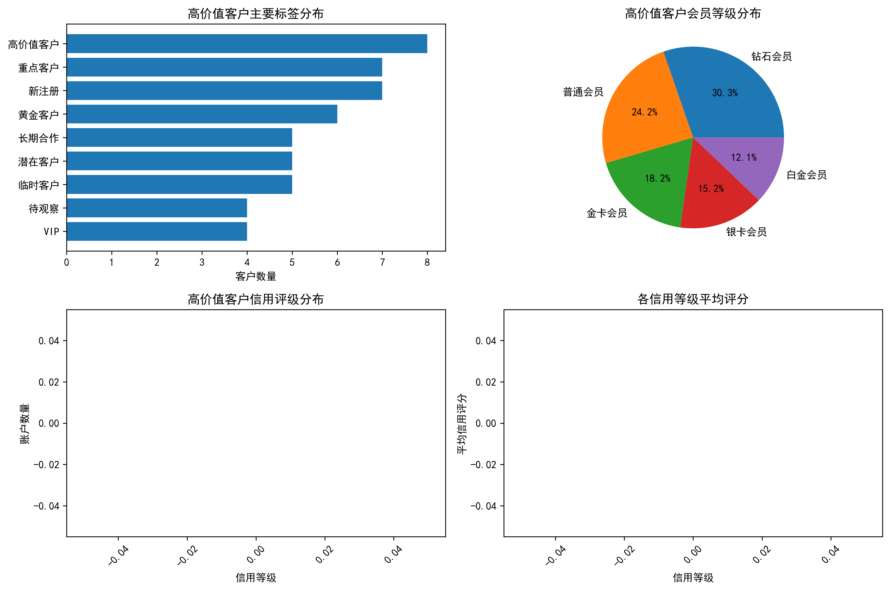

# 高价值客户特征分析报告

## 执行摘要

本报告针对累计交易金额5000元以上的高价值客户进行了深入分析，从客户标签、会员体系、信用评级等多个维度揭示了这类客户的核心特征，为精准营销和客户管理提供数据支撑。

## 核心发现

### 1. 客户规模与贡献度
- **高价值客户数量**：71名，占总活跃客户的47.33%
- **平均累计交易金额**：6,785元
- **客户价值分布**：近半数客户为高价值客户，显示出良好的客户价值分布

### 2. 客户标签特征分析

高价值客户的主要标签分布如下：

| 标签名称 | 客户数量 | 占比 |
|---------|---------|------|
| 高价值客户 | 8 | 11.27% |
| 重点客户 | 7 | 9.86% |
| 新注册 | 7 | 9.86% |
| 黄金客户 | 6 | 8.45% |
| 长期合作 | 5 | 7.04% |

**关键洞察**：
- 高价值客户中"新注册"客户占比较高，说明新客户转化效果显著
- "重点客户"和"黄金客户"标签准确识别了高价值群体
- "长期合作"客户稳定贡献价值，体现了客户忠诚度的重要性

### 3. 会员体系特征分析

高价值客户的会员等级分布：

| 会员等级 | 客户数量 |
|---------|---------|
| 钻石会员 | 10 |
| 普通会员 | 8 |
| 金卡会员 | 6 |
| 银卡会员 | 5 |
| 白金会员 | 4 |

**关键洞察**：
- 钻石会员在高价值客户中占比最高，验证了会员体系的有效性
- 值得注意的是，有8名普通会员也达到了高价值客户标准，存在升级潜力

### 4. 信用评级特征分析

高价值客户的信用评级分布：

| 信用等级 | 账户数量 | 平均评分 |
|---------|---------|---------|
| BB | 2 | 713.5 |
| AAA | 2 | 750.0 |
| BBB | 1 | 757.0 |
| AA | 1 | 813.0 |
| A | 1 | 837.0 |

**关键洞察**：
- 高价值客户信用评级分布相对均衡，说明交易金额与信用评级并非完全正相关
- BB级客户也能成为高价值客户，体现了客户价值的多元化

## 业务建议

### 1. 精准营销策略
- **新客户培育**：针对"新注册"高价值客户，制定专门的留存和增值计划
- **会员升级**：将8名普通会员高价值客户作为优先升级对象，提供个性化会员服务
- **标签优化**：基于高价值客户特征，优化客户标签体系，提高标签准确性

### 2. 客户管理策略
- **差异化服务**：为钻石会员高价值客户提供更优质的服务体验
- **信用管理**：虽然信用评级不完全决定客户价值，但仍需关注BB级客户的信用风险
- **长期关系维护**：加强与"长期合作"客户的深度合作关系

### 3. 业务拓展策略
- **价值挖掘**：47.33%的高价值客户占比显示巨大的业务潜力
- **客户培育**：将普通客户向高价值客户转化作为核心业务目标
- **产品优化**：基于高价值客户需求，优化产品和服务设计

## 结论

高价值客户呈现出多元化的特征，既包括传统意义上的高等级会员和优质信用评级客户，也包含新注册客户和普通会员。这要求企业在客户管理策略上更加精细化和个性化，通过多维度的客户分析，制定差异化的营销和服务策略，最大化客户价值。

建议建立定期的高价值客户分析机制，持续优化客户识别和培育体系，为业务增长提供持续动力。
