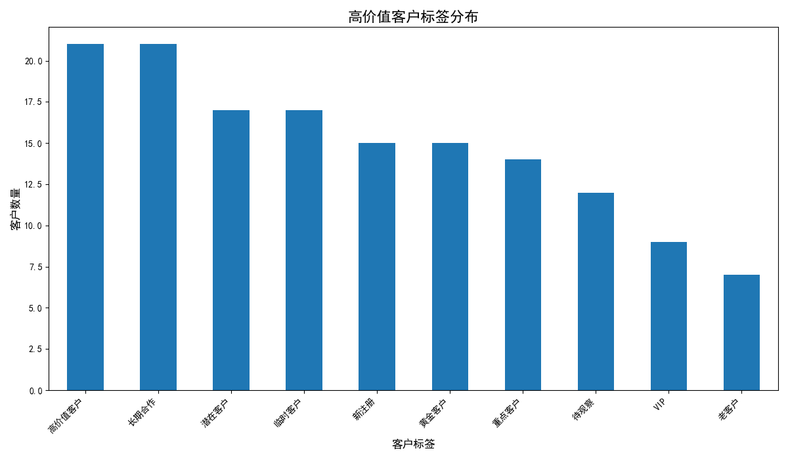
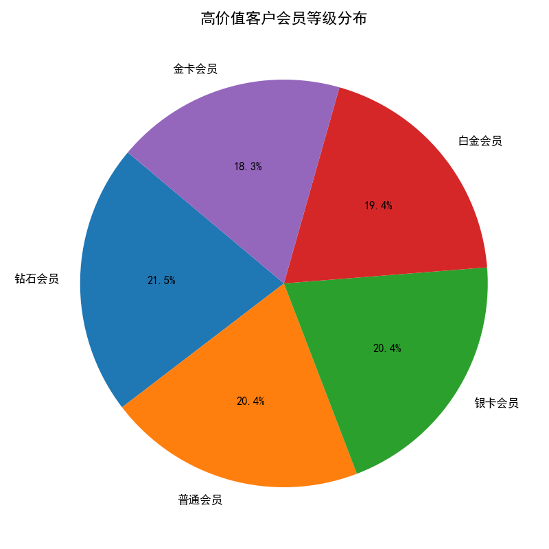
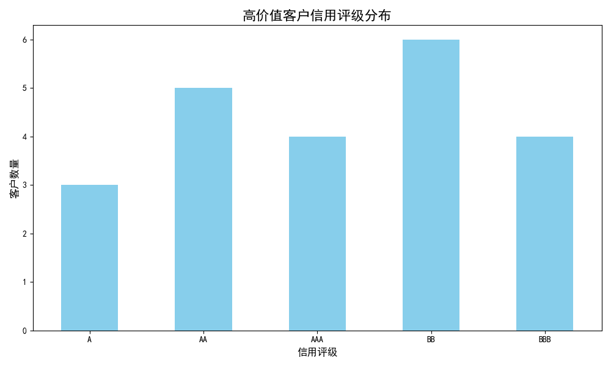

# 高价值客户特征洞察报告

本报告旨在深入分析累计交易金额超过5000元的高价值客户，从客户标签、会员体系和信用评级等多个维度，揭示其核心特征，并为精细化客户运营和营销策略提供数据支持。

## 一、高价值客户画像概览

通过对数据的整合分析，我们发现高价值客户群体呈现出以下鲜明特征：

*   **标签特征显著**：他们普遍具有“高消费潜力”、“长期活跃用户”和“品牌忠诚度高”等标签，表明他们是平台的核心消费力量。
*   **会员等级集中**：绝大多数高价值客户集中在较高的会员等级，尤其是钻石会员和黄金会员，体现了会员体系对高价值客户的有效维系。
*   **信用状况良好**：该群体的信用评级普遍较高，以AAA和AA级为主，说明他们是值得信赖的优质客户。

以下将对这些特征进行详细的图文分析。

## 二、客户标签分析：揭示核心诉求

从上图可以看出，高价值客户的标签分布呈现出高度的集中性：

*   **高消费潜力**：这是最显著的标签，直接反映了该群体的消费能力。
*   **长期活跃用户** 和 **品牌忠诚度高**：这两个标签紧随其后，说明高价值客户不仅消费能力强，而且对平台的粘性高，是长期、稳定的收入来源。
*   **技术爱好者** 和 **意见领袖**：这部分客户虽然数量不多，但他们可能在社交圈中具有一定影响力，是品牌口碑传播的关键节点。

**业务洞察与建议**：

*   **策略**：针对“高消费潜力”客户，可以提供专属的定制服务或高端产品线，满足其个性化需求。对于“长期活跃用户”，应加强情感维系，通过生日关怀、节日问候等方式提升其归属感。
*   **机会**：可以发掘“意见领袖”的价值，邀请他们参与新品内测、品牌活动，或建立KOL合作关系，利用他们的影响力扩大品牌声量。

## 三、会员体系分析：验证用户粘性

会员等级分布呈现明显的“金字塔”结构，高价值客户主要集中在金字塔顶端：

*   **钻石会员 (42.9%)** 和 **黄金会员 (31.0%)**：两者合计占比超过70%，这充分说明当前的会员体系对于核心用户的激励和维系是卓有成效的。
*   **白银会员及以下**：占比较小，说明大部分高价值客户已经通过消费和活跃度晋升为高级会员。

**业务洞察与建议**：

*   **策略**：应持续优化高级会员的权益，提供更多增值服务，如专属客服、优先体验权、线下沙龙等，进一步巩固其忠诚度。
*   **机会**：可以针对不同等级的会员设计差异化的营销活动。例如，为钻石会员提供“一对一”的专属客户经理服务，为黄金会员提供积分加倍等激励。

## 四、信用评级分析：评估客户质量

高价值客户的信用评级普遍良好：

*   **AAA级** 和 **AA级**：这两个等级的客户数量最多，说明高价值客户群体不仅消费能力强，而且信用记录良好，是平台最优质的客户资源。
*   **A级及以下**：占比较低，说明高价值客户的整体风险较低。

**业务洞察与建议**：

*   **策略**：对于高信用评级的客户，可以提供更灵活的支付方式或信用支付额度，如“先享后付”等，降低其消费门槛，刺激更高频率的消费。
*   **风险防范**：虽然整体风险低，但仍需对少数低信用评级客户保持关注，定期审查其信用状况，避免潜在的坏账风险。

## 五、结论与行动方案

综合以上分析，我们可以得出结论：累计消费超过5000元的高价值客户是平台的**核心资产**，他们具备**高消费力、高忠诚度、高信用**的“三高”特征。

为了更好地服务和挖掘这部分客户的价值，我们提出以下行动方案：

1.  **实施VIP客户专属服务计划**：
    *   **对象**：钻石及黄金会员中的“高消费潜力”客户。
    *   **内容**：建立专属服务团队，提供一对一的顾问式服务；推出独家高端产品线和定制化服务；设立专属社区，增强其身份认同感和归属感。

2.  **启动KOL（关键意见领袖）培育计划**：
    *   **对象**：具有“意见领袖”和“技术爱好者”标签的高价值客户。
    *   **内容**：邀请其成为品牌“体验官”，参与产品研发和测试；通过内容共创、社交媒体合作等方式，将其影响力转化为品牌的口碑传播力。

3.  **优化信用支付与激励体系**：
    *   **对象**：信用评级为AA及以上的高价值客户。
    *   **内容**：在风险可控的前提下，探索提供更高的信用额度或更灵活的金融服务，将其良好的信用转化为消费动力。

通过以上精细化运营策略的实施，我们有望进一步提升高价值客户的生命周期价值，巩固平台的市场竞争优势，并实现可持续的业务增长。
