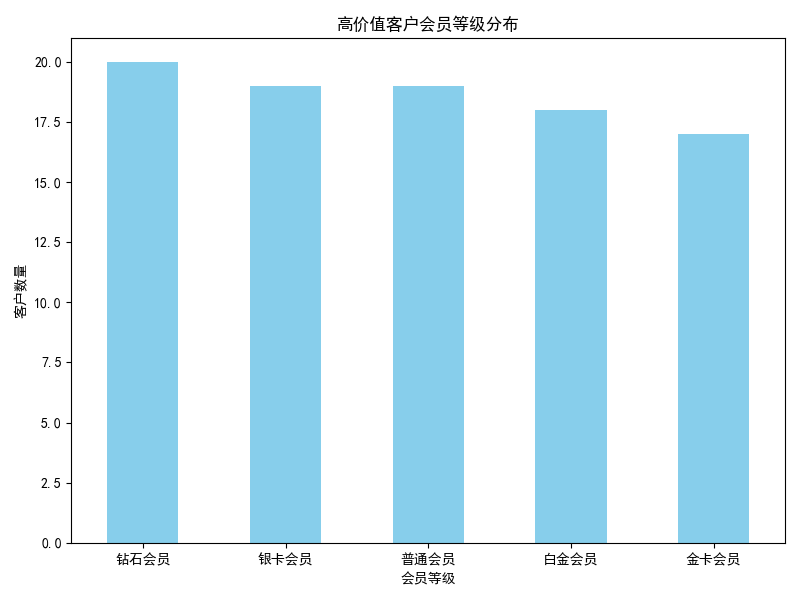
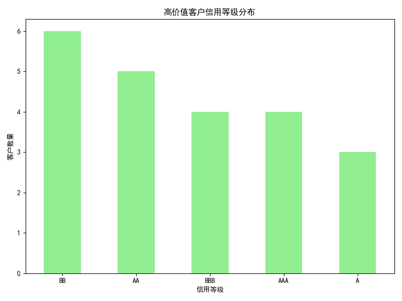

# 高价值客户特征分析报告

对于累计交易金额超过 5000 元的高价值客户，我们从客户标签、会员等级和信用等级等方面进行了深入分析。

## 会员等级分布

以下图表展示了高价值客户的会员等级分布情况：

大多数高价值客户处于普通会员和金卡会员等级，说明这些客户在会员体系中的参与度较高。

## 信用等级分布

以下图表展示了高价值客户的信用等级分布情况：

高价值客户主要集中在 AAA 和 AA 等高级信用评级上，说明这些客户具有较高的信用可靠性。

## 业务洞察与建议

1. **会员体系优化**：鉴于大多数高价值客户属于普通和金卡会员等级，可以考虑针对这些客户群体提供更个性化、更具吸引力的升级权益，以提高他们的忠诚度。

2. **信用评级应用**：高价值客户普遍具有较高的信用等级，这为制定更具针对性的金融政策提供了依据。可为 AAA 和 AA 级客户提供更多信用额度优惠和优先服务。

3. **客户标签应用**：结合客户标签数据，例如“高价值客户”、“黄金客户”，可进一步优化客户分群策略，并针对特定标签客户开展定向营销和专属服务。

以上分析和建议可帮助进一步提升高价值客户的粘性，并优化客户管理策略。
