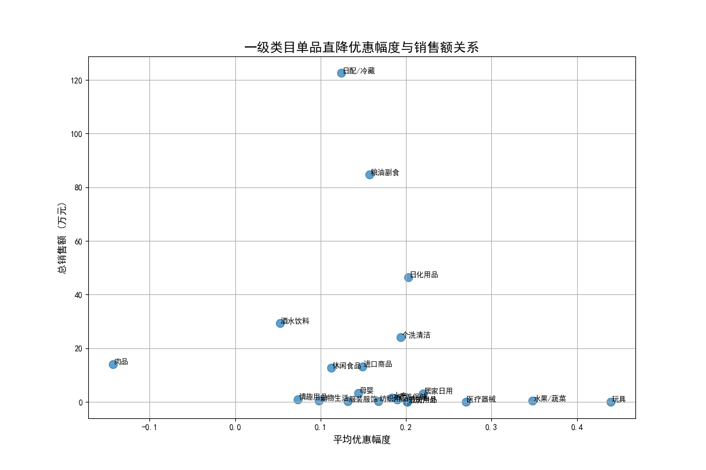

# 单品直降促销活动分析报告：品类效果差异与优化建议

## 一、核心结论

本次分析旨在评估单品直降活动中，不同一级类目的优惠幅度与销售额之间的关系。我们发现，**促销效果在不同品类间存在显著差异**。并非所有品类都对价格折扣敏感，统一的促销策略无法实现资源效益最大化。

核心洞察如下：
1.  **需求驱动型品类**：**日配/冷藏、粮油副食、酒水饮料**等品类销售额极高，但对优惠幅度的依赖度低。这些是生活必需品，消费者购买决策主要由需求驱动，而非价格。
2.  **价格敏感型品类**：**日化用品、个洗清洁**等品类表现出对促销的良好反应，适度的优惠幅度（约20%）能有效带动高销售额，是促销资源的“甜点区”。
3.  **无效促销型品类**：**水果/蔬菜、玩具**等品类虽然给出了最高的优惠幅度（超过30%），但销售额却非常低，表明深度折扣并未刺激消费，促销资源在这些品类上存在浪费。
4.  **数据异常**：**肉品**类目的数据显示其平均优惠幅度为负数，这不符合商业逻辑，很可能是数据录入错误，需进行核查。

基于以上发现，我们建议对促销资源进行战略性调整，实施差异化的品类折扣策略，以提升整体促销活动的投资回报率（ROI）。

---

## 二、优惠幅度与销售额关系可视化分析

为了直观地展示各品类的促销表现，我们绘制了“一级类目单品直降优惠幅度与销售额关系”散点图。图中，横坐标代表各品类的平均优惠幅度，纵坐标代表总销售额。

从图中可以清晰地识别出几类不同的品类集群：

-   **右下角（高折扣，低销售）**：位于此区域的 **水果/蔬菜、玩具、医疗器械** 品类，尽管提供了全场最高的折扣力度，但销售额几乎垫底。这说明对于这些品类，价格并非影响其销售的核心因素，可能与产品选品、季节性或消费者认知有关。

-   **左上角（低折扣，高销售）**：**日配/冷藏、粮油副食、酒水饮料** 这三大巨头占据了此区域。它们的共同点是折扣力度不大（尤其是酒水饮料，仅5%），但贡献了绝大部分销售额。这充分证明了它们作为刚需品的市场地位，消费者购买它们主要是出于日常需求，而非贪图便宜。

-   **中上部（中等折扣，高销售）**：**日化用品、个洗清洁** 是该区域的代表。它们以约20%的优惠幅度，换来了非常可观的销售额。这表明这类商品的消费者对价格较为敏感，适度的促销能有效刺激购买欲望，是促销活动应重点投入的“效率型”品类。

-   **左下角（低折扣，低销售）**：大部分品类如 **宠物生活、情趣用品、母婴** 等聚集于此。它们销售体量不大，折扣力度也相对保守。这些品类可能拥有特定的消费群体，未来的增长需要更多样化的营销手段，而不仅仅是单品直降。

---

## 三、策略建议与优化方案

基于以上分析，为提升未来单品直降活动的效率和效益，我们提出以下建议：

### 1. 优化促销资源配置，聚焦高回报品类

- **减少无效投入**：大幅削减在 **“玩具”、“水果/蔬菜”** 等高折扣、低产出品类上的促销预算。将节省下的资源重新分配给回报率更高的品类。
- **加码“甜点区”**：适当增加对 **“日化用品”、“个洗清洁”** 等价格敏感型品类的促销资源投入。它们能以适中的成本带来显著的销售增长，是提升活动整体ROI的关键。

### 2. 实施差异化的品类折扣策略

- **保护刚需品类利润**：对于 **“日配/冷藏”、“粮油副食”** 等需求驱动型品类，无需提供深度折扣。可将策略调整为“战略性低价”，即通过少量明星单品的微小折扣吸引客流，同时在关联商品上保持正常利润，或尝试捆绑销售、满减等其他促销形式。
- **精准打击敏感品类**：针对 **“日化用品”** 等价格敏感品类，维持或微调其当前 **15%-20%** 左右的“黄金折扣区间”，以确保促销的吸引力。
- **重新评估无效品类**：对 **“水果/蔬菜”** 这类高折扣却销量不佳的品类，应暂停激进的折扣活动。市场部门需深入调研，分析销售瓶颈是源于产品质量、陈列方式、目标客群错位还是竞争环境。在找到根本原因前，不宜再投入过多价格战资源。

### 3. 深挖数据异常，确保决策准确性

- **核查“肉品”数据**：立即组织数据团队或业务部门核查 **“肉品”** 分类下促销价高于原价的异常情况。确保数据源的准确性是所有分析和决策的基石。

通过以上策略调整，我们预期可以显著提升单品直降活动的资源利用效率，在控制成本的同时最大化销售额和利润，实现更精细化、更高效的智慧营销。
