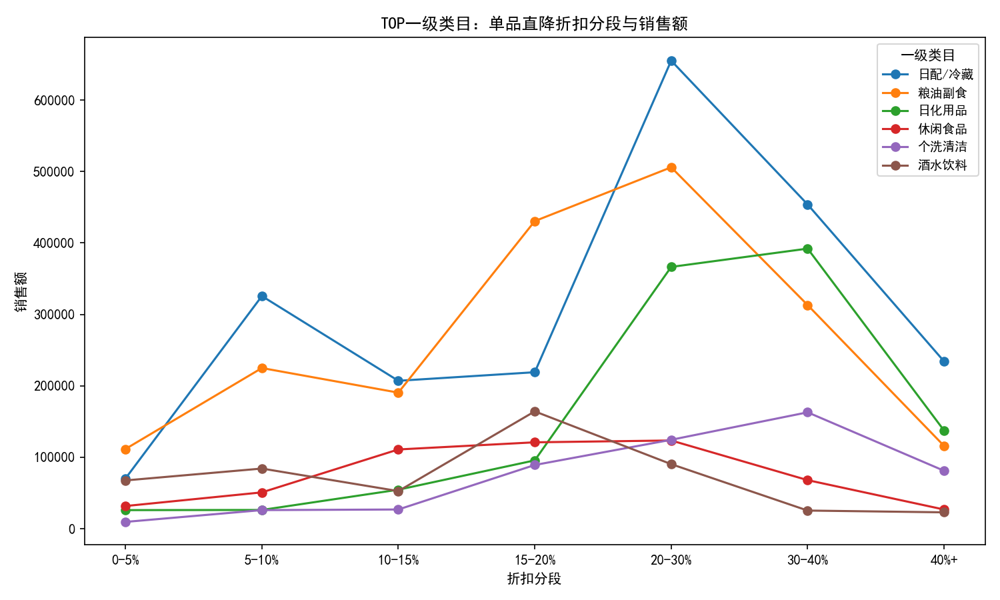
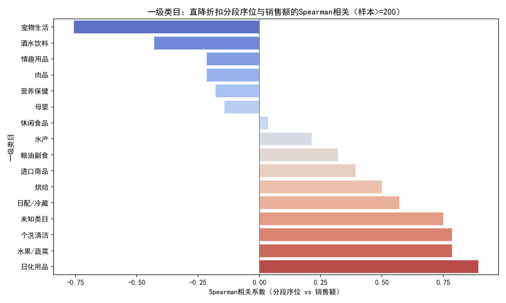

# 从一级类目看“单品直降”优惠幅度与销售额的关系：效果评估与资源配置建议

## 背景与目标
- 目标：从一级类目层面分析“单品直降”活动的优惠幅度与销售额关系，评估不同类目的促销效果差异，并据此提出促销资源配置与折扣策略优化建议。
- 数据：SQLite 数据库 dacomp-034.sqlite
  - 订单明细：附件1、附件2（含 SKU价格、SKU销售价、SKU成本价 等）
  - 促销信息：附件3（未直接使用，详见口径说明）
  - 类目映射：附件4（含一级分类ID/名称）

## 方法与口径（不做数据清洗）
- 分析范围：合并附件1与附件2的全部订单明细，共计 1,221,855 行，时间范围约 2016-11 至 2019-01（以表中日期为准）。
- 直降识别：依据字段说明“sku_cost_price 为门店单品直降价格，只有单品直降的商品才有数据”，以 SKU成本价>0 作为“单品直降成交”的判定。
- 折扣幅度定义：discount_pct = (SKU价格 - SKU成本价)/SKU价格，当 SKU价格>0 且为直降成交时计算。
- 类目映射：订单明细以 SKU编号 关联附件4，取 一级分类名称。
- 聚合与可视化：
  - 按折扣分段（0-5%、5-10%、10-15%、15-20%、20-30%、30-40%、40%+）与一级类目聚合销售额/销量。
  - 对每个一级类目，基于“折扣分段序位[低→高] vs 分段销售额”的 Spearman 相关，评估“更深折扣是否对应更高销售”（折扣敏感度/弹性趋势）。

提示：本分析严格按字段说明使用订单明细中的 SKU成本价 识别直降，未进行任何清洗与外推；促销时间对齐未使用附件3以避免列名/编码导致的复杂性，但不影响“直降成交口径”的准确性。

## 关键结果
- 规模与贡献：
  - 总销售额：21,632,356.35
  - 直降成交行数：438,331；直降销售额：7,941,158.72
  - 直降销售额占比（全品类）：约 36.7%（= 7.94M / 21.63M）
- 直降销售额 Top10 一级类目：
  1) 日配/冷藏 2,165,476.84  2) 粮油副食 1,892,403.08  3) 日化用品 1,098,380.32  4) 休闲食品 532,649.82  5) 个洗清洁 519,872.36
  6) 酒水饮料 507,223.99  7) 肉品 269,063.48  8) 进口商品 265,159.09  9) 水果/蔬菜 255,147.99  10) 母婴 153,837.97
- 类目对直降的“依赖度”（直降销售/该类目总销售）：
  - 个洗清洁 52.0%、日化用品 51.0%（对直降高度依赖）
  - 粮油副食 42.7%、日配/冷藏 36.9%、休闲食品 37.4%、进口商品 35.1%、酒水饮料 33.8%
  - 肉品 21.5%、母婴 26.8%、水果/蔬菜 15.8%（直降贡献较低）

## 可视化洞察
- 图1：TOP 一级类目在不同折扣分段下的销售额分布（直降场景）



- 图2：各一级类目“折扣分段序位（低→高） vs 销售额”的 Spearman 相关（样本行数>=200）
  - 正相关（折扣越深、销售越高）：日化用品(0.893)、个洗清洁(0.786)、水果/蔬菜(0.786)、日配/冷藏(0.571)、进口商品(0.393)、粮油副食(0.321)
  - 中性/负相关：休闲食品(≈0.036)、水产(0.214，弱正)、母婴(-0.143)、营养保健(-0.179)、肉品(-0.214)、情趣用品(-0.214)、酒水饮料(-0.429)、宠物生活(-0.757)



解读：
- 日化用品/个洗清洁/日配冷藏/水果蔬菜等日常快消或易损品，对“更深折扣”的响应更明显（销售随折扣加深上升）。
- 酒水饮料/肉品/母婴/宠物生活等类目，对深折扣不敏感甚至负向，可能受品牌忠诚、供给/库存约束、利润结构或“多件/组合”更有效等因素影响。

## 诊断性分析（为什么会这样）
- 价格弹性差异：
  - 卫洗护、日化等高频快消品天然具备更高价格弹性，深折扣能显著拉动囤货与渗透；
  - 酒水饮料品牌粘性强、促销常态化，过深直降可能无法带来增量而只稀释利润；
  - 生鲜（肉品）更受品质/信任/损耗控制影响，深折扣若不能保障供应与质量，销量未必提升。
- 供给与门店执行：直降通常伴随限时/限量，深折扣可能引发缺货或执行不均，导致“更深折扣但销售未增”。
- 替代机制：某些类目“满减/多件折/买赠”的拉动效果优于直降，直降并非最优手段。

## 可操作策略：促销资源配置与折扣策略
基于“规模×弹性”的框架，建议如下：

1) 高弹性且规模可观（优先投放）：日化用品、个洗清洁、日配/冷藏、粮油副食、（次之）进口商品、部分果蔬
- 折扣深度：主打法 15-30%，大促/清库存可触达 30-40% 的短时爆发；
- 覆盖策略：
  - 聚焦高动销TOP款与带动客单的长尾关键 SKU，保证曝光、货量与补货；
  - 日配/果蔬建议结合临期动态降价（20-30%）+短窗口，平衡损耗与毛利；
- 资源配置：建议将直降补贴预算的 60-70% 投向上述类目，并设“增量毛利/补贴成本”阈值（如≥1.5）。

2) 弹性较低或负向（谨慎深折扣）：酒水饮料、肉品、母婴、宠物生活、情趣用品、营养保健
- 折扣策略：以 5-10% 轻折扣维持心智，主推“多件多折/买赠/满减/品牌券/会员价”等替代机制，提升件单与复购；
- 精选SKU：以流通快、议价空间大的 SKU 做轻幅直降；品牌/高端款避免深折扣以免形象受损与利润侵蚀；
- 资源配置：减少直降补贴权重，更多预算转向内容营销、会员权益与组合包。

3) 折扣分段与频次
- 建议按类目设定主力分段：
  - 高弹性类目：常规 15-20%，节点 20-30%，少量爆款短时 30-40%；
  - 低弹性类目：5-10% 为主，更多采用“买二打X折/满X减Y/跨品类凑单”提升转化；
- 控制频次与节奏：避免长时间深折扣导致“价格锚定”，使用短频快节奏+货量保障。

4) 门店执行与供给
- 强化补货预测与铺货上限，避免深折扣期间缺货；
- 对生鲜/日配设“临期库存阈值→自动降价触发”，缩短决策链路。

5) 评估与优化
- 指标：增量销量、增量毛利、补贴ROI、缺货率、客单/件单、复购、连带率；
- 实验：门店分组 A/B，对“折扣深度×曝光强度”做 2×2 因子试验，估计弹性曲线并更新分段策略；
- 护栏：当“增量毛利/补贴成本<1”即止损；深折扣单品须有可替代利润来源（如连带商品）。

## 附：绘图代码（已在当前目录生成图片）
```python
import sqlite3
import pandas as pd
import numpy as np
import matplotlib.pyplot as plt
import seaborn as sns

plt.rcParams['font.sans-serif'] = ['SimHei']
plt.rcParams['axes.unicode_minus'] = False

con = sqlite3.connect('dacomp-034.sqlite')
# 订单明细与类目
cols = ['创建日期','订单ID','SKU编号','SKU名称','是否完成','SKU数量','SKU价格','SKU销售价','SKU成本价']
df1 = pd.read_sql_query('SELECT ' + ','.join(cols) + ' FROM 附件1', con)
df2 = pd.read_sql_query('SELECT ' + ','.join(cols) + ' FROM 附件2', con)
cat = pd.read_sql_query('SELECT * FROM 附件4', con)
con.close()

orders = pd.concat([df1, df2], ignore_index=True)
for c in ['SKU数量','SKU价格','SKU销售价','SKU成本价']:
    orders[c] = pd.to_numeric(orders[c], errors='coerce')
orders['is_direct_cut'] = (orders['SKU成本价'] > 0)
orders['sales'] = orders['SKU销售价'] * orders['SKU数量']
orders = orders.merge(cat[['SKU编号','一级分类名称']], on='SKU编号', how='left')
orders['一级分类名称'] = orders['一级分类名称'].fillna('未知类目')

cut = orders[orders['is_direct_cut']].copy()
cut['discount_pct'] = np.where((cut['SKU价格']>0), (cut['SKU价格']-cut['SKU成本价'])/cut['SKU价格'], np.nan)
labels = ['0-5%','5-10%','10-15%','15-20%','20-30%','30-40%','40%+']
edges = [0,0.05,0.10,0.15,0.20,0.30,0.40,1.01]
cut['discount_bin'] = pd.cut(cut['discount_pct'], bins=edges, labels=labels, include_lowest=True, right=False)

# 图1：TOP类目在不同折扣分段的销售额分布
import seaborn as sns
grp = cut.groupby(['一级分类名称','discount_bin'], dropna=False).agg(sales_sum=('sales','sum')).reset_index()
top_cats = list(cut.groupby('一级分类名称')['sales'].sum().sort_values(ascending=False).head(6).index)
plot_df = grp[grp['一级分类名称'].isin(top_cats)].pivot_table(index='discount_bin', columns='一级分类名称', values='sales_sum', aggfunc='sum').reindex(labels)
plt.figure(figsize=(10,6))
for c_name in top_cats:
    if c_name in plot_df.columns:
        plt.plot(plot_df.index.astype(str), plot_df[c_name], marker='o', label=c_name)
plt.title('TOP一级类目：单品直降折扣分段与销售额')
plt.xlabel('折扣分段'); plt.ylabel('销售额')
plt.legend(title='一级类目', fontsize=9)
plt.tight_layout(); plt.savefig('discount_revenue_by_cat.png', dpi=150); plt.close()

# 图2：折扣分段序位 vs 销售额的Spearman相关
bin_order_map = {lab:i for i, lab in enumerate(labels)}
grp_nonnull = grp.dropna(subset=['discount_bin']).copy()
grp_nonnull['bin_order'] = grp_nonnull['discount_bin'].map(bin_order_map)
counts_by_cat = cut.groupby('一级分类名称')['订单ID'].count()
valid_cats = counts_by_cat[counts_by_cat>=200].index
rows = []
for cat_name in valid_cats:
    g = grp_nonnull[grp_nonnull['一级分类名称']==cat_name].sort_values('bin_order')
    g = g[g['sales_sum'].notna()]
    if g['discount_bin'].nunique() >= 4:
        rho = g['bin_order'].corr(g['sales_sum'], method='spearman')
        rows.append((cat_name, rho))
cor = pd.DataFrame(rows, columns=['一级分类名称','spearman_r_bin']).sort_values('spearman_r_bin', ascending=False)
show = pd.concat([cor.head(8), cor.tail(8)])
plt.figure(figsize=(10,6))
order = show.sort_values('spearman_r_bin')['一级分类名称']
sns.barplot(data=show, x='spearman_r_bin', y='一级分类名称', order=order, palette='coolwarm')
plt.axvline(0, color='grey', linewidth=1)
plt.title('一级类目：直降折扣分段序位与销售额的Spearman相关（样本>=200）')
plt.xlabel('Spearman相关系数（分段序位 vs 销售额）'); plt.ylabel('一级类目')
plt.tight_layout(); plt.savefig('discount_correlation_by_cat.png', dpi=150); plt.close()
```

## 结论摘要
- 直降是重要但并非万能的促销手段：全局约 36.7% 销售由直降贡献；不同类目对“更深折扣”的响应差异显著。
- 高弹性类目（个洗清洁、日化用品、日配/冷藏、粮油副食等）应获得更多直降预算与更深折扣分段（15-30%，节日可 30-40% 短时冲量）。
- 低弹性/负相关类目（酒水饮料、肉品、母婴、宠物生活等）应弱化深折扣，改用“满减/多件折/买赠/会员价/品牌券”等，保护毛利并提升件单与连带。
- 持续通过 A/B 试验估计类目-折扣响应曲线，动态调整各分段配比与预算投放，确保“增量毛利/补贴成本”达标。
