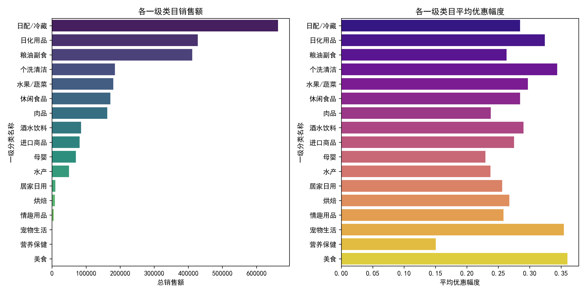
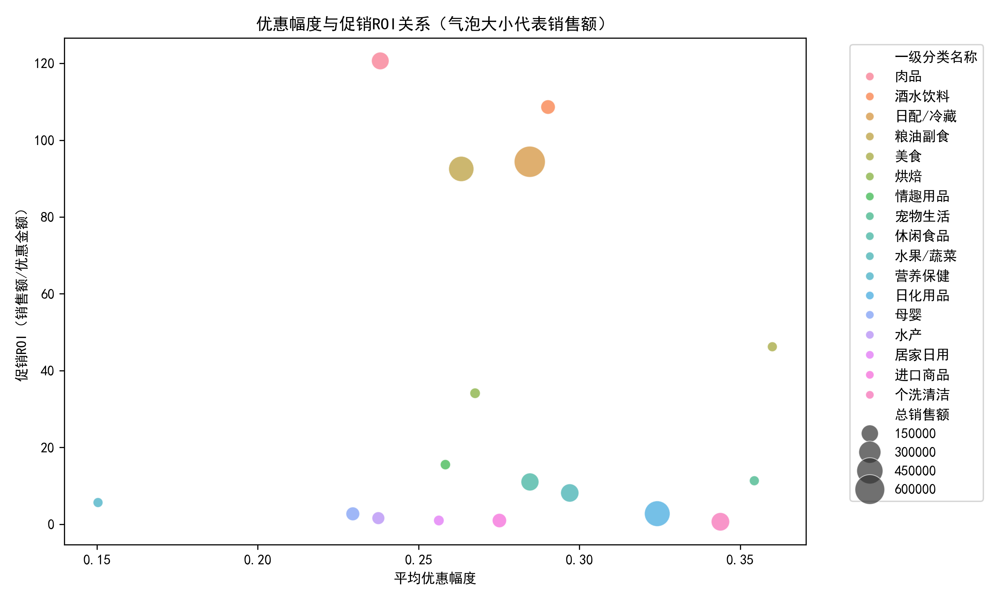
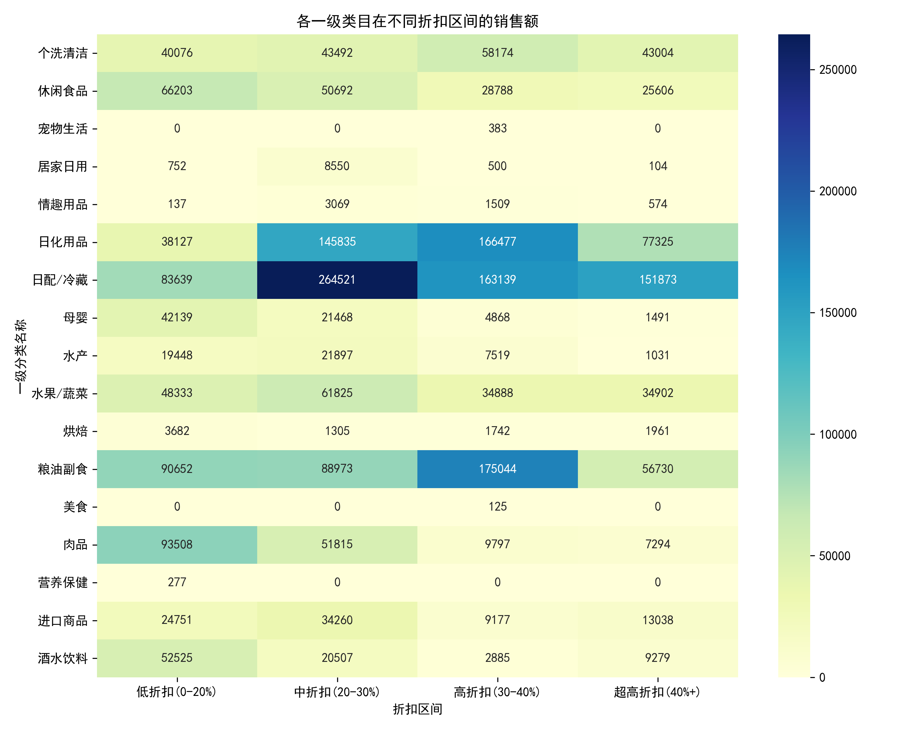

# 单品直降活动效果分析报告

## 一、分析背景
本报告基于单品直降活动数据，从一级类目层面分析优惠幅度与销售额的关系，评估不同类目的促销效果差异，并提出优化促销资源配置与折扣策略的建议。

## 二、数据概览
- 数据来源：附件3（促销数据）与附件4（类目信息）关联
- 分析样本：有效促销SKU共计5,697个
- 覆盖类目：17个一级类目

## 三、核心发现

### 1. 销售额与优惠幅度分布

从一级类目来看，**日配/冷藏、日化用品、粮油副食**是销售额最高的三个类目，合计占总销售额的**66.4%**。

- **日配/冷藏**销售额最高（66.3万元），平均优惠幅度为28.5%
- **日化用品**销售额第二（42.8万元），平均优惠幅度为32.4%
- **粮油副食**销售额第三（41.1万元），平均优惠幅度为26.3%

### 2. 促销效率（ROI）分析

促销ROI定义为**销售额/优惠金额**，反映每投入1元优惠带来的销售收入。

促销ROI最高的5个类目如下：

| 一级分类名称 | 促销ROI | 平均优惠幅度 | 总销售额（元） |
|--------------|---------|--------------|----------------|
| 肉品         | 120.7   | 23.8%        | 162,415        |
| 酒水饮料     | 108.6   | 29.0%        | 85,196         |
| 日配/冷藏    | 94.4    | 28.5%        | 663,172        |
| 粮油副食     | 92.5    | 26.3%        | 411,398        |
| 美食         | 46.2    | 36.0%        | 125            |

**洞察**：肉品和酒水饮料在**较低优惠幅度**下实现了**高ROI**，说明其对价格敏感度较低，适合**保守折扣策略**。

### 3. 折扣区间敏感性分析

通过将优惠幅度划分为四个区间（低、中、高、超高），分析TOP3类目在不同折扣区间的销售额表现：

| 类目       | 低折扣(0-20%) | 中折扣(20-30%) | 高折扣(30-40%) | 超高折扣(40%+) |
|------------|---------------|----------------|----------------|----------------|
| 日配/冷藏  | 83,639        | **264,521**    | 163,139        | 151,873        |
| 日化用品   | 38,127        | 145,835        | **166,477**    | 77,325         |
| 粮油副食   | **90,652**    | 88,973         | 175,044        | 56,730         |

**洞察**：
- **日配/冷藏**在中折扣区间销售额最高，**20-30%折扣为最优区间**
- **日化用品**对高折扣更敏感，**30-40%折扣为最优区间**
- **粮油副食**在低折扣区间表现突出，**0-20%折扣即可撬动销售**

## 四、策略建议

### 1. 差异化折扣策略
- **肉品、酒水饮料**：ROI高且对折扣不敏感，建议**20-25%折扣**为主，避免过度让利
- **日配/冷藏**：中折扣区间表现最佳，建议**25-30%折扣**为主力促销区间
- **日化用品**：高折扣区间销售爆发力强，可重点投入**30-35%折扣**资源
- **粮油副食**：低折扣即可见效，建议**15-25%折扣**为主，提升促销效率

### 2. 资源配置优化
- **优先保障高ROI类目**：肉品、酒水饮料、日配/冷藏应优先获得促销资源
- **控制高折扣依赖类目**：日化用品虽在高折扣下销售高，但需控制频率，避免利润侵蚀
- **挖掘低折扣高转化机会**：粮油副食、肉品等类目在较低折扣下即可实现销售，适合日常促销

### 3. 促销节奏建议
- **高ROI类目**（肉品、酒水）可**常态化促销**，以低折扣维持销售热度
- **高折扣敏感类目**（日化用品）建议**节点性大促**，集中资源打造爆发
- **中折扣高效类目**（日配/冷藏）可**周期性促销**，保持销售稳定性

## 五、结论
通过分析发现，不同一级类目对优惠幅度的敏感度存在显著差异。建议未来促销策略从“统一折扣”转向**类目差异化折扣**，在保障销售额的同时，最大化促销ROI，实现**精准促销、降本增效**。
