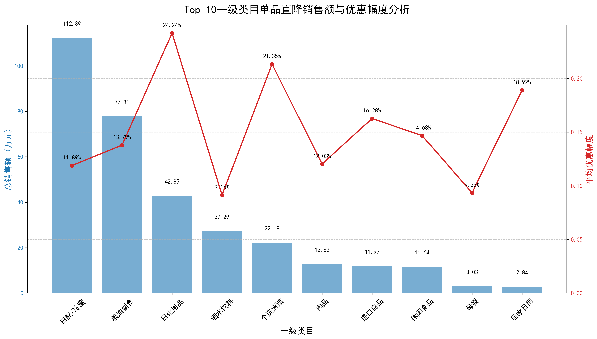

# 单品直降促销活动分析报告：一级类目的优惠与销售关系探究

## 1. 分析背景与目标

本次分析旨在深入探讨“单品直降”促销活动中，不同商品一级类目的**优惠幅度**与**销售额**之间的关系。通过评估各品类的促销效果差异，我们期望为未来的促销资源分配、折扣策略以及整体营销活动提供数据驱动的优化建议，以实现销售额和利润的最大化。

## 2. 核心分析发现

我们通过整合订单数据、促销记录和商品类目信息，聚焦于“单品直降”活动，对各一级类目的总销售额和平均优惠幅度进行了计算和可视化分析。下图展示了销售额排名前十的一级类目及其对应的促销表现：

根据上图及数据分析，我们得出以下核心洞察：

### 洞察一：刚需品类是销售基石，对折扣敏感度较低

- **日配/冷藏** 和 **粮油副食** 作为销售额冠亚军，贡献了超过一半以上的促销总销售额，是单品直降活动的绝对主力。
- 值得注意的是，这两个类目的平均优惠幅度分别为 **11.9%** 和 **13.8%**，均处于中等偏低水平。这表明此类商品作为高频次、生活必需的刚需品，其购买决策对价格的依赖性相对较小。消费者即使在没有大幅折扣的情况下，依然会保持稳定的购买需求。

### 洞察二：价格敏感型品类通过高折扣实现显著销售增长

- **日化用品** 和 **个洗清洁** 品类展现出最高的平均优惠幅度，分别达到了 **24.2%** 和 **21.3%**。
- 高幅度的折扣成功刺激了销售，使“日化用品”的销售额冲至第三位。这证明该类商品（通常为消耗品，但购买频率低于食品）的消费者对价格更为敏感，显著的降价能有效促成购买决策，是提升销售额的有效手段。

### 洞察三：部分品类具备高促销效率，小幅折扣即可撬动高销量

- **酒水饮料** 品类的平均优惠幅度仅为 **9.1%**，在Top 10中排名倒数第二，但其销售额却高居第四位。
- 这揭示了酒水饮料品类极高的**促销效率**。由于其兼具社交、即时消费和一定的价格弹性，小幅度的优惠足以吸引大量消费者，成为撬动销售额的“四两拨千斤”的典范。

## 3. 业务建议与策略优化

基于以上分析，我们提出以下针对性的促销资源配置与折扣策略优化建议：

### 策略一：实施差异化折扣策略，优化资源配置

- **对于高频刚需品类（如日配/冷藏、粮油副食）**: 建议**适当降低优惠幅度**，将折扣预算控制在较低水平（如8%-12%）。由于其销售对折扣不敏感，过高的折扣只会侵蚀利润。节省下的促销资源可转移到其他能有效拉动增量的品类。

- **对于价格敏感型品类（如日化用品、个洗清洁）**: 建议**维持或适度增加高折扣活动**（如20%-25%）。这些品类的销售增长与折扣深度强相关，将其作为引流和提升客单价的重点品类，通过“爆款单品”策略吸引顾客。

- **对于高促销效率品类（如酒水饮料）**: 建议**保持当前或略低的优惠幅度**（如7%-10%），利用其高转化特性，频繁开展小力度促销活动，或作为订单凑单的补充优惠品类，持续稳定地贡献销售额。

### 策略二：关注潜力品类，进行增长测试

- 对于**进口商品**和**休闲食品**等销售额和折扣率都处于中游的品类，存在进一步优化的潜力。
- 建议对这些品类进行A/B测试，探索它们对不同折扣深度的反应。例如，可以尝试将休闲食品的折扣从当前的14.7%提升至18%-20%，观察其销售额增长是否符合预期，以找到最佳的“投入产出比”点位。

## 4. 结论

总而言之，单品直降活动并非“一刀切”的折扣游戏。不同一级类目对价格的敏感度和需求刚性存在显著差异。未来的促销策略应摒弃单一的折扣模式，转向基于品类属性的**精细化、差异化运营**。通过将促销资源向“价格敏感型”和“高效率型”品类倾斜，同时维持“刚需品类”的稳定利润，企业可以在提升整体销售额的同时，实现更健康的利润结构，最大化营销活动的投资回报率。
