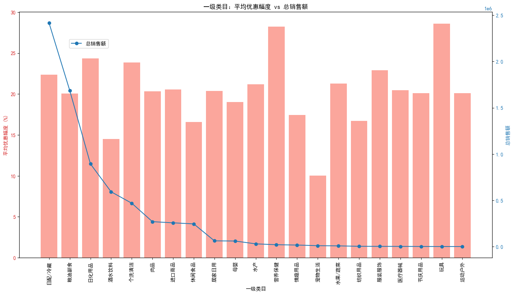

# 单品直降促销效果分析报告

## 数据背景
我们分析了“单品直降”促销活动对不同一级类目的影响，结合销售数据、促销价和原价计算了优惠幅度，并统计总销售额，最终按类目汇总如下：

| 一级类目名称 | 促销SKU数量 | 平均优惠幅度 (%) | 总销售额 |
| --- | --- | --- | --- |
| 日配/冷藏 | 239 | 22.36 | 2,415,620.16 |
| 粮油副食 | 224 | 20.09 | 1,686,750.48 |
| 日化用品 | 128 | 24.34 | 893,974.17 |
| 酒水饮料 | 121 | 14.49 | 592,072.09 |
| 个洗清洁 | 183 | 23.88 | 468,391.78 |
| 肉品 | 33 | 20.34 | 268,916.59 |
| 进口商品 | 94 | 20.54 | 256,355.39 |
| 休闲食品 | 160 | 16.60 | 244,898.03 |
| 居家日用 | 38 | 20.40 | 61,597.18 |
| 母婴 | 22 | 19.03 | 59,700.70 |
| 水产 | 11 | 21.18 | 29,000.06 |
| 营养保健 | 3 | 28.26 | 19,701.60 |
| 情趣用品 | 11 | 17.46 | 16,218.30 |
| 宠物生活 | 6 | 10.03 | 9,304.90 |
| 水果/蔬菜 | 2 | 21.31 | 7,136.22 |
| 纺织用品 | 1 | 16.74 | 2,786.00 |
| 服装服饰 | 7 | 22.92 | 1,784.20 |
| 医疗器械 | 4 | 20.46 | 1,534.30 |
| 节庆用品 | 11 | 20.13 | 690.00 |
| 玩具 | 2 | 28.61 | 159.60 |
| 运动户外 | 2 | 20.11 | 42.80 |

## 可视化分析

上图中：
- 红色柱状图表示各类目的**平均优惠幅度**（以百分比表示）；
- 蓝色折线图显示**总销售额**（以元为单位）；
- 类目按销售额排序，从高到低排列。

## 分析与业务洞察
### 1. **高销售额高优惠类目（日配/冷藏、粮油副食）**
- **日配/冷藏** 和 **粮油副食** 是销售额最高的两个类目，分别为 **2,415,620.16 元** 和 **1,686,750.48 元**。
- 它们的平均优惠幅度分别为 **22.36%** 和 **20.09%**，处于正常范围内，说明消费者对这些类目的价格敏感度适中。
- **建议**：维持当前优惠策略，但可适当尝试小幅折扣，测试是否可提高利润率且不影响销量。

### 2. **高优惠低销售额类目（营养保健、玩具）**
- **营养保健** 和 **玩具** 的平均优惠幅度最高，分别为 **28.26%** 和 **28.61%**，但销售额相对较低。
- 这意味着即使大幅让利，消费者购买意愿依然较弱。
- **建议**：优化产品组合，考虑捆绑销售或增加非价格类促销（如赠品、体验券）以提升吸引力。

### 3. **低优惠高销售额类目（日化用品、酒水饮料）**
- **日化用品** 的优惠幅度为 **24.34%**，但销售额达到 **893,974.17 元**；
- **酒水饮料** 优惠幅度仅 **14.49%**，但销售额达 **592,072.09 元**；
- 表明这些类目对价格不敏感，即使折扣较小也能保持较高的销售水平。
- **建议**：减少折扣幅度，提高毛利空间，同时观察是否影响销售量。

### 4. **低优惠低销售额类目（宠物生活、节庆用品、运动户外等）**
- 这些类目优惠幅度较小，且销售额也偏低，促销效果不佳。
- **建议**：重新评估促销频率，或考虑更精准的目标人群营销，提升促销效率。

## 优化建议
### 1. **资源分配优化**
- 增加对 **高销售额高优惠类目** 的促销资源投入，如日配/冷藏、粮油副食；
- 减少对 **高优惠低销售额类目**（如营养保健、玩具）的资源投入，除非有战略目的（如提升品类丰富度）。

### 2. **折扣策略调整**
- 对 **低优惠高销售额类目**（如日化用品、酒水饮料）可尝试**适度降低折扣力度**，以提升整体利润；
- 对 **低优惠低销售额类目**（如宠物生活、节庆用品）可尝试**组合促销**或**赠品策略**，以提升吸引力。

### 3. **促销活动差异化**
- 将促销资源更精准地分配给**具有价格敏感度的类目**，如休闲食品、母婴等；
- 对于价格敏感较低的类目，如日化用品、粮油副食，可采用**会员专属折扣**或**满减活动**，以提升客单价。

## 结论
数据分析表明，不同类目在促销效果上存在显著差异。通过优化资源分配和折扣策略，可以更有效地提升整体促销效率与盈利能力。
