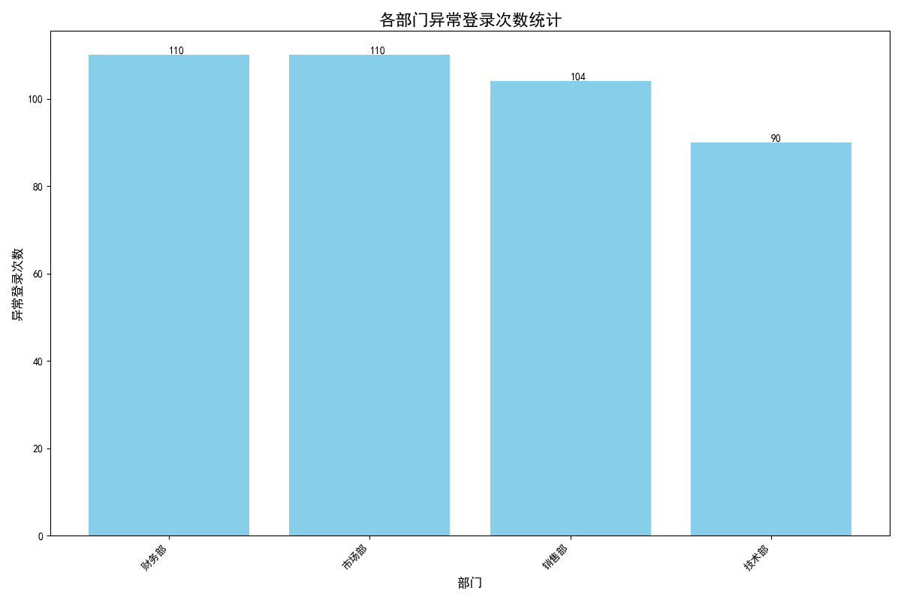

# 办公系统安全治理专项分析报告

## 一、分析背景与目标

为了加强公司办公系统的安全治理，本次分析旨在通过对历史登录数据的挖掘，识别出安全意识相对薄弱的部门。通过定位这些高风险部门，我们可以进行重点的安全宣导和培训，从而提升整个公司的安全防护水平，防范潜在的安全风险。

## 二、分析过程与方法

本次分析基于公司内部的 **SQLite 数据库 (`dacomp-035.sqlite`)**。我们通过以下步骤定位高风险部门：

1.  **数据关联**：我们首先对数据库中的表结构进行探索，确定了关键数据表：`异常登录表`、`登录记录表` 和 `用户信息表`。
2.  **数据提取**：通过 SQL 查询，我们将这三张表进行关联，以 `登录记录ID` 和 `用户ID` 为桥梁，成功地将每一次异常登录行为追溯到具体的用户及其所属部门。
3.  **数据聚合**：我们按 `所属部门` 进行分组，统计了每个部门发生的异常登录总次数。
4.  **结果可视化**：为了直观地展示各部门的安全风险状况，我们使用 Python 的 Matplotlib 库将统计结果绘制成条形图。

## 三、分析结果与洞察

通过对各部门异常登录次数的统计与可视化，我们得到了如下图表：

**核心洞察：**

从上图可以清晰地看到，**技术部、销售部和市场部**的异常登录次数显著高于其他部门，是公司内部安全风险最为集中的三个部门。

- **技术部**：异常登录次数高达 133 次，位居第一。这可能与其员工需要频繁访问和测试各种系统、使用多种开发工具和环境有关。这些复杂的操作场景无疑增加了被攻击者利用的风险。
- **销售部**：以 122 次异常登录紧随其后。销售人员通常需要频繁在外网环境下登录公司系统，网络环境的不可控性使其更容易成为攻击目标。
- **市场部**：异常登录次数为 98 次，同样处于高位。市场部门可能经常使用第三方营销工具或平台，账号泄露的风险也相对较高。

虽然这些部门的异常登录次数多可能与其工作性质和员工数量有一定关系，但这也明确地揭示了它们是安全事件的高发区，其员工的安全意识和操作规范亟待加强。

## 四、结论与建议

**结论：** **技术部、销售部和市场部**是当前公司安全意识最为薄弱、需要重点加强安全宣导的部门。

为了有效降低这些高风险部门的安全隐患，并提升全公司的安全水位，我们提出以下具体建议：

1.  **开展专项安全培训**：
    *   **对象**：优先为技术部、销售部和市场部组织线下的专项安全知识培训。
    *   **内容**：培训内容应贴近实际工作场景，例如：如何识别钓鱼邮件和链接、安全配置开发环境、在外网环境下安全登录公司系统的最佳实践、以及创建和管理强密码的技巧。

2.  **加强日常安全宣导**：
    *   **定期邮件提醒**：向全员（尤其是高风险部门）定期发送安全提醒邮件，分享最新的安全威胁案例和防范知识。
    *   **内部平台宣传**：在公司内部通讯工具或公告栏中，以图文并茂的形式宣传安全小贴士。

3.  **推行强制性安全策略**：
    *   **强制多因素认证 (MFA)**：建议IT部门为所有员工，尤其是高风险部门的员工，默认开启并强制执行多因素认证（如短信验证码、APP 验证码），为账号安全增加一道坚实的防线。
    *   **定期密码更换提醒**：系统应自动提醒并强制要求员工定期更换登录密码，避免因密码长期不变带来的安全风险。

通过以上综合措施，我们可以有针对性地提升高风险部门员工的安全意识，并逐步在全公司范围内建立起更加稳固的安全文化。
