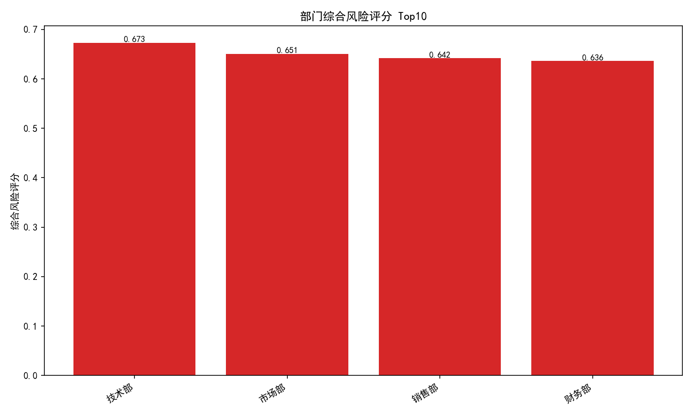
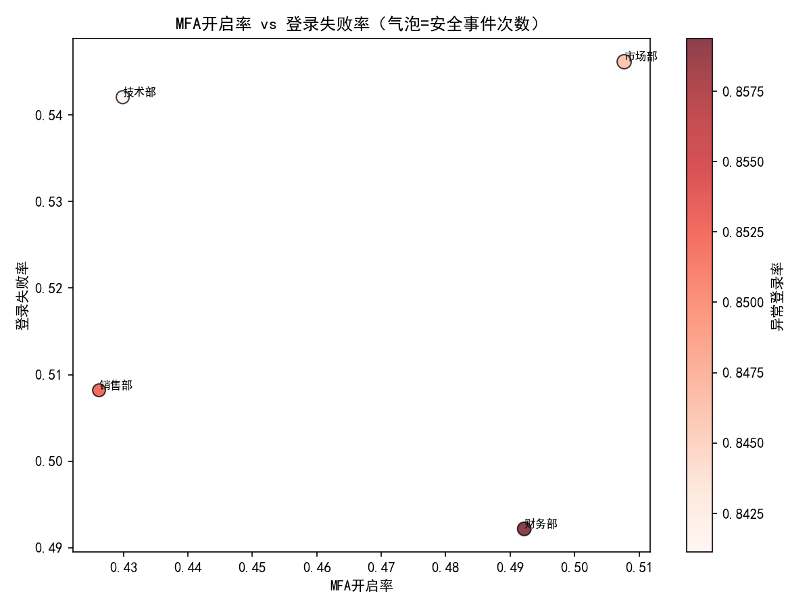

# 办公系统安全治理专项分析报告：哪些部门需要重点加强安全宣导

本报告基于历史的登录、异常登录与安全事件数据，对各部门的安全表现进行对比分析，识别安全意识相对薄弱的部门，并给出针对性改进建议。报告不进行数据清洗，仅基于现有数据探索与指标构建。

---

## 数据与方法

- 数据来源：SQLite 数据库 dacomp-035.sqlite，涉及的核心表包括：
  - 用户信息表：包含用户ID与所属部门等。
  - 登录记录表：包含用户登录的认证状态、二次认证状态等。
  - 异常登录表：记录登录异常、风险等级、异常分数等（通过登录记录ID关联）。
  - 安全事件表：记录触发的安全事件及级别、风险评分等（通过登录记录ID关联）。

- 全局分布快照（用于校准总体基线）：
  - 认证状态：失败 254，成功 233（整体失败率略高于成功）。
  - 二次认证状态：已开启 227，未开启 260（MFA采用率偏低）。
  - 异常登录风险等级：严重 109，高 113，中 98，低 94（高+严重占比偏高）。
  - 安全事件级别：严重 108，高 79，中 78，低 85（严重+高占比较大）。

- 部门级聚合：通过用户ID关联部门，并把登录、异常与事件在部门维度聚合，得到每部门的登录次数、失败/成功次数、MFA开关次数、异常登录次数/分布、安全事件次数/级别等。随后计算核心安全指标与综合风险评分（不训练模型，仅规则加权）：
  - 登录失败率 = 失败次数 / 登录次数
  - MFA开启率 = MFA已开启次数 / (MFA已开启次数 + MFA未开启次数)
  - 异常登录率 = 异常登录次数 / 登录次数
  - 安全事件率 = 安全事件次数 / 登录次数
  - 事件严重占比 = 事件严重 / 安全事件次数
  - 综合风险评分（权重）：0.30×异常登录率 + 0.25×安全事件率 + 0.25×登录失败率 + 0.10×(1-MFA开启率) + 0.10×事件严重占比

为便于复现，核心SQL（聚合到部门）如下：

```sql
WITH login_stats AS (
  SELECT ui.所属部门 AS 部门,
         COUNT(*) AS 登录次数,
         SUM(CASE WHEN lr.认证状态='失败' THEN 1 ELSE 0 END) AS 失败次数,
         SUM(CASE WHEN lr.认证状态='成功' THEN 1 ELSE 0 END) AS 成功次数,
         SUM(CASE WHEN lr.二次认证状态='已开启' THEN 1 ELSE 0 END) AS MFA已开启次数,
         SUM(CASE WHEN lr.二次认证状态='未开启' THEN 1 ELSE 0 END) AS MFA未开启次数
  FROM 登录记录表 lr
  JOIN 用户信息表 ui ON lr.用户ID = ui.用户ID
  GROUP BY ui.所属部门
), abnormal_stats AS (
  SELECT ui.所属部门 AS 部门,
         COUNT(*) AS 异常登录次数,
         SUM(异常分数) AS 异常分数合计,
         SUM(CASE WHEN 风险等级='严重' THEN 1 ELSE 0 END) AS 异常严重,
         SUM(CASE WHEN 风险等级='高' THEN 1 ELSE 0 END) AS 异常高,
         SUM(CASE WHEN 风险等级='中' THEN 1 ELSE 0 END) AS 异常中,
         SUM(CASE WHEN 风险等级='低' THEN 1 ELSE 0 END) AS 异常低
  FROM 异常登录表 ab
  JOIN 登录记录表 lr ON ab.登录记录ID = lr.登录记录ID
  JOIN 用户信息表 ui ON lr.用户ID = ui.用户ID
  GROUP BY ui.所属部门
), event_stats AS (
  SELECT ui.所属部门 AS 部门,
         COUNT(*) AS 安全事件次数,
         SUM(风险评分) AS 事件风险评分合计,
         SUM(CASE WHEN 级别='严重' THEN 1 ELSE 0 END) AS 事件严重,
         SUM(CASE WHEN 级别='高' THEN 1 ELSE 0 END) AS 事件高,
         SUM(CASE WHEN 级别='中' THEN 1 ELSE 0 END) AS 事件中,
         SUM(CASE WHEN 级别='低' THEN 1 ELSE 0 END) AS 事件低
  FROM 安全事件表 se
  JOIN 登录记录表 lr ON se.登录记录ID = lr.登录记录ID
  JOIN 用户信息表 ui ON lr.用户ID = ui.用户ID
  GROUP BY ui.所属部门
), dept AS (
  SELECT DISTINCT 所属部门 AS 部门 FROM 用户信息表
  UNION
  SELECT DISTINCT 部门 FROM login_stats
  UNION
  SELECT DISTINCT 部门 FROM abnormal_stats
  UNION
  SELECT DISTINCT 部门 FROM event_stats
)
SELECT d.部门,
       (SELECT COUNT(*) FROM 用户信息表 ui2 WHERE ui2.所属部门 = d.部门) AS 用户数,
       COALESCE(l.登录次数,0) AS 登录次数,
       COALESCE(l.失败次数,0) AS 失败次数,
       COALESCE(l.成功次数,0) AS 成功次数,
       COALESCE(l.MFA已开启次数,0) AS MFA已开启次数,
       COALESCE(l.MFA未开启次数,0) AS MFA未开启次数,
       COALESCE(a.异常登录次数,0) AS 异常登录次数,
       COALESCE(a.异常分数合计,0) AS 异常分数合计,
       COALESCE(a.异常严重,0) AS 异常严重,
       COALESCE(a.异常高,0) AS 异常高,
       COALESCE(a.异常中,0) AS 异常中,
       COALESCE(a.异常低,0) AS 异常低,
       COALESCE(e.安全事件次数,0) AS 安全事件次数,
       COALESCE(e.事件风险评分合计,0) AS 事件风险评分合计,
       COALESCE(e.事件严重,0) AS 事件严重,
       COALESCE(e.事件高,0) AS 事件高,
       COALESCE(e.事件中,0) AS 事件中,
       COALESCE(e.事件低,0) AS 事件低
FROM dept d
LEFT JOIN login_stats l ON d.部门 = l.部门
LEFT JOIN abnormal_stats a ON d.部门 = a.部门
LEFT JOIN event_stats e ON d.部门 = e.部门
ORDER BY d.部门;
```

---

## 关键图表与发现

1) 部门综合风险评分 Top10（越高越需要关注）



- 风险Top5（含关键指标节选）：
  - 技术部：登录失败率 0.542，MFA开启率 0.430，异常登录率 0.841，安全事件率 0.766，事件严重占比 0.366，综合风险评分 0.673。
  - 市场部：登录失败率 0.546，MFA开启率 0.508，异常登录率 0.846，安全事件率 0.754，事件严重占比 0.224，综合风险评分 0.651。
  - 销售部：登录失败率 0.508，MFA开启率 0.426，异常登录率 0.852，安全事件率 0.656，事件严重占比 0.375，综合风险评分 0.642。
  - 财务部：登录失败率 0.492，MFA开启率 0.492，异常登录率 0.859，安全事件率 0.703，事件严重占比 0.289，综合风险评分 0.636。

解读：以上部门的“异常登录率+安全事件率”均较高，是综合风险评分的主要驱动；MFA开启率整体偏低（0.43-0.51），对风险有一定推升；登录失败率整体偏高，暗示存在口令管理薄弱、钓鱼/撞库等问题。

2) MFA开启率 vs 登录失败率（气泡=安全事件次数，颜色=异常登录率）



- 观察：
  - 多数部门处在“中等MFA开启率（约0.45-0.50）+较高失败率（约0.50左右）”的区域。
  - 气泡普遍较大（安全事件次数较多），且颜色偏红（异常登录率较高），说明“异常行为频发”是风险的共同特征。
  - 未发现极端低MFA（<40%）或极端高失败率（>55%）的部门，但当前基线也并不安全，需要提升整体门槛。

3) Top8部门的安全事件级别分布（堆叠柱状）


- 观察：严重/高等级事件在Top风险部门中占比偏高（尤其技术部、销售部）。这意味着这些部门不仅事件多，且冲击面更大。

---

## 结论：需要重点加强安全宣导的部门

基于综合风险评分、异常登录率、事件级别分布等，建议优先对以下部门进行强化宣导与治理：“技术部”“市场部”“销售部”“财务部”。

- 技术部：异常登录率与安全事件率都偏高，严重/高等级事件占比较大。可能原因：对外接口多、账号权限较高，攻击面更广；同时MFA采用率未达标，口令使用习惯仍需提升。
- 市场部：异常行为与事件频度高，失败率也较高。可能原因：外出与第三方协作频繁，设备与网络环境复杂，易受钓鱼与窃密威胁。
- 销售部：异常与事件明显，严重事件占比高。可能原因：移动办公多、跨区域访问多，弱口令/重复密码或共享账号风险更高。
- 财务部：异常登录与事件率偏高，虽严重占比略低于技术/销售，但业务敏感度高，必须前置强化。

---

## 诊断性分析：为什么会这样？

- 异常登录率高：可能包含撞库/凭据填充、机器人批量尝试、非常用设备/地区访问较多、共享账号缺乏管控等。
- 登录失败率高：反映密码强度不足、密码重试/更换习惯差、易受钓鱼影响；也可能是对异常行为的风控拦截导致的“防御性失败”。
- MFA采用率不高：整体MFA开启率在0.43-0.51区间，明显低于企业级最佳实践（>0.9）。
- 事件严重度高：说明异常行为未被足够早地阻断，或策略阈值保守导致触发晚、影响范围扩大。

---

## 预测性判断（在当前策略不变的情况下）

- 若不提升MFA与口令策略，异常登录与事件率大概率维持高位，尤其对外部协作频繁、移动办公比例高的部门（市场/销售）与权限高度集中的技术/财务部门。
- 随系统边界外延（更多SaaS/外部系统接入），基于凭据的攻击面会进一步扩大。

---

## 规范性建议：我们应该做什么？

短期（0-4周，优先级高）：
- 强制MFA：将高风险部门（技术、市场、销售、财务）纳入强制MFA清单，目标4周内部门MFA开启率≥90%。
- 口令与凭据治理：
  - 启用泄露密码库校验与密码强度策略（≥12位、包含复杂度）；
  - 开启登录速率限制与渐进式延迟/冻结机制，抵御暴力破解与批量尝试；
  - 禁止共享账号，梳理并回收冗余账号与过期权限。
- 风险感知训练：开展针对钓鱼与凭据防护的训练与模拟演练，重点覆盖技术/销售/市场。

中期（1-3个月）：
- 风险自适应认证：对非常用设备/位置/时间段实施“按风险分级的二次认证”，减少不必要摩擦同时提升风险时的拦截能力。
- 零信任实践：按最小权限原则梳理访问控制，细化到应用与API级别；关键操作启用强认证与审批。
- 可观测性与响应：构建部门级安全看板，按周跟踪“异常登录率、失败率、事件率、严重占比、MFA率”等，并建立告警阈值与应急演练。

长期（3-6个月）：
- 供应链与第三方接入治理：统一接入网关、令牌与密钥管理，落地密钥轮换、最小可用期与权限隔离。
- 安全文化建设：将安全评分纳入部门季度考核，形成“安全红线”与正向激励，推动持续改进。

---

## 量化目标与预期改善

以技术部为例，若实施以下目标：
- MFA开启率从约0.43提升至0.90（MFA未开启率下降0.47），综合风险评分因该项预计下降约0.10×0.47≈0.047；
- 登录失败率从约0.54降至0.25，风险再降约0.25×(0.54-0.25)≈0.073；
- 若异常登录率与安全事件率各下降20%，风险还将下降约0.55×0.2≈0.11（按当前权重合计0.55估算）。
- 综合预计可降低风险评分约0.23-0.28，显著改善部门安全态势。

---

## 可复现的分析与制图代码

以下为用于绘图的Python片段（完整脚本已在当前目录生成：dept_security_analysis.py），注意包含中文字体设置：

```python
import pandas as pd
import numpy as np
import matplotlib.pyplot as plt

plt.rcParams['font.sans-serif'] = ['SimHei']
plt.rcParams['axes.unicode_minus'] = False

df = pd.read_csv('dept_security_stats.csv')

def safe_div(a, b):
    return np.where(b==0, 0, a / b)

# 指标计算
df['登录失败率'] = safe_div(df['失败次数'], df['登录次数'])
df['MFA开启率'] = safe_div(df['MFA已开启次数'], df['MFA已开启次数'] + df['MFA未开启次数'])
df['异常登录率'] = safe_div(df['异常登录次数'], df['登录次数'])
df['安全事件率'] = safe_div(df['安全事件次数'], df['登录次数'])
df['事件严重占比'] = safe_div(df['事件严重'], df['安全事件次数'])
df['综合风险评分'] = (
    0.30 * df['异常登录率'].fillna(0) +
    0.25 * df['安全事件率'].fillna(0) +
    0.25 * df['登录失败率'].fillna(0) +
    0.10 * (1 - df['MFA开启率'].fillna(0)) +
    0.10 * df['事件严重占比'].fillna(0)
)

# 图1：综合风险评分Top10
rank = df.sort_values('综合风险评分', ascending=False).head(10)
plt.figure(figsize=(10, 6))
plt.bar(rank['部门'], rank['综合风险评分'], color='#d62728')
plt.title('部门综合风险评分 Top10')
plt.ylabel('综合风险评分')
plt.xticks(rotation=30, ha='right')
plt.tight_layout()
plt.savefig('部门综合风险评分Top10.png', dpi=150)
plt.close()

# 图2：MFA开启率 vs 登录失败率（气泡=安全事件次数，颜色=异常登录率）
plt.figure(figsize=(8, 6))
size = 100 * (df['安全事件次数'] + 1) / (df['安全事件次数'] + 1).max()
sc = plt.scatter(df['MFA开启率'], df['登录失败率'], s=size, c=df['异常登录率'], cmap='Reds', alpha=0.75, edgecolor='k')
plt.colorbar(sc, label='异常登录率')
for _, r in df.iterrows():
    plt.text(r['MFA开启率'], r['登录失败率'], r['部门'], fontsize=8, ha='left', va='bottom')
plt.xlabel('MFA开启率')
plt.ylabel('登录失败率')
plt.title('MFA开启率 vs 登录失败率（气泡=安全事件次数）')
plt.tight_layout()
plt.savefig('MFA开启率_vs_登录失败率_散点.png', dpi=150)
plt.close()
```

---

## 限制与注意

- 数据为历史切片，未对数据质量进行清洗；结果依赖于登录记录到部门的关联完整性。
- 异常与事件间可能存在关联与重复触发，本文未对事件去重或合并异常链路，仅从频度与占比观察风险。
- 综合风险评分为规则权重模型，用于相对比较而非绝对风险度量，需结合业务背景进行解读与调整。

---

## 总结

- “技术部、市场部、销售部、财务部”在本期数据中风险评分靠前，建议作为安全宣导与技术治理的重点对象。
- 企业层面应立刻提升MFA采用率、强化口令策略与风控阈值，结合零信任与风险自适应认证缓释风险。
- 建议建立部门级周报看板，持续跟踪异常登录率/安全事件率/MFA率/失败率等指标，形成闭环改进。
