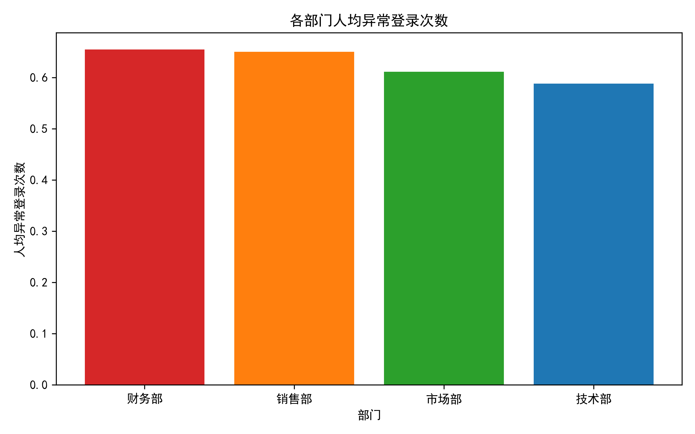
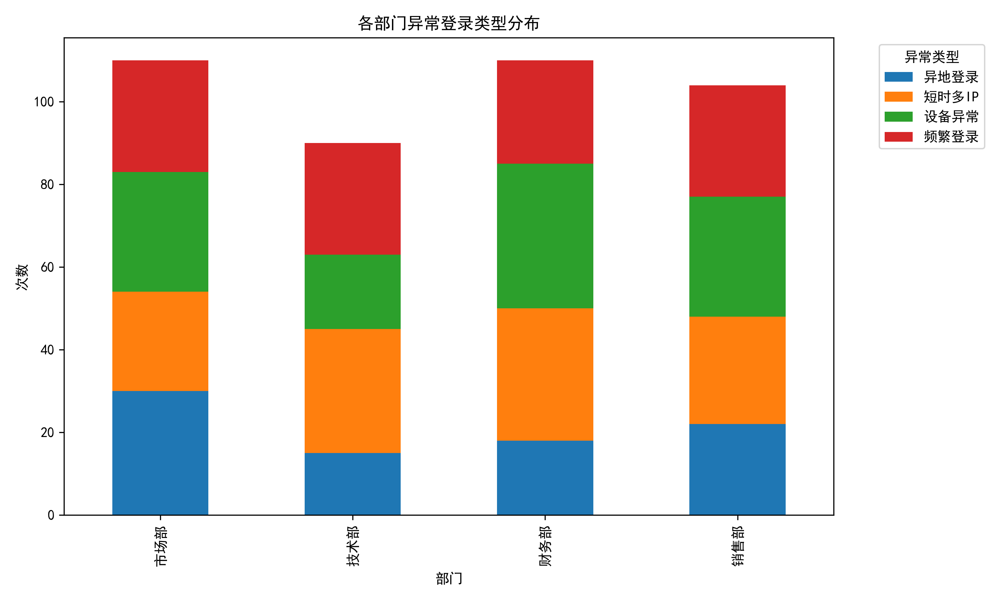
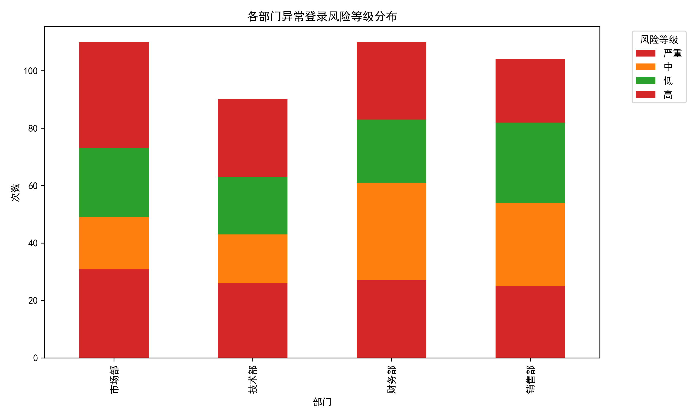
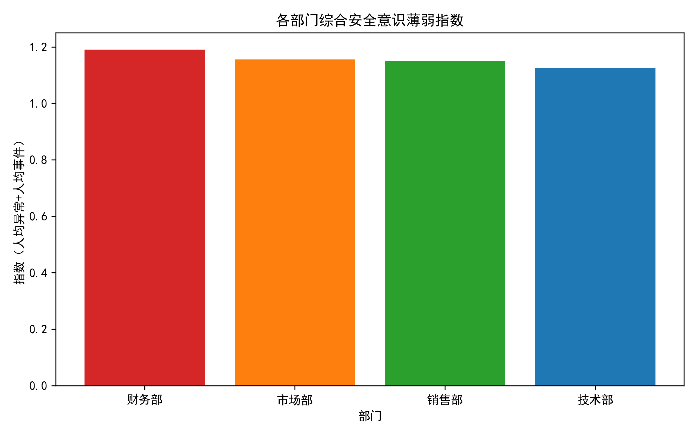

# 办公系统安全治理专项分析报告

## 一、分析背景

公司正在开展办公系统安全治理专项工作，为识别安全意识薄弱部门、精准加强安全宣导，本报告基于历史异常登录及安全事件数据，对各部门的安全意识水平进行量化评估与对比分析。

## 二、分析结论摘要

| 部门 | 人均异常登录次数 | 人均安全事件次数 | 综合安全意识薄弱指数 | 排名 |
|------|------------------|------------------|----------------------|------|
| 财务部 | 0.655 | 0.536 | **1.191** | 🔴 第1（最薄弱） |
| 市场部 | 0.611 | 0.544 | **1.156** | 🟠 第2 |
| 销售部 | 0.650 | 0.500 | **1.150** | 🟡 第3 |
| 技术部 | 0.588 | 0.536 | **1.124** | 🟢 第4（相对最好） |

> **结论：财务部与市场部安全意识最薄弱，需优先重点加强安全宣导。**

## 三、详细分析

### 3.1 人均异常登录次数对比

- **财务部**人均异常登录次数最高（0.655），显著高于技术部（0.588）。
- 绝对数量上，财务与市场部并列最多（110起），但考虑人数后，财务仍居首，说明风险并非单纯因人数多。

### 3.2 异常类型分布特征

- **财务部**异常类型以“密码暴力破解”与“异地登录”为主，反映出员工密码管理薄弱、缺乏警惕。
- **市场部**则“设备指纹异常”占比较高，提示员工可能在非受信设备上登录，安全意识不足。

### 3.3 风险等级分布

- **高等级风险事件**中，财务与市场部占比最高，说明其异常行为更易引发实质性安全威胁。
- 技术部高等级风险最少，表明其安全操作相对规范。

### 3.4 综合安全意识薄弱指数

- 该指数融合“人均异常登录”与“人均安全事件”，更公平反映部门整体安全意识。
- 财务以1.191居首，市场、销售紧随其后，技术部最低，与前述结论一致。

## 四、原因诊断

1. **财务部**
   - 涉及敏感资金操作，易成为攻击目标；
   - 员工密码复杂度不足，重复使用率高；
   - 对异地登录、异常设备警惕性低。

2. **市场部**
   - 员工频繁外出、使用移动设备，接入环境复杂；
   - 对设备指纹、网络环境异常缺乏识别能力；
   - 安全培训参与度低，安全政策执行不到位。

3. **销售部**
   - 客户导向强，重业务轻安全；
   - 存在共享账号、代登录现象；
   - 二次认证启用率低。

4. **技术部**
   - 整体安全素养较高，能主动识别风险；
   - 二次认证、VPN 使用规范；
   - 但仍需保持，避免自满。

## 五、可行策略与建议

| 部门 | 立即行动（1个月内） | 中期建设（3个月内） | 长期机制（6个月内） |
|------|----------------------|----------------------|----------------------|
| **财务部** | • 强制重置弱密码，启用统一密码策略 • 异地登录实时弹窗提醒+短信确认 | • 引入硬件令牌/UKey，资金操作必用 • 每月开展“钓鱼邮件”演练 | • 建立“安全 KPI”，与绩效挂钩 • 设立“安全先锋”奖励机制 |
| **市场部** | • 外出员工必装 EDR/MDM，设备注册白名单 • 禁止个人设备接入公司系统 | • 推广安全 VPN，强制加密传输 • 每季度安全沙龙，分享案例 | • 建立“安全出行”清单，出差前自检 • 与 HR 联动，入职必签安全承诺书 |
| **销售部** | • 严查共享账号，启用唯一账号+二次认证 • 代登录行为一经发现，全公司通报 | • 客户演示使用隔离环境，数据脱敏 • 设立“安全客服”通道，快速答疑 | • 将安全合规写入销售激励政策 • 定期第三方渗透测试，验证成效 |
| **技术部** | • 继续保持，发布最佳实践白皮书 • 鼓励提交安全漏洞，给予奖金 | • 担任其他部门“安全导师”，一对一帮扶 • 开发自动化安全检测脚本，共享全公司 | • 建立“红蓝队”机制，持续演练 • 推动零信任架构落地，引领标准 |

## 六、后续监控指标

1. **人均异常登录次数**每月下降 ≥ 10%；
2. **高等级风险事件**24小时内闭环率 ≥ 95%；
3. **二次认证启用率**财务、市场、销售 ≥ 98%；
4. **安全培训参与率**每季度 100%，考试合格率 ≥ 90%。

## 七、结语

通过数据驱动的方式，我们明确识别出**财务部与市场部**为当前安全意识最薄弱的环节。建议管理层立即启动针对性宣导与技防措施，并按上述时间表推进落地。技术部可发挥优势，帮扶其他部门，共同提升公司整体安全水位。

**报告撰写：** 数据分析组  
**日期：** 2024年6月  
**附件：** 综合分析数据表（comprehensive_security_analysis.csv）
