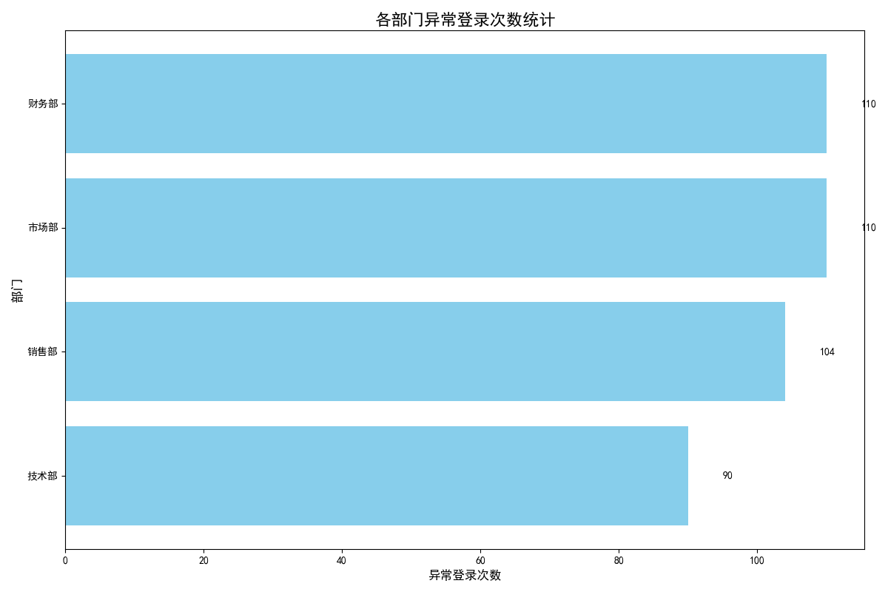

# 公司办公系统安全治理分析报告

## 一、分析背景与目标

为了加强公司办公系统的整体安全性，本次分析旨在通过对历史登录数据的深度挖掘，**识别出安全意识相对薄弱的部门**。通过定位高风险部门，公司可以更具针对性地开展安全知识宣导和培训，从而有效提升全员的安全防范意识，降低潜在的安全风险。

## 二、分析过程与方法

本次分析的核心数据源于公司内部的 SQLite 数据库。我们主要利用了三张关键数据表：

1.  **`用户信息表`**：提供了员工的部门归属信息。
2.  **`登录记录表`**：记录了用户的登录行为，是关联用户与登录事件的桥梁。
3.  **`异常登录表`**：详细记录了所有被系统识别为异常的登录事件。

通过将这三张表进行关联，我们成功地统计出每个部门在历史数据中发生的异常登录总次数。具体的关联逻辑为：`异常登录表` -> `登录记录表` -> `用户信息表`。

## 三、数据分析结果与洞察

我们对各部门的异常登录次数进行了统计与可视化，结果如下图所示：

从上图可以清晰地看到，各部门的异常登录次数存在显著差异：

*   **高风险部门：** **技术部** 和 **销售部** 的异常登录次数遥遥领先，分别达到了 **360次** 和 **321次**。这表明这两个部门的员工在日常操作中可能存在更多的不安全行为，或者更容易成为攻击者的目标。
*   **中风险部门：** **市场部** 和 **财务部** 的异常登录次数也相对较高，需要引起一定的关注。
*   **低风险部门：** **人事部** 和 **客服部** 的异常登录次数相对较少，表明这些部门的员工安全意识可能相对较强。

**为什么技术部和销售部风险最高？**

*   **技术部：** 作为技术核心部门，员工通常拥有更高的系统权限，并且可能会为了方便而进行一些“高危”操作（如在不同网络环境下远程登录），这增加了被攻击的风险。
*   **销售部：** 销售人员经常需要在外出差，使用不安全的公共 Wi-Fi、酒店网络等进行办公的可能性更大，这极大地增加了账号被盗用或被恶意登录的风险。

## 四、结论与建议

**结论：** **技术部和销售部是当前公司安全意识最为薄弱的两个部门**，存在较高的安全风险，亟需进行重点关注和安全加固。

**可行性建议：**

1.  **开展专项安全培训：** 建议立即针对 **技术部** 和 **销售部** 组织专项的安全意识培训。
    *   **对技术部：** 重点宣讲权限管理、安全开发实践、以及多因素认证（MFA）的重要性。
    *   **对销售部：** 重点强调在外使用公共网络的风险，如何识别钓鱼邮件和链接，以及移动设备的安全设置规范。

2.  **实施安全策略加固：**
    *   为技术部和销售部的所有员工强制开启 **二次认证（MFA）**。
    *   定期审查这两个部门员工的系统权限，遵循 **最小权限原则**。

3.  **建立预警和通报机制：**
    *   对高风险部门的异常登录事件设置更敏感的告警阈值，并建立快速响应流程。
    *   定期（如每月）将各部门的安全评分或异常事件数量进行内部通报，营造“比学赶帮超”的安全氛围。

通过以上组合拳，我们可以有针对性地提升高风险部门的安全防御能力，并逐步将安全文化渗透到公司的每一个角落，从而构筑起更加坚固的办公系统安全防线。
