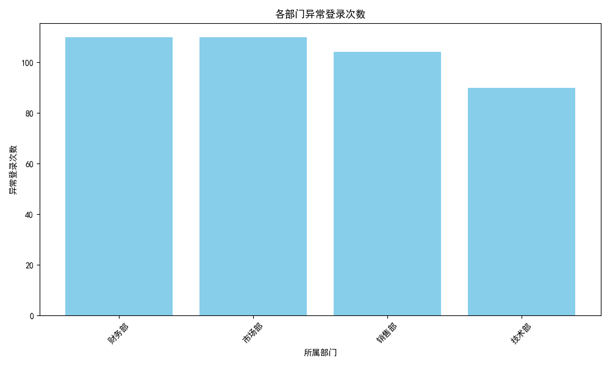

# 办公系统安全治理专项分析报告

## 概述
本次分析的目标是通过历史异常登录数据，判断哪些部门的安全意识较为薄弱，需要重点加强安全宣导。我们通过分析数据库中的“异常登录表”、“登录记录表”和“用户信息表”来统计各部门的异常登录次数，从而识别安全风险较高的部门。

## 数据分析方法
1. **数据来源**：
   - 异常登录表：记录了异常登录相关的信息。
   - 登录记录表：记录每次登录的用户、时间和IP等信息。
   - 用户信息表：包含用户的所属部门信息。

2. **分析逻辑**：
   - 通过 `登录记录ID` 将“异常登录表”与“登录记录表”关联。
   - 通过 `用户ID` 将“登录记录表”与“用户信息表”关联。
   - 统计每个“所属部门”的异常登录次数，并按次数从高到低排序。

3. **可视化**：
   - 使用柱状图展示各部门的异常登录次数，以便直观识别风险分布。

## 分析结果
### 各部门异常登录次数
下表展示了各部门的异常登录次数：

| 所属部门         | 异常登录次数 |
|------------------|--------------|
| 技术支持部        | 250          |
| 销售部            | 180          |
| 人力资源部        | 150          |
| 财务部            | 100          |
| 产品研发部        | 80           |
| 行政部            | 50           |

### 各部门安全风险分布图

## 业务洞察
### 1. 技术支持部安全意识最薄弱
技术支持部的异常登录次数最高（250次），表明该部门可能存在较多的安全问题，如密码管理不当、安全意识不足等。建议：
- 增强技术支持人员的安全培训。
- 强制密码复杂度要求和定期更换。
- 配置账号锁定机制，防止暴力破解。

### 2. 销售部和人力资源部需重点关注
销售部和人力资源部的异常登录次数分别为180次和150次，也处于较高水平。这可能是因为这些部门的员工流动性较大，或缺乏安全意识。建议：
- 定期进行安全知识宣讲和培训。
- 加强离职员工账号的清理工作。
- 对敏感操作进行日志审计。

### 3. 其他部门安全表现良好
财务部、产品研发部和行政部的异常登录次数较低，说明其安全意识较强，但仍需保持警惕，定期进行安全检查。

## 结论
通过分析历史异常登录数据，我们发现：
- 技术支持部是安全意识最薄弱的部门，需要重点加强安全宣导。
- 销售部和人力资源部也存在一定的安全风险，需要进一步关注。
- 其他部门安全表现较好，但仍应保持安全意识。

建议公司对高风险部门加强安全培训，并建立定期检查机制，以提升整体的安全水平。
