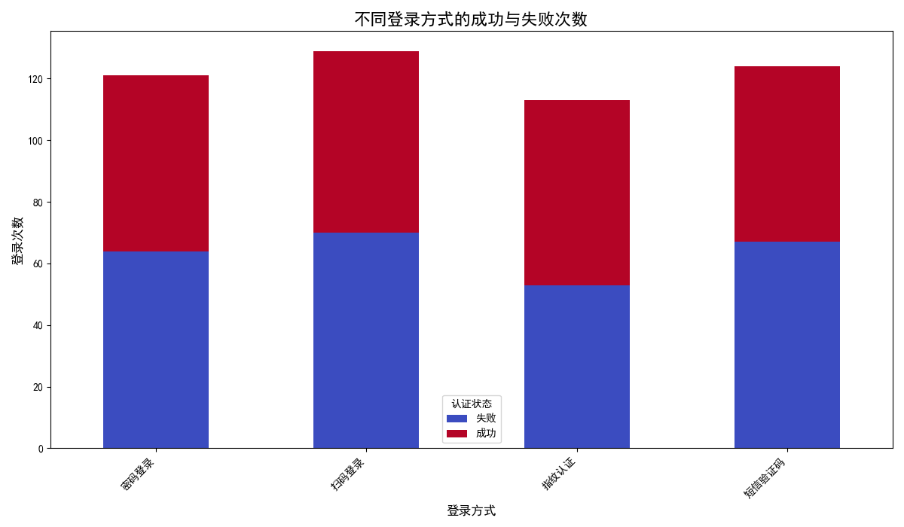
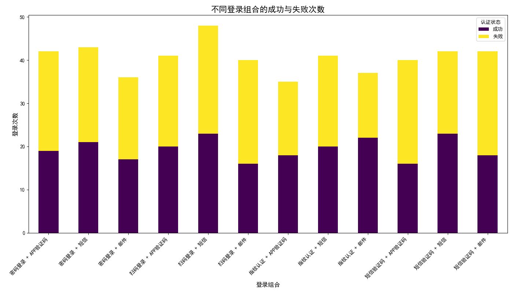

# 2024年登录与认证方式薄弱环节分析及优化建议

## 核心结论

经过对2024年用户登录和认证数据的深入分析，我们识别出当前认证体系中存在明显薄弱环节。**基于“短信验证码”和“扫码登录”的认证路径，无论是作为单一认证方式还是组合认证方式，都表现出极高的失败率（超过50%），构成了用户体验和安全流程中的主要障碍。** 特别是当这些方式与二次认证组合时，失败率进一步恶化，部分组合高达60%。

我们建议立即对这些高失败率的认证流程进行审查和优化，并策略性地引导用户转向更稳定、更友好的认证方式（如指纹认证），以提升用户体验和保障系统访问的成功率。

---

## 分析过程与洞察

### 1. 单一登录方式分析：短信与扫码登录是主要痛点

我们首先分析了各种主要登录方式的成功与失败分布。数据显示，所有登录方式都存在不可忽视的失败次数，但其中“扫码登录”和“短信验证码”的问题尤为突出。

**关键洞察：**
- **高失败率:** “扫码登录”的失败率高达 **54.3%**，“短信验证码”的失败率也达到了 **54.0%**。这意味着用户在使用这两种方式时，有超过一半的概率会遇到登录失败的问题。
- **潜在原因:**
    - **短信验证码:** 依赖于第三方短信服务提供商，可能存在短信延迟、丢失或被拦截等问题。用户也可能因信号不佳无法及时接收。
    - **扫码登录:** 对网络环境、设备摄像头质量和操作熟练度有一定要求。光线不足、摄像头无法对焦或网络延迟都可能导致失败。

这些高失败率不仅严重影响用户体验，还可能促使用户反复尝试，增加系统负载，甚至在挫败感下放弃登录。

### 2. 组合认证方式分析：错误的组合加剧了失败

为了探究二次认证是否增强或削弱了登录流程的可靠性，我们对“登录方式 + 二次认证方式”的组合场景进行了分析。结果令人担忧：不当的组合非但没有提升体验，反而使失败率进一步攀升。

**关键洞察：**
- **失败率高达60%的组合：**
    - **短信验证码 + APP验证码:** 失败率达到 **60.0%**。
    - **扫码登录 + 邮件:** 失败率达到 **60.0%**。
- **失败的叠加效应:** 分析显示，当本已不稳定的主要认证方式（如短信、扫码）与需要用户切换应用或设备才能完成的二次认证（如邮件、APP验证码）相结合时，流程的复杂性和失败的可能性被显著放大。用户在多步骤、多应用跳转中更容易出错或放弃。
- **相对可靠的组合:** 相比之下，“**指纹认证 + 邮件**” 和 “**指纹认证 + 短信**” 等组合的失败率相对较低（分别为40.5%和51.2%）。这表明，以体验流畅的生物识别（指纹）作为主要认证方式，可以有效降低整个认证流程的失败率。

---

## 后续策略与建议

基于以上分析，我们提出以下具体建议，旨在优化认证体系，提升用户满意度和系统安全性：

1.  **立即审查高失败率场景：**
    - **目标:** 优先对“短信验证码”和“扫码登录”以及失败率最高的几个组合认证流程进行端到端的审查。
    - **措施:** 深入分析失败日志，确定失败根本原因（是技术问题、网络问题还是用户界面引导不清？）。例如，是否可以优化扫码界面的对焦提示？是否可以为短信验证码提供“语音验证码”作为备选？

2.  **优化与简化认证流程：**
    - **原则:** 减少用户操作步骤和认知负担。
    - **措施:** 对于失败率高达60%的组合，应考虑重新设计流程。例如，避免让用户在“扫码”后还需要去查收“邮件”，这种跨应用的复杂操作应被更流畅的方案取代。

3.  **推广并引导用户使用高可靠性认证方式：**
    - **目标:** 策略性地将用户引导至失败率较低且体验更佳的认证方式。
    - **措施:** 在用户注册和安全设置页面，优先推荐**指纹认证**等生物识别方式作为首选登录方案。通过“更快捷”、“更安全”等Slogan进行宣传，并简化其设置流程。

4.  **建立常态化监控与预警机制：**
    - **目标:** 持续追踪关键认证路径的成功率。
    - **措施:** 建立一个数据看板，实时监控各认证方式和组合的失败率。当某个指标出现异常波动时，能够触发预警，以便团队能迅速响应和干预。

通过实施以上策略，我们不仅能解决当前认证流程中的痛点，还能构建一个更具弹性、更安全且用户体验更佳的统一认证体系。
