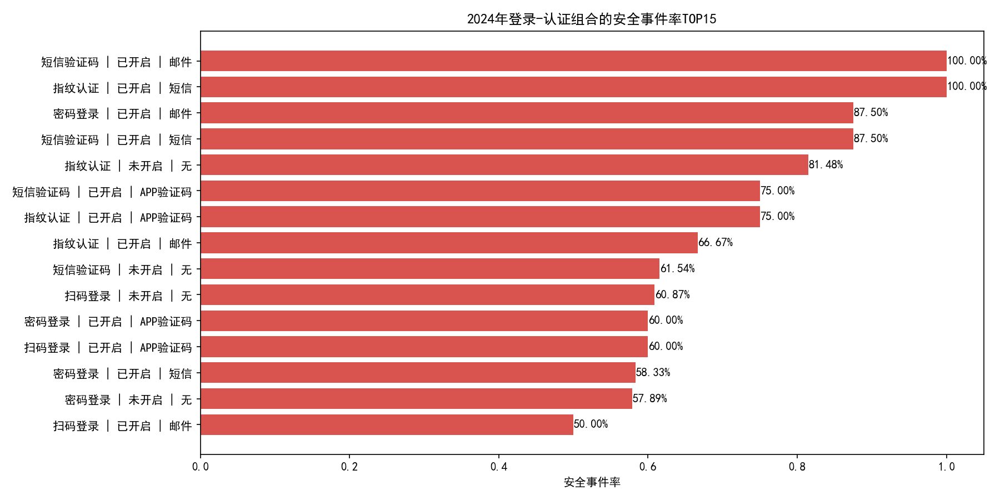
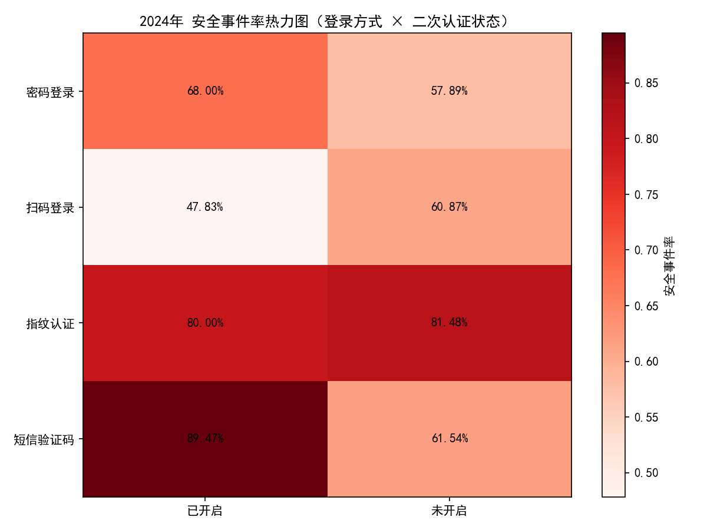
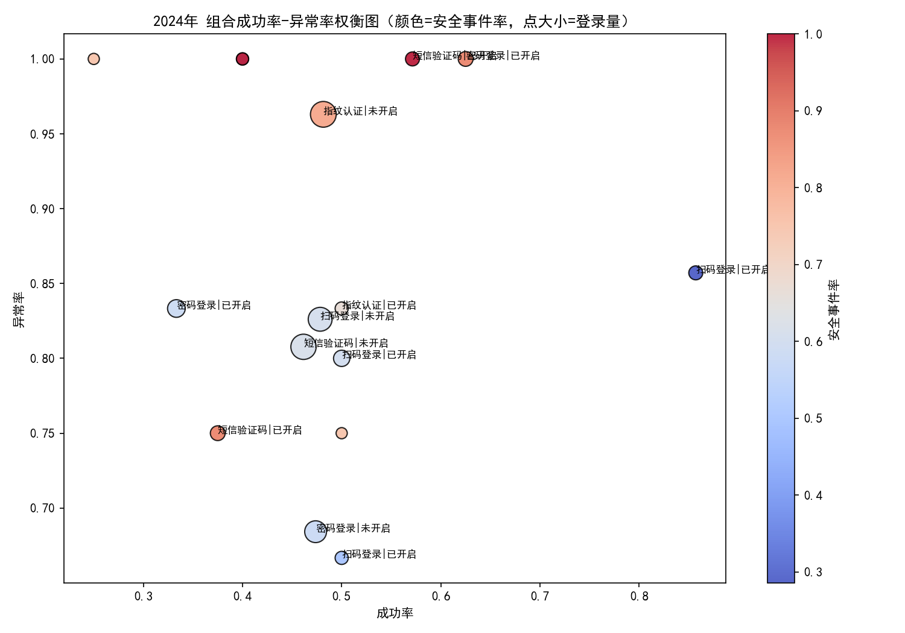

# 2024年登录-认证组合薄弱环节分析与策略建议

## 摘要
基于SQLite库中的登录记录、异常登录及安全事件数据，对2024年不同“登录方式 × 二次认证方式”组合进行了系统评估。通过计算登录成功率、异常率与安全事件率并可视化，我们识别出以下明显薄弱环节：
- 邮件作为二次认证方式的组合整体风险显著偏高，安全事件率可达100%，例如：
  - 短信验证码 | 已开启 | 邮件：登录总量=7，成功率=57.14%，异常率=100%，安全事件率=100%。
  - 密码登录 | 已开启 | 邮件：登录总量=8，成功率=62.5%，异常率=100%，安全事件率=87.5%（且为“高量”）。
- 短信作为二次认证方式在“短信验证码登录”或“指纹认证登录”的组合中也表现出高风险：
  - 短信验证码 | 已开启 | 短信：登录总量=8，成功率=37.5%，异常率=75%，安全事件率=87.5%（“高量”）。
  - 指纹认证 | 已开启 | 短信：登录总量=5，成功率=40%，异常率=100%，安全事件率=100%。
- 相较之下，APP验证码（二次认证）在部分组合中的安全事件率略低，但仍存在较高异常率或较低成功率的现象：
  - 密码登录 | 已开启 | APP验证码：登录总量=5，成功率=40%，异常率=100%，安全事件率=60%。
  - 指纹认证 | 已开启 | APP验证码：登录总量=4，成功率=25%，异常率=100%，安全事件率=75%。

结论上，邮件二次认证在2024年明显是“高风险通道”；短信作为二次认证在某些登录方式下也呈现高风险；APP验证码相对较优但仍需配合设备绑定与风控策略。

## 数据与方法
- 数据来源：dacomp-036.sqlite（登录记录表、异常登录表、安全事件表、认证方式表）。
- 分析口径：限定2024年；按“登录方式 × 二次认证状态 × 二次认证方式 × 认证级别”聚合，并跨认证级别进行归并对比。
- 核心指标定义：
  - 成功率 = 成功次数 / 登录总量。
  - 异常率 = 关联异常登录记录数 / 登录总量（基于异常登录表的关联登录记录ID）。
  - 安全事件率 = 关联安全事件登录记录数 / 登录总量（基于安全事件表的关联登录记录ID）。
- 未进行数据清洗，仅对表做直接汇总与关联分析。

## 关键可视化与解读
1) 各组合安全事件率Top15（红色越深风险越高）



- 前列组合以“邮箱二次认证”占比居多；短信作为二次认证也多次出现于高风险组合。
- 注意：个别组合样本量较低，但总体趋势仍清晰地指向“邮箱通道”为主要薄弱点。

2) 登录方式 × 二次认证状态的安全事件率热力图



- “已开启”二次认证的组合中仍出现较高的安全事件率，提示二次认证“通道强度”与“通道防护”比“是否开启”更关键。

3) 成功率 vs 异常率 权衡气泡图（点大小=登录量，颜色=安全事件率）



- 多数高安全事件率的点同时拥有较高异常率与较低成功率，说明这些组合在“风险”与“用户体验”两侧均不理想。

## 诊断：为何这些组合更脆弱？
- 邮件二次认证：
  - 邮箱被接管（弱密码、撞库、钓鱼）与邮件通道的延迟/可拦截性增加了验证码泄露风险。
  - 邮件链路较长，易被转发或被安全策略（筛选、转发规则）影响，造成验证码被旁路或被自动化工具获取。
- 短信二次认证：
  - 存在SIM换卡（SIM swap）、短信拦截、短信网关攻击、鱼叉式钓鱼诱导转码等威胁。
  - 当“登录方式本身就是短信验证码”时，再用“短信”做二次认证属于“同源通道”，抗钓鱼与抗中间人能力更弱。
- APP验证码：
  - 相对安全，但如果缺少设备绑定、越狱/Root检测与防调试、防截屏等，仍可能被木马或社工手段绕过。
- 指纹认证：
  - 生物识别若未配合设备完整性校验与可信执行环境（TEE/SE）证据，可能遭受回放/欺骗；同时少量样本下的高比率也可能反映当前风控规则更敏感地标记了该通道。

## 建议：后续应采取怎样的登录-认证方式
优先目标：降低高风险通道的占比、提升整体成功率与安全性，在“体验-安全”之间达成平衡。

A. 二次认证方式策略
- 短期（立即）：
  - 禁止在高风险场景中使用“邮件二次认证”，将其降级为仅限低敏感操作或仅作灾备备用通道；清理所有“邮箱自动转发规则”并对可疑邮箱进行强制改密与风控排查。
  - 避免“短信验证码登录 + 短信二次认证”的同源组合；对“短信二次认证”增加行为与设备风控（设备指纹、IP信誉、地理位置与24小时内风险计数）。
- 中期（1-3个月）：
  - 推广APP验证码（TOTP）或基于企业APP的“推送确认 + 设备绑定 + 风险感知”方案，强制高敏业务场景使用APP或更强认证。
  - 对短信二次认证加固：验证码长度/有效期/重试次数限制、异常路由拦截、黑卡段与虚拟号段识别、SIM更换冷冻期。
- 中长期：
  - 引入基于设备的强认证（如基于平台生物识别的本地验证结合设备绑定与硬件信任信号），并逐步减少对邮件/短信的依赖。

B. 登录方式策略
- 密码登录：
  - 配置“自适应MFA”：当设备/网络/行为风险升高时，强制APP验证码或更强二次认证；默认禁用“邮件二次认证”。
  - 强制密码策略与泄露密码检测，降低初始入侵概率。
- 短信验证码登录：
  - 不作为默认登录方式，保留为应急或低敏业务入口；若使用，二次认证必须“跨通道”（例如APP验证码），禁用“短信二次认证”。
- 指纹认证登录：
  - 必须与“设备绑定 + 完整性校验（反越狱/Root）+ 风险引擎”一起使用；高风险时叠加APP验证码或可信推送确认。

C. 风控与治理配套
- 建立“通道风险评分”与“场景分级”：按业务敏感度、用户群体与设备可信度，动态决定MFA强度。
- 加强异常检测闭环：
  - 对“安全事件率/异常率高”的组合进行专项治理，设置专用拦截策略与动态升级MFA。
  - 加入登录地异常、设备异常、行为异常的阈值与阻断策略，并将“邮件/短信二次认证”的触发前置到更严格的校验。
- 用户教育与反钓鱼：上线钓鱼预警、验证码防骗提示、模拟钓鱼演练，降低社工成功率。
- 度量与迭代：以“安全事件率、异常率、登录成功率”为核心KPI，按周/按月复盘。

## 结果摘录（高风险薄弱组合示例）
基于2024年数据聚合（跨认证级别），以下为安全事件率与异常率显著偏高的组合：
- 短信验证码 | 已开启 | 邮件：登录量=7，成功率=57.14%，异常率=100%，安全事件率=100%。
- 指纹认证 | 已开启 | 短信：登录量=5，成功率=40%，异常率=100%，安全事件率=100%。
- 密码登录 | 已开启 | 邮件：登录量=8，成功率=62.5%，异常率=100%，安全事件率=87.5%（高量）。
- 短信验证码 | 已开启 | 短信：登录量=8，成功率=37.5%，异常率=75%，安全事件率=87.5%（高量）。
- 指纹认证 | 已开启 | APP验证码：登录量=4，成功率=25%，异常率=100%，安全事件率=75%。
- 密码登录 | 已开启 | APP验证码：登录量=5，成功率=40%，异常率=100%，安全事件率=60%。

这些组合凸显：
- 邮件二次认证是显著薄弱点，应尽快被替换或严格限用。
- 短信二次认证在“短信验证码登录”或“指纹认证登录”中风险较高，需改为跨通道APP验证码或更强认证。

## 技术实现说明与代码片段
- SQL核心汇总（示意）：
  - 以“登录记录表”为基，关联“异常登录表/安全事件表”（按登录记录ID），限定2024年，按“登录方式 × 二次认证状态 × 二次认证方式 × 认证级别”聚合，计算成功率、异常率、事件率。
- Python绘图（含字体设置，已生成图片保存在当前目录）：
```python
import pandas as pd
import numpy as np
import matplotlib.pyplot as plt

# 字体设置（必须包含）
plt.rcParams['font.sans-serif'] = ['SimHei']
plt.rcParams['axes.unicode_minus'] = False

combo = pd.read_csv('analysis_2024_combo.csv')
agg = combo.groupby(['登录方式','二次认证状态','二次认证方式'], as_index=False)\\
         .agg({'登录总量':'sum','成功次数':'sum','异常登录数':'sum','安全事件登录数':'sum'})
agg['成功率'] = (agg['成功次数'] / agg['登录总量']).round(4)
agg['异常率'] = (agg['异常登录数'] / agg['登录总量']).round(4)
agg['安全事件率'] = (agg['安全事件登录数'] / agg['登录总量']).round(4)
agg['组合'] = agg['登录方式'] + ' | ' + agg['二次认证状态'] + ' | ' + agg['二次认证方式']

# 图1：安全事件率TOP15
plot1 = agg.sort_values('安全事件率', ascending=False).head(15)
plt.figure(figsize=(12,6))
plt.barh(plot1['组合'], plot1['安全事件率'], color='#d9534f')
plt.gca().invert_yaxis()
plt.xlabel('安全事件率')
plt.title('2024年登录-认证组合的安全事件率TOP15')
plt.tight_layout()
plt.savefig('图1_安全事件率TOP15.png', dpi=150)
plt.close()

# 图2：登录方式×二次认证状态热力图
agg2 = combo.groupby(['登录方式','二次认证状态'], as_index=False)\\
        .agg({'登录总量':'sum','安全事件登录数':'sum'})
agg2['安全事件率'] = (agg2['安全事件登录数'] / agg2['登录总量']).round(4)
methods = agg2['登录方式'].unique().tolist()
status = agg2['二次认证状态'].unique().tolist()
mat = np.zeros((len(methods), len(status)))
mat[:] = np.nan
for i,m in enumerate(methods):
    for j,s in enumerate(status):
        v = agg2[(agg2['登录方式']==m) & (agg2['二次认证状态']==s)]['安全事件率']
        mat[i,j] = float(v.values[0]) if len(v)>0 else np.nan
plt.figure(figsize=(8,6))
plt.imshow(mat, cmap='Reds', aspect='auto')
plt.colorbar(label='安全事件率')
plt.xticks(range(len(status)), status)
plt.yticks(range(len(methods)), methods)
plt.title('2024年 安全事件率热力图（登录方式 × 二次认证状态）')
plt.tight_layout()
plt.savefig('图2_安全事件率热力图.png', dpi=150)
plt.close()

# 图3：成功率 vs 异常率 气泡图
size = (agg['登录总量'] / agg['登录总量'].max())*400 + 20
plt.figure(figsize=(10,7))
sc = plt.scatter(agg['成功率'], agg['异常率'], s=size, c=agg['安全事件率'], cmap='coolwarm', alpha=0.85, edgecolor='k')
plt.xlabel('成功率')
plt.ylabel('异常率')
plt.title('2024年 组合成功率-异常率权衡图')
plt.colorbar(sc, label='安全事件率')
plt.tight_layout()
plt.savefig('图3_成功率与异常率权衡.png', dpi=150)
plt.close()
```

## 局限与后续工作
- 样本量：部分组合量级偏小，比例可能受个别事件影响较大，建议按月/季度进一步跟踪。
- 上下文：当前未引入IP、设备、地理等上下文维度，后续可做“自适应MFA与场景分级”更细粒度验证。
- 质控：建议对“邮件/短信通道”的日志链路做专项审计，排查是否存在自动转发、网关重放等系统性问题。

## 总结
2024年的数据清楚显示：“邮件二次认证”为最主要薄弱环节；“短信二次认证”在特定登录方式下也呈现高风险。建议以APP验证码（或更强的设备绑定式认证）为主、辅以自适应MFA和通道风控，快速压降安全事件率，同时兼顾用户成功率与体验。
