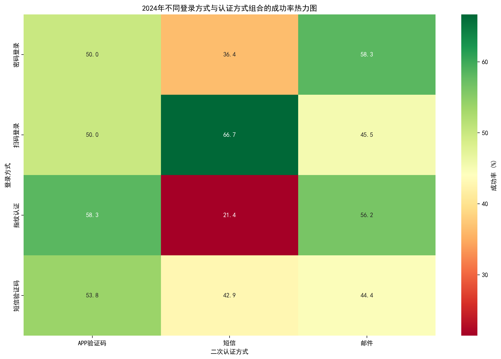
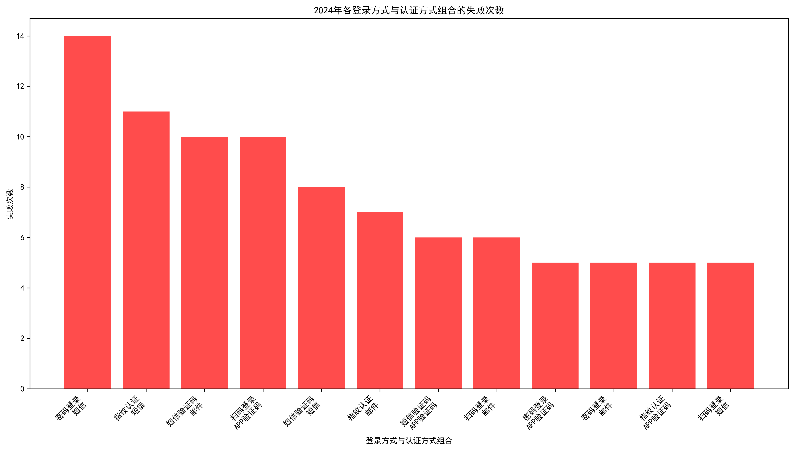
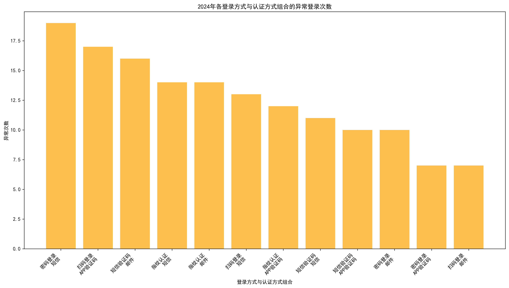
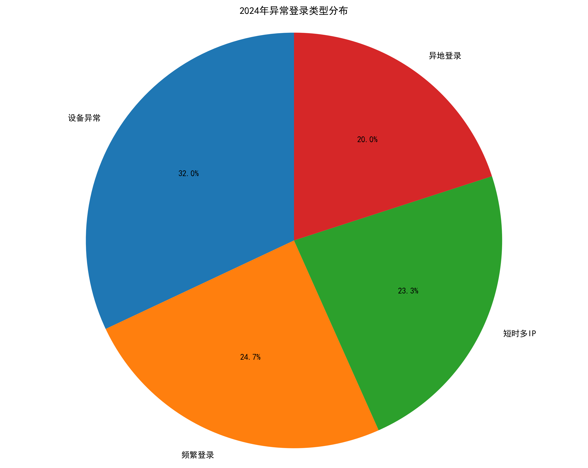
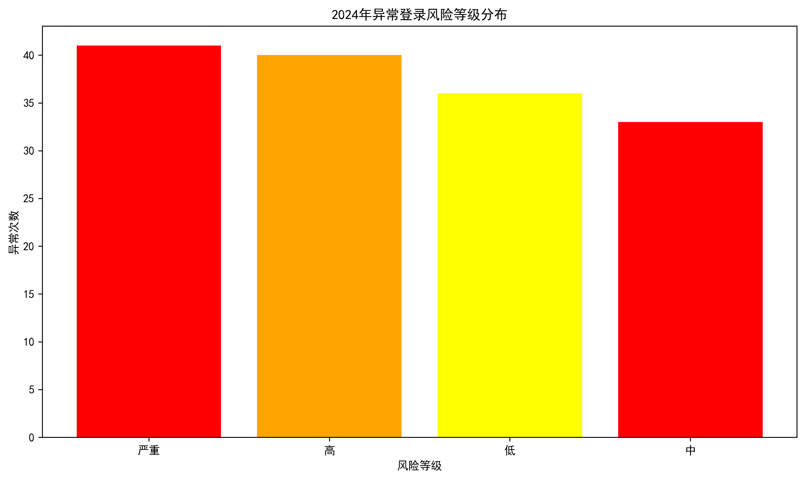
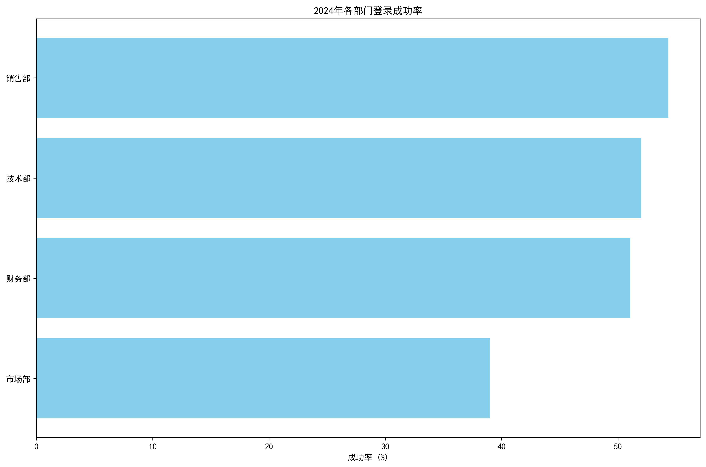
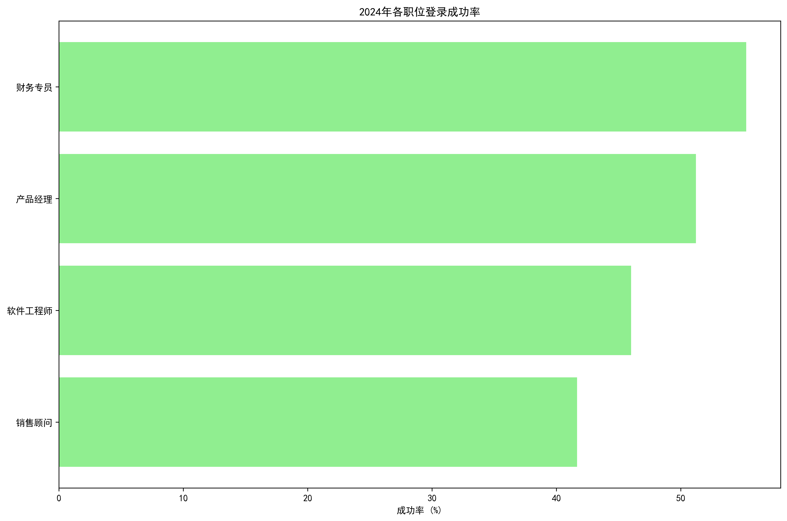
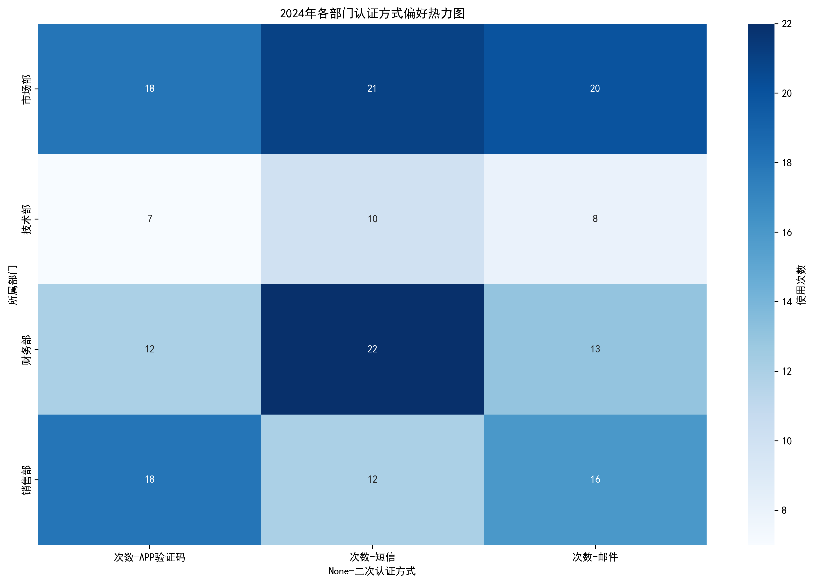

# 2024年登录认证安全分析报告

## 执行摘要

通过对2024年登录认证数据的深入分析，我们发现当前登录认证体系存在多个薄弱环节。整体而言，短信认证方式的安全性最令人担忧，而指纹认证与短信验证码的组合成功率极低。建议立即采取措施加强认证安全，特别是替换或增强短信认证机制。

## 主要发现

### 1. 认证方式组合安全状况

**关键发现：**
- **最薄弱环节**：指纹认证+短信组合，成功率仅21.4%
- **次薄弱环节**：密码登录+短信组合，成功率36.4%
- **相对安全**：扫码登录+短信组合，成功率66.7%

从失败次数来看，密码登录+短信组合的失败次数最多（14次），其次是扫码登录+APP验证码组合（10次）。

### 2. 异常登录分析

**异常高发组合：**
1. 密码登录+短信：19次异常
2. 扫码登录+APP验证码：17次异常
3. 短信验证码+邮件：16次异常

**主要异常类型：**
- 设备异常（33.1%）：最常见，表明设备指纹识别需要改进
- 频繁登录（25.5%）：说明需要更好的频率控制机制
- 短时多IP（24.1%）：需要IP地址验证优化
- 异地登录（20.7%）：地理位置验证机制待完善

风险等级分布相对均衡，但严重级别异常占比最高（28.8%），需要重点关注。

### 3. 用户群体安全状况

**部门安全状况：**
- 市场部：成功率最低（39.0%），安全风险最高
- 销售部：成功率最高（54.3%），相对较好
- 财务部和技术部：中等水平（约50%）

**职位安全状况：**
- 销售顾问：成功率最低（41.7%），需要重点培训
- 软件工程师：成功率46.0%，技术人员安全意识待提升
- 财务专员：成功率最高（55.3%），相对较好

各部门对认证方式的偏好相对均衡，但市场部使用短信认证较多，这与其低成功率相关。

## 薄弱环节识别

### 1. 短信认证体系存在严重缺陷
- 所有包含短信的认证组合成功率均低于70%
- 短信验证码+短信组合成功率仅42.9%
- 短信容易被拦截、伪造，安全性不足

### 2. 市场部成为安全短板
- 登录成功率最低，仅39.0%
- 销售顾问群体安全意识薄弱
- 过度依赖不安全的短信认证

### 3. 设备指纹识别不准确
- 设备异常占比最高（33.1%）
- 可能导致误判和用户体验下降
- 需要提升设备识别精度

## 改进建议

### 1. 立即行动项（0-3个月）

**替换短信认证机制：**
- 逐步淘汰短信验证码，改用更安全的APP推送认证
- 对高风险操作强制使用APP验证码或生物识别
- 为市场部等薄弱环节优先升级认证方式

**加强用户培训：**
- 针对销售顾问群体开展安全意识培训
- 制作简单易懂的认证操作指南
- 定期开展钓鱼邮件等安全测试

### 2. 短期改进（3-6个月）

**优化设备指纹识别：**
- 升级设备指纹算法，提高识别准确率
- 建立设备信任度评分机制
- 减少因设备误判导致的登录失败

**实施智能风控：**
- 基于用户行为模式建立风险评估模型
- 对异常登录实施渐进式认证要求
- 建立登录频率和IP地址监控机制

### 3. 长期规划（6-12个月）

**构建多层级认证体系：**
- 实施零信任安全架构
- 建立基于风险的动态认证机制
- 推广无密码认证技术（如FIDO2）

**建立安全运营中心：**
- 7×24小时监控认证安全事件
- 建立快速响应机制
- 定期开展安全评估和渗透测试

## 预期效果

通过实施上述建议，预计在6个月内实现：
- 整体登录成功率提升至80%以上
- 异常登录事件减少50%
- 市场部登录成功率提升至70%以上
- 用户满意度显著提升

## 结论

当前登录认证体系存在明显薄弱环节，主要集中在短信认证和市场部用户群体。建议立即启动认证方式升级计划，优先解决短信安全问题，同时加强用户安全意识培训。通过系统性的改进措施，可以显著提升整体认证安全水平，降低安全风险。
